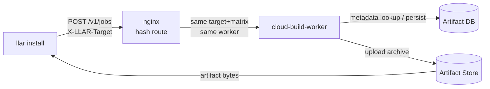

# Cloud Build Design

## Goal

`llar install` should obtain build artifacts from cloud build infrastructure
instead of building on the user's machine. The user-facing goal is remote
prebuilt installation:

```text
local cache hit
  use the existing LLAR local cache

local cache miss
  ask cloud build for an artifact
```

`llar make` remains the build command. Cloud build does not redefine formula
semantics, module loading semantics, matrix propagation, local install
directories, or cache metadata.

## Roles

The simplified cloud build system has four roles:



- **Client**: `llar install`. It resolves modules locally, computes dependency
  build order, checks the local cache, submits cloud build requests for cache
  misses, downloads completed artifacts, writes install directories and
  `.cache.json`, and prints the root metadata.
- **nginx**: Routes `POST /v1/jobs` by hashing `X-LLAR-Target`. Requests for
  the same artifact key should reach the same worker while that worker is
  healthy.
- **cloud-build-worker**: Owns HTTP handling, local active build entries,
  build execution, verbose log fanout, artifact upload, and completed artifact
  metadata persistence.
- **Artifact store**: Stores archive bytes. GHCR is the default backend. The
  artifact DB stores completed artifact metadata. Artifact bytes do not flow
  through the DB.

Public GHCR blob downloads use `Authorization: Bearer QQ==`.
Publish credentials are provided by the worker runtime, such as GitHub Actions
`GITHUB_TOKEN`; they are not part of the public build API.

There is no Scheduler, dispatcher, queue, Redis building key, Asynq task,
client WebSocket, agent WebSocket, VM module, or pending jobs table in this
design.

## Request Identity

The routing and artifact identity are carried by `X-LLAR-Target`:

```http
X-LLAR-Target: <module>@<version>#<matrixStr>
```

Examples:

```http
X-LLAR-Target: madler/zlib@v1.3.1#amd64-linux
X-LLAR-Target: pnggroup/libpng@v1.6.47#amd64-linux|false
```

`matrixStr` is the existing LLAR matrix string used by local cache keys and
install directory layout. The worker uses the header value as the artifact key.
It does not need to reconstruct `formula.Matrix` from `matrixStr`.
It is produced by `formula.Matrix.Combinations()[0]`: keys are used only for
stable ordering, and the string contains selected values joined by `-` and `|`.

The request body carries the selected matrix values:

```go
type JobRequest struct {
	Matrix Matrix `json:"matrix"`
}

type Matrix struct {
	Require map[string]string `json:"require"`
	Options map[string]string `json:"options,omitempty"`
}
```

`defaultOptions` is not part of this request. Defaults belong to formula
declarations; the client submits the final selected values.

The worker does not recompute `matrixStr` from `body.matrix` for request
validation. `llar install` is responsible for generating `X-LLAR-Target` and
`body.matrix` from the same selected matrix.

## Public API

Cloud build has one public build endpoint:

```http
POST /v1/jobs
POST /v1/jobs?verbose=1
```

Required headers:

```http
X-LLAR-Target: <module>@<version>#<matrixStr>
Content-Type: application/json
```

Request body:

```json
{
  "matrix": {
    "require": {
      "arch": "amd64",
      "os": "linux"
    },
    "options": {
      "debug": "false"
    }
  }
}
```

`verbose` is a query option because it only changes response streaming. It is
not part of artifact identity and is not included in the request body.

### Non-Verbose Response

Without `verbose=1`, the HTTP request waits until the artifact is available or
the build fails. The response body is a single JSON value using the existing
client status message shape:

```go
type StatusMessage struct {
	Type  string     `json:"type"`  // status
	State JobState   `json:"state"` // completed | failed
	Body  StatusBody `json:"body"`
}

type JobState string

const (
	JobCompleted JobState = "completed"
	JobFailed    JobState = "failed"
)

type StatusBody struct {
	Artifact *Artifact `json:"artifact,omitempty"`
	Status   int       `json:"status,omitempty"`
	Message  string    `json:"message,omitempty"`
}
```

Completed response:

```json
{
  "type": "status",
  "state": "completed",
  "body": {
    "artifact": {
      "source": {
        "type": "ghcr",
        "url": "https://..."
      },
      "type": "zip",
      "metadata": "...",
      "checksum": "0f4c2f1b6f1c0c7b7a0d6f6c9a2c8f4e5d7c3b2a1f0e9d8c7b6a5f4e3d2c1b0a"
    }
  }
}
```

Failed response:

```json
{
  "type": "status",
  "state": "failed",
  "body": {
    "status": 500,
    "message": "llar make failed"
  }
}
```

### Verbose Response

With `verbose=1`, the response still uses `Content-Type: application/json`, but
the body is a stream of JSON messages. The worker writes zero or more log
messages and then one terminal status message.

The log message shape is the existing client log message shape:

```go
type LogMessage struct {
	Type string  `json:"type"` // log
	Data LogData `json:"data"`
}

type LogData struct {
	Stream string `json:"stream,omitempty"` // stderr
	Text   string `json:"text"`             // ANSI preserved
}
```

Example verbose stream:

```json
{"type":"log","data":{"stream":"stderr","text":"checking..."}}
{"type":"log","data":{"stream":"stderr","text":"building..."}}
{"type":"status","state":"completed","body":{"artifact":{"source":{"type":"ghcr","url":"https://..."},"type":"zip","metadata":"...","checksum":"0f4c2f1b6f1c0c7b7a0d6f6c9a2c8f4e5d7c3b2a1f0e9d8c7b6a5f4e3d2c1b0a"}}}
```

Go clients can read verbose responses with `json.Decoder` by decoding one JSON
value at a time.

## Data Flow

### Completed Artifact

```text
1. llar install resolves the target, matrix selection, dependency order, and
   matrixStr locally.
2. llar install hits a local cache miss and sends POST /v1/jobs with
   X-LLAR-Target.
3. nginx hashes X-LLAR-Target and forwards the request to a worker.
4. The worker parses module, version, and matrixStr from X-LLAR-Target.
5. The worker calls artifact.Store.Get.
6. If the artifact exists, the worker returns completed.
7. llar install downloads Artifact.Source from the Artifact Store, verifies
   checksum, extracts into the local install directory, and writes .cache.json.
```

### Missing Artifact

```text
1. The worker calls artifact.Store.Get and misses.
2. The worker checks its local in-memory build entries by ArtifactKey.
3. If an entry exists, the request waits on that entry.
4. If no entry exists, the worker creates one and starts a build.
5. The build executes the LLAR build path and writes raw verbose logs to the
   entry fanout.
6. The build uploads the completed archive through upload.
7. The build writes completed metadata through artifact.Store.Put.
8. After Put succeeds, the entry fans out completed to waiting requests.
9. The worker removes the in-memory entry.
10. Clients download Artifact.Source directly from the Artifact Store.
```

Completed artifact lookup always happens before local building-entry lookup.
After `artifact.Store.Put` succeeds, the entry is only a fanout object for
already-waiting requests and must not shadow the completed artifact. If a new
request arrives after `Put` but before entry deletion, it should hit the
artifact DB and return completed directly.

### Multiple Workers

nginx hash routing gives active build affinity across workers:

```text
hash(X-LLAR-Target) -> worker
```

When a worker is healthy, requests for the same artifact key should reach the
same worker and share that worker's in-memory build entry.

If a worker restarts or is removed by nginx health checks, later requests may
fall back to another worker. The fallback worker uses the same logic: check the
artifact DB first, then build if the artifact is still missing. Duplicate builds
are acceptable in these failure windows. `artifact.Store.Put` is the final
consistency boundary.

## Worker Project Modules

The worker project uses three internal modules plus `cmd/worker` glue:

```text
cmd/worker
internal/build
internal/artifact
internal/upload
```

### cmd/worker

`cmd/worker` owns HTTP concerns:

- start the Gin server;
- register `POST /v1/jobs`;
- parse `X-LLAR-Target`;
- parse `verbose`;
- decode the request body matrix;
- call `internal/build`;
- wrap raw build logs into JSON log messages when verbose is enabled;
- write the terminal completed or failed status message.

`cmd/worker` does not own active build entry state, artifact DB semantics, or upload
semantics.

### internal/build

`internal/build` owns worker-local build coordination and execution flow:

- completed artifact lookup before local entry lookup;
- `ArtifactKey -> build entry` in-memory coordination;
- waiting for an existing local build;
- starting a new local build when no entry exists;
- raw verbose log fanout to waiting requests;
- invoking the LLAR build path;
- calling `upload` for archive bytes;
- calling `artifact.Store.Put` for completed metadata;
- removing local entries after terminal status.

The module does not depend on Gin or HTTP. It does not JSON-encode log
messages. It writes only raw verbose log text to the optional `io.Writer`
provided by the caller.

Public interface:

```go
package build

type Target struct {
	Module  string
	Version string
}

type Matrix struct {
	Require map[string]string `json:"require"`
	Options map[string]string `json:"options,omitempty"`
}

type Request struct {
	Target    Target
	MatrixStr string
	Matrix    Matrix
}

type Result struct {
	Artifact artifact.Artifact
}

type Builds struct {
	// internal state
}

func New(opts Options) *Builds
func (b *Builds) Build(ctx context.Context, req Request, log io.Writer) (Result, error)
```

`log` is optional:

```text
log == nil
  non-verbose request; Build waits and returns only the final Result/error.

log != nil
  verbose request; Build writes raw log text to log while waiting.
```

`Build` never writes terminal completed or failed messages. The caller writes
terminal status from the returned `Result` or `error`.

### internal/artifact

`internal/artifact` owns completed artifact metadata. It does not upload,
download, unpack, calculate checksums, manage local build entries, or handle
HTTP.

```go
package artifact

type Key struct {
	Module    string
	Version   string
	MatrixStr string
}

type Artifact struct {
	Source   Source `json:"source"`
	Type     string `json:"type"`     // zip | tar.gz | tar.zst
	Metadata string `json:"metadata"` // LLAR metadata, for example pkg-config info
	Checksum string `json:"checksum"` // sha256
}

type Source struct {
	Type string `json:"type"` // artifact backend, for example ghcr
	URL  string `json:"url"`
}

type Store interface {
	Get(ctx context.Context, key Key) (Artifact, bool, error)
	Put(ctx context.Context, key Key, artifact Artifact) (Artifact, error)
	Delete(ctx context.Context, key Key) error
}
```

Artifact table:

```sql
CREATE TABLE artifacts (
  module      TEXT NOT NULL,
  version     TEXT NOT NULL,
  matrix_str  TEXT NOT NULL,
  source_type TEXT NOT NULL,
  source_url  TEXT NOT NULL,
  type        TEXT NOT NULL,
  metadata    TEXT NOT NULL,
  checksum    TEXT NOT NULL,
  created_at  TIMESTAMP NOT NULL,
  expires_at  TIMESTAMP NULL,
  PRIMARY KEY (module, version, matrix_str)
);
```

`Put` is atomic and idempotent:

```text
missing key
  insert artifact and return it

same key + same checksum
  return the existing stored artifact

same key + different checksum
  return conflict
```

`Artifact.Source` describes how the client downloads archive bytes:

```text
http
  source.url is a direct HTTP file URL. The client downloads it with a normal
  GET.

ghcr
  source.url is a GitHub Container Registry blob URL. Public GHCR blob downloads
  use Authorization: Bearer QQ==. Private GHCR packages use client-local
  registry credentials. Credentials are never stored in Artifact.
```

For GHCR, completed artifacts use this storage shape:

```text
package = ghcr.io/<owner>/<target.module>
tag     = target.version
matrix  = OCI index manifest annotation org.llar.matrix = MatrixStr
blob    = artifact archive layer
```

For example, `pnggroup/libpng@v1.6.43` is published under:

```text
ghcr.io/<owner>/pnggroup/libpng:v1.6.43
```

The tag points to an OCI image index. Each matrix variant is an index manifest
entry. The index entry should fill standard OCI `platform.os` and
`platform.architecture` when those values are available, but LLAR artifact
matching uses the custom annotation:

```text
org.llar.matrix = <MatrixStr>
```

The uploader publishes the archive blob, writes or updates the version index,
and returns the final blob URL:

```text
https://ghcr.io/v2/<owner>/<target.module>/blobs/sha256:<digest>
```

### internal/upload

`internal/upload` owns artifact byte upload to the configured Artifact Store backend. GHCR is the default backend.

```go
package upload

type Options struct {
	Name  string
	Type  string // zip | tar.gz | tar.zst
	Attrs map[string]string
}

type Result struct {
	URL      string
	Size     int64
	Checksum string // sha256
}

type Uploader interface {
	Type() string
	Upload(ctx context.Context, r io.ReadSeeker, opts Options) (Result, error)
}

type GHCRConfig struct {
	Owner string
	Token string
}

func NewGHCR(cfg GHCRConfig) Uploader
```

`Uploader.Type()` is the artifact source type, for example `ghcr`.
`Options.Type` is the archive type, for example `zip`, `tar.gz`, or `tar.zst`.
`Upload` reads from the current `r` offset to EOF, computes SHA-256 and size,
seeks back to the original offset, uploads the same bytes, and returns
`Result{URL, Size, Checksum}`. It does not query or mutate the artifact DB and
does not manage build state.

For GHCR:

```text
Options.Name  = ghcr.io/<owner>/<module>:<version>
Options.Type  = zip
Options.Attrs = {"org.llar.matrix": "<matrixStr>"}
Result.URL    = https://ghcr.io/v2/<owner>/<module>/blobs/sha256:<digest>
```

`build` combines `Uploader.Type()`, upload URL, archive type, checksum, and
LLAR metadata into `artifact.Artifact`, then calls `artifact.Store.Put`.

## llar Client Behavior

`llar install` remains responsible for install semantics:

```text
1. Resolve module versions locally.
2. Resolve dependency order locally.
3. Select one matrix and derive matrixStr.
4. Check the local build cache.
5. For each cache miss, POST /v1/jobs with X-LLAR-Target and body.matrix.
6. If verbose is enabled, decode streamed JSON messages and print log messages.
7. Wait for terminal completed or failed status.
8. Download completed artifact bytes from Artifact.Source.
9. Verify checksum.
10. Extract into installDir(module, version, matrixStr).
11. Write .cache.json with LLAR metadata.
```

The client submits builds in dependency build order. The worker does not
recursively submit dependency jobs.

## Failure Boundaries

Request parsing errors return HTTP request errors before build execution:

```text
missing X-LLAR-Target
  400

invalid X-LLAR-Target
  400

invalid JSON body
  400

missing matrix
  400
```

If `artifact.Store.Get` fails, the worker must not start a build. The worker
returns an internal error because it cannot know whether the artifact already
exists.

Build-time failures return a failed status message:

```text
llar build failure
  failed status

upload failure
  failed status

artifact.Store.Put database error
  failed status

artifact.Store.Put checksum conflict
  failed status with 409
```

`artifact.Store.Put` is the consistency boundary for completed artifacts.
Completed status is sent only after `Put` succeeds.

Client disconnect behavior:

```text
waiting client disconnects
  only that request stops waiting

first client disconnects after starting a build
  the shared worker-local build may continue

verbose log writer fails
  remove that subscriber; do not fail the build or other subscribers
```

Verbose reconnect is a new `POST /v1/jobs?verbose=1` for the same
`X-LLAR-Target`. If the build is still active, the worker replays the current
in-memory log ring from its first retained entry, then streams live logs. The
client may keep a per-build printed log count and skip that many replayed log
messages to avoid duplicate terminal output. The log ring is bounded, so log
replay is diagnostic best effort and does not guarantee complete history.
Terminal completed/failed status is independent from log replay.

Worker failure behavior:

```text
worker dies or is removed by nginx health checks
  later requests may reach another worker

fallback worker artifact DB hit
  return completed

fallback worker artifact DB miss
  build again
```

Duplicate builds across workers are acceptable in failure windows.

## Out Of Scope

- Global exactly-once build execution.
- Persistent pending job state.
- Redis, Asynq, or distributed locks.
- Client WebSocket wait API.
- Agent WebSocket control protocol.
- Scheduler-managed VM provisioning.
- New formula APIs.
- New `modules.Load` semantics.
- `sourceHash`, `formulaHash`, or lock-file reproducibility.
