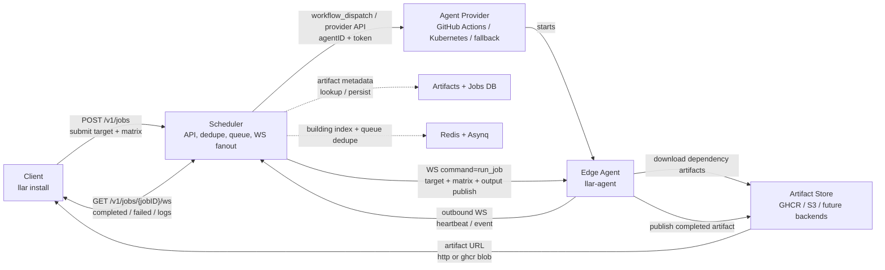
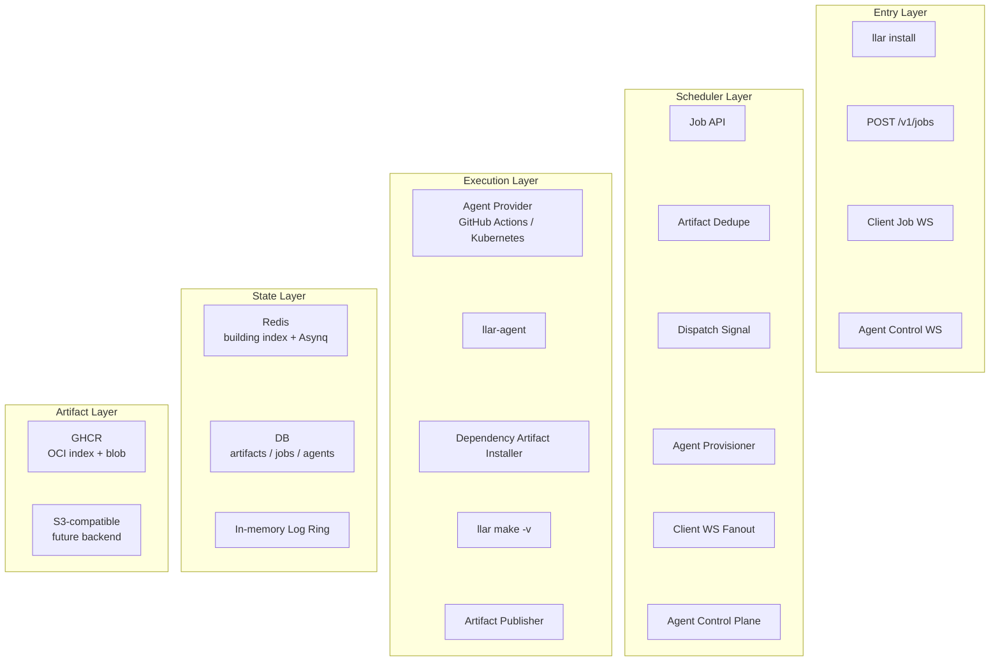

# Cloud Build Design

## Goal

`llar install` should obtain build artifacts from cloud build infrastructure
instead of building on the user's machine. `llar make` remains the local build
command and is also the build capability used by remote agents.

This design is intentionally scoped to cloud artifact orchestration. It must
not redefine formula semantics, module loading semantics, matrix propagation,
or `build.Builder` behavior.

## Roles

The cloud build system has four roles:



Layered module view:



- **Client**: `llar install`. Resolves the requested module locally, computes
  the existing build order, submits each module build to the Scheduler, downloads
  artifacts, writes the local build cache, and prints the root metadata.
- **Scheduler**: Owns the public API, artifact lookup, active-job dedupe,
  queueing, agent provisioning, job state, and client WebSocket fanout. It can
  provision agents through GitHub Actions, Kubernetes, or a fallback provider,
  but it does not execute builds and does not initiate network connections to
  agents.
- **Edge Agent**: A provider-started `llar-agent` process that executes
  build jobs. It starts with Scheduler connection credentials, opens an
  outbound control-plane WebSocket to the Scheduler, receives the job
  assignment, prepares dependency artifacts in its workspace, coordinates
  `llar make` as the build command, uploads the artifact, and streams logs/status
  back to the Scheduler.
- **Artifact Store**: Stores artifact archives. Clients and agents download
  archives from artifact URLs; agents upload completed archives. The initial
  backend can be GHCR, with S3-compatible and future backends hidden behind the
  same abstraction.

## Command Semantics

`llar make` is the build command.

- It can still be used locally.
- The Edge Agent invokes `llar make` in a controlled workspace.
- Existing build cache, workspace layout, and result selection are preserved.

`llar install` is the cloud artifact command.

- It does not build locally.
- It resolves dependencies locally and submits cloud build jobs in build order.
- It first checks the local build cache and skips remote work for local hits.
- It downloads each remote artifact into the existing workspace layout and writes
  the existing build cache metadata so later `llar make` sees a normal cache hit.
- It prints the root target metadata, matching `llar make`.
- With `-v`, it streams remote agent logs while waiting for pending jobs.

## Matrix Handling

The cloud API receives the existing `formula.Matrix` shape, not the internal
matrix string.

```go
type Matrix struct {
	Require        map[string][]string
	Options        map[string][]string
	DefaultOptions map[string][]string
}
```

The matrix sent to the Scheduler must represent one concrete build variant.
The client is responsible for filling defaults, including the host matrix when
the user did not pass matrix flags. In practice, each selected dimension is sent
as a single-element slice so `formula.Matrix.Combinations()` produces exactly
one build key. The Scheduler validates the matrix but does not infer missing
values from its own host.

The internal `MatrixStr` is derived from the same matrix:

```text
formula.Matrix.Combinations()[0]
```

`MatrixStr` is used for artifact keys, active-job dedupe, workspace install
directories, and build cache keys. The public API and `build.Options` do not
accept `MatrixStr`; callers pass `formula.Matrix`, and internal code derives
the string when needed.

Cloud build does not redefine matrix behavior. It reuses `formula.Matrix` and
the existing `Combinations()[0]` string for compatibility with current cache
and install directory layout.

## Public API

### Submit Job

```text
POST /v1/jobs
```

Request:

```go
type SubmitJobRequest struct {
	Target Target         `json:"target"`
	Matrix formula.Matrix `json:"matrix"`
}

type Target struct {
	Module  string `json:"module"`
	Version string `json:"version"`
}
```

`Target.Version` is required. If the user omits a version in the CLI, the
client resolves it before submitting the request.

Response:

```go
type SubmitJobResponse struct {
	Target   Target    `json:"target"`
	Status   string    `json:"status"` // ready | pending
	JobID    string    `json:"jobID,omitempty"`
	Artifact *Artifact `json:"artifact,omitempty"`
}

type Artifact struct {
	Source   ArtifactSource `json:"source"`
	Type     string         `json:"type"`     // zip | tar.gz | tar.zst
	Metadata string         `json:"metadata"`
	Checksum string         `json:"checksum"` // SHA-256 of archive bytes
}

type ArtifactSource struct {
	Type string `json:"type"` // http | ghcr
	URL  string `json:"url"`
}
```

Response constraints:

```text
status=ready   -> artifact required
status=pending -> jobID required
```

Scheduler behavior:

```text
1. Convert the request target + matrix into ArtifactKey.
2. Read Redis artifact:building key.
3. If Redis returns jobID:
   return pending + jobID.
4. If Redis misses, enter singleflight for ArtifactKey.
5. Inside singleflight, read Redis artifact:building again.
6. If Redis returns jobID:
   return pending + jobID.
7. If Redis still misses, read artifacts by ArtifactKey.
8. If artifact exists, return ready + artifact.
9. If artifact is missing, call build.Submit.
10. build.Submit inserts or reuses a pending jobs row with
    `INSERT ... ON CONFLICT ... DO UPDATE ... RETURNING`.
11. build.Submit creates or restores the in-memory build runtime entry for the
    returned jobID.
12. build.Submit writes Redis artifact:building key to the jobID and
    creates/reuses the Asynq task with `TaskID=ArtifactKey.String()`.
13. Publish a Redis dispatch signal.
14. Return pending + jobID.
```

The internal artifact key is:

```go
type ArtifactKey struct {
	Module    string
	Version   string
	MatrixStr string
}
```

`ArtifactKey.String()` uses the internal form:

```text
<module>@<version>#<matrixStr>
```

This string is used for Redis artifact state keys and Asynq task IDs. It is an
internal representation; the public API still accepts structured target and
matrix fields.

## Redis, Asynq, and Dispatch Dedupe

Redis is used as the hot in-progress index, not as an artifact metadata cache.
It does not store artifact URL, type, metadata, checksum, or completed state.
The artifact database remains the source of truth for completed artifact
metadata.

For each artifact key being built, the Scheduler maintains:

```text
artifact:building:<ArtifactKey.String()> = jobID
```

`artifact:building` has no TTL. A Redis hit is the intended fast path for submit
dedupe:

```text
Redis hit
  return pending + jobID without querying the database.

Redis miss
  enter singleflight for the artifact key. Inside singleflight, check Redis
  building again, then query completed artifacts, and finally create or reuse
  the pending build with INSERT ON CONFLICT only if both still miss.
```

The Scheduler deletes `artifact:building:<key>` after a completed or failed
terminal event has been persisted. Completed artifacts are not written back to
Redis; later ready responses come from the artifacts table.

Asynq tasks use `ArtifactKey.String()` as their task ID so repeated dispatch
triggers for the same artifact key can be deduped. Asynq task state is not job
state: it is only part of the scheduling hot path and does not prove that a
build is running or completed.

The Scheduler wakes the dispatcher with Redis pub/sub. The pub/sub message is
only a signal; the dispatcher does not trust it as job data. The durable job
source is the jobs table, and the hot scheduling path is Redis building plus the
Asynq task keyed by `ArtifactKey.String()`.

On every signal, the dispatcher scans pending jobs with
`current_agent_id IS NULL`, claims jobs with conditional updates, and starts or
assigns agents. A low-frequency tick is only a fallback for missed pub/sub
messages or Scheduler restart. The tick does not directly assign agents; it
scans unassigned pending jobs, restores missing Redis building keys, restores
missing Asynq tasks, and publishes a dispatch signal.

## Persistent State

Persistent state exists to recover client job waits, agent reconnects, and
completed artifacts across Scheduler restart. Redis and Asynq are fast-path
coordination tools, not the only source of truth.

### Artifacts Table

`artifacts` stores completed artifact metadata. It is queried by
`module/version/matrix_str`.

```sql
CREATE TABLE artifacts (
  module      TEXT NOT NULL,
  version     TEXT NOT NULL,
  matrix_str  TEXT NOT NULL,

  source_type TEXT NOT NULL,
  source_url  TEXT NOT NULL,
  type        TEXT NOT NULL,
  metadata    TEXT NOT NULL,
  checksum    TEXT NOT NULL,

  created_at  TIMESTAMP NOT NULL,
  expires_at  TIMESTAMP NULL,

  PRIMARY KEY (module, version, matrix_str)
);
```

Artifact rows are immutable for a given primary key. When an agent submits a
completed artifact:

```text
missing row:
  insert artifact

existing row with same checksum:
  treat as idempotent success

existing row with different checksum:
  fail the job with 409 Conflict and do not overwrite the artifact
```

If the same module/version/matrix produces a different checksum, the package
should publish a new version instead of replacing the old artifact.

### Jobs Table

`jobs` stores the client-visible build request. `job_id` is the client's
recovery handle for `/v1/jobs/{jobID}/ws`.

```sql
CREATE TABLE jobs (
  job_id             TEXT PRIMARY KEY,

  module             TEXT NOT NULL,
  version            TEXT NOT NULL,
  matrix_str         TEXT NOT NULL,

  current_agent_id   TEXT NULL,
  state              TEXT NOT NULL, -- pending | completed | failed

  error_status       INTEGER NULL,
  error_message      TEXT NULL,

  created_at         TIMESTAMP NOT NULL,
  finished_at        TIMESTAMP NULL
);
```

`jobs.current_agent_id` points to the agent currently responsible for the job.
It is used to validate agent log/status messages and to recover client
subscriptions after reconnect. A job only accepts terminal status from its
current agent.

At most one pending job may exist for the same `module/version/matrix_str` at a
time. `build.Submit` uses insert-on-conflict/upsert semantics to create or
reuse that pending job. The concrete database constraint used for the conflict
target is an implementation detail and is not fixed by this design. Historical
completed/failed jobs may remain for diagnostics.

### Agents Table

`agents` stores Scheduler-created agent identities. Provider IDs are external
provider handles, not Scheduler identities.

```sql
CREATE TABLE agents (
  agent_id         TEXT PRIMARY KEY,

  state            TEXT NOT NULL, -- created | connected | reconnecting | closed

  provider         TEXT NOT NULL,
  provider_id      TEXT NULL,

  token_hash       TEXT NOT NULL,

  created_at       TIMESTAMP NOT NULL,
  connected_at     TIMESTAMP NULL,
  disconnected_at  TIMESTAMP NULL,
  closed_at        TIMESTAMP NULL
);
```

`agent_id` is the Scheduler identity used for agent WebSocket registration and
job assignment. `provider_id` is the external ID returned by the provider, such
as a GitHub Actions run ID, Kubernetes job/pod name, or VM instance ID.

Agent reconnect validation uses `agent_id + token`, `state`, and
`disconnected_at`:

```text
state=connected:
  agent has an active Scheduler WebSocket

state=reconnecting:
  agent disconnected; it may reconnect if now - disconnected_at <= 150 seconds

state=closed:
  agent is no longer accepted; later reconnects or results are rejected
```

Jobs assigned to an agent are found through:

```sql
SELECT job_id FROM jobs
WHERE current_agent_id = ?
  AND state = 'pending';
```

## Artifact Store Abstraction

The design does not choose a concrete object storage backend or upload
mechanism. S3-compatible storage, GitHub Releases, GitHub Packages, local
storage, and future backends are implementation choices behind an internal
artifact store abstraction.

The public API exposes completed artifacts as `Artifact{Source, Type, Metadata,
Checksum}`. `Artifact.Source` describes where and how the client downloads the
archive. `Artifact.Type` describes how the downloaded archive is unpacked.
`ArtifactSource.Type` selects the download behavior:

```text
http
  source.url is a direct HTTP file URL. The client downloads it with a normal
  GET.

ghcr
  source.url is a GitHub Container Registry blob URL. The client downloads it
  with the same style Homebrew uses for bottles:

  Authorization: Bearer QQ==

  Private GHCR packages may override this with client-local registry
  credentials. Credentials are never stored in Artifact.
```

The Scheduler uses the artifact store abstraction for artifact lookup and for
publishing completed artifact metadata. The Edge Agent uses provider-specific
upload capability supplied through that abstraction. The upload path may be a
direct object-storage upload, a GitHub Release asset upload, GHCR OCI publish,
or another backend-specific mechanism.

Those storage details must not leak into the public job protocol. For cloud
build orchestration, the stable public contract is the completed `Artifact`
download description:

```text
artifact key -> maybe completed Artifact
completed build output -> completed Artifact
```

Upload credentials, publish APIs, provider-specific push flows, and temporary
upload configuration do not appear in the public job API. `Artifact.Source` is
public because clients need it to download completed archives.

`Artifact.Source.URL` must be usable by clients when `POST /v1/jobs` returns
`status=ready` or when a job WebSocket reports `completed`. The Scheduler must
not proxy artifact downloads; artifact bytes flow from the artifact backend to
the client.

### GHCR Artifact Store

GitHub Container Registry is supported using the same shape as Homebrew bottles.
The mapping is:

```text
package = ghcr.io/<owner>/<target.module>
tag     = target.version
matrix  = OCI index manifest annotation org.llar.matrix = MatrixStr
blob    = artifact archive layer
```

For example, `pnggroup/libpng@v1.6.43` is published under:

```text
ghcr.io/<owner>/pnggroup/libpng:v1.6.43
```

The tag points to an OCI image index. Each matrix variant is an index manifest
entry. The index entry SHOULD fill standard OCI `platform.os` and
`platform.architecture` when those values are available, but llar artifact
matching uses the custom annotation:

```text
org.llar.matrix = <MatrixStr>
```

The agent uploads the archive blob, writes or updates the version index, and
reports the final blob URL:

```text
https://ghcr.io/v2/<owner>/<target.module>/blobs/sha256:<digest>
```

Public GHCR packages must be pre-created or made public manually before clients
can use anonymous downloads. For public packages, clients send
`Authorization: Bearer QQ==`. Private GHCR packages use client-local registry
credentials. Publish credentials are provided by the agent runtime, such as
GitHub Actions `GITHUB_TOKEN` or provider-injected secrets; they are not sent
through the Scheduler protocol.

### Client Job WebSocket

```text
GET /v1/jobs/{jobID}/ws?verbose=true|false
```

The connection is bound to a single job. The Scheduler broadcasts the job's
terminal status to all subscribers. When `verbose=true`, it also forwards agent
logs.

The Scheduler sends two message shapes.

```go
type StatusMessage struct {
	Type  string     `json:"type"`  // status
	State JobState   `json:"state"` // completed | failed
	Body  StatusBody `json:"body"`
}

type JobState string

const (
	JobCompleted JobState = "completed"
	JobFailed    JobState = "failed"
)

type StatusBody struct {
	Artifact *Artifact `json:"artifact,omitempty"` // completed
	Status   int       `json:"status,omitempty"`   // failed, HTTP-style status
	Message  string    `json:"message,omitempty"`  // failed
}
```

```go
type LogMessage struct {
	Type string  `json:"type"` // log
	Data LogData `json:"data"`
}

type LogData struct {
	Stream string `json:"stream,omitempty"` // stderr for current agent logs
	Text   string `json:"text"`             // UTF-8, ANSI preserved
}
```

The WebSocket does not send progress. Without verbose logs, the client waits
for `completed` or `failed`. After sending a terminal status, the Scheduler
closes the connection.

### Job Log Window

Agent logs are required for diagnostics, but log volume must not compete with
Redis queue/dedupe traffic in the initial design. The Scheduler keeps a
best-effort in-memory log window per job.

Default behavior:

```text
capacity
  1024 log fragments per job.

append
  Each agent log fragment is appended to the job's in-memory ring buffer.

eviction
  When the ring is full, the oldest fragments are dropped.

verbose reconnect
  A verbose client connection replays the current ring buffer before receiving
  live log fragments.

non-verbose
  Non-verbose clients do not receive log fragments.
```

The log window is not a source of truth. It may be lost on Scheduler restart and
is not required for job recovery. Completed/failed job status and artifacts are
recovered from persistent state; logs are diagnostic only.

The storage behind this log window should remain replaceable. Future
implementations may move the same sliding-window semantics to Redis List,
Redis Stream, or a dedicated log backend without changing the client WebSocket
message shapes.

### HTTP Errors

Synchronous API errors use HTTP status codes and a simple body:

```go
type ErrorResponse struct {
	Message string `json:"message"`
}
```

Initial status set:

```text
400 Bad Request
  malformed JSON, missing target/matrix fields, empty matrix values

404 Not Found
  unknown job, missing artifact object

409 Conflict
  inconsistent artifact/job state for an artifact key

424 Failed Dependency
  agent cannot find a required dependency artifact

500 Internal Server Error
  unexpected scheduler or agent error
```

Asynchronous job failures are sent over the client WebSocket as
`StatusMessage{State: failed}` with `body.status` and `body.message`. The
status value uses HTTP status code semantics.

## Agent Control Plane

The Scheduler owns dispatch and provisions Edge Agents. The Edge Agent is an
execution process. An agent may execute multiple independent jobs over its
lifetime, but it is not a long-lived agent pool member.

Agents are not public HTTP/WebSocket servers. The network direction is always:

```text
Edge Agent -> Scheduler
```

When the Scheduler decides to run an unassigned pending job and has no suitable
active agent, it creates an agent identity and token, then starts an agent
through the selected provider:

```text
GitHub Actions workflow_dispatch: scheduler URL + agent ID + agent token as inputs
Kubernetes Job/Pod: scheduler URL + agent ID + agent token as environment variables
Fallback provider: equivalent agent launch metadata
```

The agent starts and opens an authenticated outbound WebSocket to the
Scheduler:

```text
GET /v1/agents/{agentID}/ws
Authorization: Bearer <agent_token>
```

This is an internal control-plane endpoint. Authentication happens before the
HTTP upgrade completes. Failed authentication returns an HTTP error and does not
create a WebSocket. The exact URL can change, but the direction must not:
agents connect to the Scheduler, not the other way around.

After authenticating the agent ID/token, the Scheduler records the agent as
connected. The agent periodically sends resource heartbeats. The first
heartbeat gates scheduling eligibility: the Scheduler must not send commands to
a connection until it has received at least one heartbeat. Heartbeats are not an
application-level liveness check. The Scheduler does not close a healthy TCP
connection merely because heartbeats are late or missing; connection liveness is
determined by TCP keepalive and WebSocket read/write errors.

Agent WebSocket messages have three top-level types:

```text
heartbeat  agent -> scheduler
command    scheduler -> agent
event      agent -> scheduler
ack        scheduler -> agent
```

There is no `register` message. Successful WebSocket upgrade is agent
registration. There is no command ack. If a connection is lost and later
restored inside the reconnect window, the Scheduler may re-send still-pending
commands for the same agent.

The Scheduler owns concurrency and lifecycle limits; agents do not choose their
own limits. The Scheduler may send commands while the agent is eligible to
accept work.

The concrete JSON message structs are defined once in the Agent Protocol Module
section below. The control plane uses that `protocol.Message` envelope:
`type=heartbeat`, `type=command` with `name=run_job`, `type=event` with
`name=log|completed|failed`, and `type=ack` for terminal event acknowledgement.

Agent protocol does not expose `jobID`. Agents build artifacts identified by
`target + matrix`. The Scheduler maps each agent event back to the pending job
by converting `target + matrix` into the internal ArtifactKey and selecting the
pending job assigned to the current agent.

Agent event handling is Scheduler glue, not `agent` package behavior. The
`agent` package only decodes WebSocket messages and invokes registered
callbacks. The Scheduler callback validates the current agent assignment, looks
up the pending job, writes artifact metadata when needed, and then calls
`Job.Log`, `Job.Complete`, or `Job.Fail`. The `agent` package must not import or
call the `build` package.

`run_job` does not carry `verbose`. Edge Agents always run `llar make -v` and
stream stderr as `event=log`. Stdout is reserved for final build metadata and is
not forwarded as log. The Scheduler stores logs in the per-job ring and forwards
them only to client subscribers connected with `verbose=true`.

The Scheduler acknowledges completed and failed events with `ack target+matrix`
after the terminal state has been persisted. Log events are not acknowledged.

For `output.publish.type=ghcr`, `output.publish.config` is omitted. The
agent derives the GHCR package and tag from the command:

```text
package = ghcr.io/<owner>/<target.module>
tag     = target.version
matrix  = MatrixStr from command.matrix
```

`owner` and publish credentials are provided by the agent runtime. For GitHub
Actions, this normally comes from `GITHUB_REPOSITORY_OWNER`,
`GITHUB_ACTOR`, and `GITHUB_TOKEN` with `packages: write` permission. The
Scheduler does not receive or forward third-party publish credentials.

The Scheduler stores agent logs and forwards them only to verbose client
subscribers. Agent terminal events update the job record, update artifact
metadata on success, fan out terminal status to clients, close client WebSockets,
close the agent connection when the agent has no more running jobs, and
trigger provider cleanup when needed.

Agent reuse policy:

```text
maxConcurrency
  Scheduler-controlled. An agent may run at most this many jobs concurrently.
  It is bounded by CPU cores and resource headroom.

maxJobs
  Scheduler-controlled. An agent may execute at most this many jobs over its
  lifetime. The default cap is min(cpu cores, 4).

busy-only reuse
  An agent may receive a new job only while it already has at least one running
  job. If the agent has no running jobs, it must stop accepting work and be
  destroyed instead of waiting for future jobs.

independent jobs only
  Concurrent jobs on the same agent must be independent. The Scheduler must not
  assign jobs with dependency relationships to the same agent at the same time.
```

Every job assigned to an agent uses its own workspace and cache root. Completed
job workspaces are cleaned before the agent exits. This preserves `llar`
isolation even when an agent executes more than one job.

If a provisioned agent never connects or misses its reconnect window after
disconnecting before terminal status, the Scheduler keeps the original job IDs,
treats affected agent assignments as lost, and may provision replacement
agents. Client subscribers continue waiting on the same client WebSocket until
each job reaches `completed` or `failed`.

Agent disconnect recovery:

```text
1. Agent WebSocket disconnects.
2. Scheduler marks the agent as reconnecting and starts a 150 second reconnect
   timer in the Scheduler-layer agent connection map.
3. Jobs assigned to that agent stay pending and keep the same jobID.
4. The Scheduler does not assign those jobs to another agent during the
   reconnect window.
```

The 150 second timer is owned by the Scheduler layer, not by the `agent` or
`build` packages. The `agent` package reports `OnDisconnect` for a single
WebSocket connection. Scheduler glue updates `agents.state`,
`agents.disconnected_at`, and its private `agentID -> entry` map. The `build`
package only keeps client subscribers waiting on `jobID`; it does not know
whether the current agent is connected, reconnecting, or ready.

If the agent reconnects within 150 seconds, it reconnects with the same agent
ID and agent token:

```text
GET /v1/agents/{agentID}/ws
Authorization: Bearer <agent_token>
```

The Scheduler recognizes the agent by `agentID + token`, verifies that the
agent is still in the reconnect window, and restores the agent connection. The
jobs remain assigned to the same agent, so later agent events for the same
target and matrix are mapped back to the pending jobs and fanned out to client
subscribers exactly as before. Clients that lost their own WebSocket reconnect
independently through `GET /v1/jobs/{jobID}/ws`; the recovery handle for
clients is always `jobID`, not agent ID.

If the agent does not reconnect within 150 seconds, the Scheduler reclaims it:

```text
1. Mark the agent closed.
2. Invalidate the agent token.
3. Unassign its pending jobs.
4. Requeue those jobs for other agents, keeping the original jobIDs.
5. Stop the provider resource through `vm.Stop` when a provider handle exists.
```

Any later reconnect or result submission from a reclaimed agent is rejected.
A job accepts terminal status only from its currently assigned agent.

On Scheduler startup, every persisted `connected` or `reconnecting` agent is
treated as needing reconnect because the old WebSocket process state is gone:

```text
1. Load agents with state=connected or state=reconnecting.
2. For state=connected, update state=reconnecting and set disconnected_at to
   Scheduler boot time when it is missing.
3. Rebuild private agent map entries with conn=nil and state=reconnecting.
4. Restore pending job assignments from jobs.current_agent_id.
5. Start each entry's remaining reconnect timer.
```

If an agent reconnects within the window, the Scheduler validates
`agentID + token`, installs the new WebSocket connection into the existing map
entry, waits for the first heartbeat before scheduling more work, and keeps the
existing pending job assignments. Client WebSocket subscribers that reconnected
through `GET /v1/jobs/{jobID}/ws` stay attached to the build fanout and receive
later `log`, `completed`, or `failed` messages when Scheduler glue calls
`Job.Log`, `Job.Complete`, or `Job.Fail`.

## Client Install Flow

`llar install` is responsible for dependency scheduling.

```text
1. Parse CLI target and matrix flags.
2. Resolve any omitted root version locally. SubmitJobRequest requires a version.
3. Convert matrix flags into a complete single-variant formula.Matrix.
4. Derive matrixStr from formula.Matrix.Combinations()[0].
5. Run modules.Load(root, matrixStr) locally.
6. Use the same postorder build ordering as the existing build path.
7. For each module in build order:
   a. Check local build cache using existing build cache helpers.
   b. If local cache hit, skip remote work.
   c. Submit POST /v1/jobs for that module.
   d. If ready, download the artifact.
   e. If pending, open /v1/jobs/{jobID}/ws and wait for completed/failed.
   f. Verify artifact checksum.
   g. Extract artifact into the existing installDir for module/version/matrixStr.
   h. Write cache metadata through the same helpers/format used by build.Builder.
8. Print the root module metadata.
```

The client does not submit dependency metadata or BuildList to the Scheduler.
It schedules modules one at a time in build order. Future concurrency can submit
independent modules concurrently without changing the public job API.

Dependency scheduling is client-owned. The Scheduler does not recursively submit
dependency jobs and `run_job` does not carry dependency metadata. The Edge Agent
resolves dependencies itself from the assigned target and matrix, but only to
prepare its local build workspace. Dependency artifacts are prerequisites for
`run_job`; if a required dependency artifact is missing, the agent reports
`event=failed` with status `424`.

The Edge Agent uses llar module loading for dependency discovery:
`modules.Load(target, matrixStr)`. It does not use a separate dependency CLI and
does not receive dependency lists from the client or Scheduler.

### Client Implementation Interfaces

`llar install` uses the existing `build.Builder` instead of introducing a
separate installer abstraction. Remote artifact resolution is a build mode.

```go
package build

type Mode string

const (
	ModeLocal  Mode = "local"  // llar make
	ModeRemote Mode = "remote" // llar install
)

type Options struct {
	Store        repo.Store
	Matrix       formula.Matrix
	RunTest      bool
	WorkspaceDir string

	Mode    Mode
	Remote  *remote.Client
	Verbose bool
}
```

`build.Options` does not expose `MatrixStr`. `NewBuilder` derives the internal
matrix string from `Options.Matrix.Combinations()[0]` and uses it for the
existing cache and install directory layout.

`ModeLocal` preserves the current `llar make` behavior: cache misses run
`OnBuild`. `ModeRemote` preserves the same build order, cache lookup, install
directory calculation, and cache format, but changes the cache-miss action:

```text
1. Submit the current module target and formula.Matrix to the Scheduler.
2. If the response is ready, use the returned Artifact.
3. If the response is pending, wait for the job WebSocket to report completed
   or failed.
4. Download the completed artifact from Artifact.Source.
5. Verify the archive checksum.
6. Extract the archive into installDir(module, version, matrixStr).
7. Write the module's .cache.json entry with the returned metadata.
8. Return build.Result{Metadata, OutputDir}.
```

The `remote` package is only the Scheduler protocol client:

```go
package remote

type Client struct {
	// base URL, auth token, HTTP client, WebSocket dialer
}

type Options struct {
	BaseURL string
	Token   string
	HTTP    *http.Client
}

func NewClient(opts Options) *Client

func (c *Client) Submit(ctx context.Context, req SubmitJobRequest) (SubmitJobResponse, error)

func (c *Client) Wait(ctx context.Context, jobID string, opts WaitOptions) (Artifact, error)

type WaitOptions struct {
	Verbose bool
	OnLog   func(LogMessage)
}
```

`Submit` performs only `POST /v1/jobs`. `Wait` performs only
`GET /v1/jobs/{jobID}/ws?verbose=<bool>` and translates WebSocket status/log
messages into an artifact, error, or `OnLog` callback. The `remote` package does
not resolve dependencies, compute build order, extract archives, calculate
install directories, or write `.cache.json`.

`build.Options.Verbose` controls the `WaitOptions.Verbose` value used by remote
mode. When verbose is enabled, `build` provides an `OnLog` callback that writes
remote log fragments to the same output stream used by local verbose builds.

## Scheduler Service Interfaces

The Scheduler service keeps Gin resources inside the Scheduler layer. Resource
objects are private Scheduler glue: they bind HTTP/WebSocket routes, parse
requests, render responses, and delegate to the modules below. They are not
part of the `job` or `build` domain packages.

### Artifact Module

The Scheduler-side `artifact` module owns completed artifact metadata. It does
not upload, download, unpack, calculate checksums, manage Redis building state,
or fan out client WebSocket messages.

```go
package artifact

type Key struct {
	Module    string
	Version   string
	MatrixStr string
}

func (k Key) String() string

type Artifact struct {
	Source   Source `json:"source"`
	Type     string `json:"type"`     // zip | tar.gz | tar.zst
	Metadata string `json:"metadata"`
	Checksum string `json:"checksum"` // sha256
}

type Source struct {
	Type string `json:"type"` // http | ghcr
	URL  string `json:"url"`
}

type Store interface {
	Get(ctx context.Context, key Key) (Artifact, bool, error)
	Put(ctx context.Context, key Key, artifact Artifact) error
	Delete(ctx context.Context, key Key) error
}
```

`Put` is immutable for a key: a missing row is inserted, an existing row with
the same checksum is idempotent success, and an existing row with a different
checksum returns a conflict.

### Build Module

The Scheduler-side `build` module owns the pending build data flow: build
runtime entries, Redis building state, Asynq dispatch task creation, client
subscription fanout, log windows, and terminal completed/failed fanout. It does
not own completed artifact lookup/persistence, agent WebSocket connections, VM
startup, agent reconnect policy, dispatcher wakeup policy, or agent
acknowledgement.

```go
package build

type BuildID string

type Build struct {
	Target Target `json:"target"`
	Matrix Matrix `json:"matrix"`
}

type Target struct {
	Module  string `json:"module"`
	Version string `json:"version"`
}

type Matrix struct {
	Require        map[string][]string `json:"require"`
	Options        map[string][]string `json:"options,omitempty"`
	DefaultOptions map[string][]string `json:"defaultOptions,omitempty"`
}

type Builds struct {
	// redis building index, asynq client,
	// client subscribers, and log ring
}

func New(opts Options) *Builds

func (b *Builds) Submit(ctx context.Context, req Build) (*Job, error)
func (b *Builds) Subscribe(ctx context.Context, id BuildID, opts SubscribeOptions) error
```

`BuildID` is the Scheduler's internal type name for the public `jobID` returned
by `POST /v1/jobs` and used by `GET /v1/jobs/{jobID}/ws`. The public HTTP field
name remains `jobID`.

`Submit` only handles the pending path. The Scheduler resource checks the
separate `artifact.Store` before calling `Submit`; if a completed artifact
already exists, the HTTP response is `ready` and `build.Submit` is not called.
When the artifact is missing, `Submit` creates or reuses the pending jobs row
with `INSERT ... ON CONFLICT ... RETURNING`, creates or restores the in-memory
build runtime entry, writes the Redis building entry, creates or reuses the
Asynq task, and returns the pending build handle. The Scheduler resource
publishes the Redis dispatch signal after this pending path has been restored.

`Job` is the pending build handle returned by `Submit`. It represents the same
`Build` inside the Scheduler build runtime; it is not the agent protocol job and
does not expose VM or agent connection details.

```go
type Job struct {
	// internal: Builds, BuildID, Build, and artifact key
}

func (j *Job) ID() BuildID

func (j *Job) Complete(ctx context.Context, artifact artifact.Artifact) error
func (j *Job) Fail(ctx context.Context, status int, message string) error
func (j *Job) Log(ctx context.Context, log LogData) error
```

`Complete` deletes the Redis building entry and fans out a completed status
using the artifact passed by the caller. It does not write the artifact store;
the Scheduler event glue writes `artifact.Store` before calling `Complete`.
`Fail` deletes the Redis building entry and fans out a failed status. `Log`
appends to the build log window and forwards the fragment only to verbose
subscribers.

`Subscribe` is the client WebSocket wait path. It blocks until terminal status,
context cancellation, or writer failure:

```go
type SubscribeOptions struct {
	Verbose bool
	Writer  MessageWriter
}

type MessageWriter interface {
	Write(ctx context.Context, msg Message) error
}
```

`Subscribe` replays the current log ring when `Verbose=true`, registers the
writer as a live subscriber, writes completed/failed status when the build
reaches a terminal state, and then returns. The Scheduler resource wrapping
`GET /v1/jobs/{buildID}/ws` adapts `MessageWriter` to the client WebSocket.

### Submit and Artifact Race Boundary

The Scheduler jobs resource handles ready-vs-pending decisions before returning
from `POST /v1/jobs`:

```text
1. Derive artifact key from the request build.
2. Read Redis artifact:building:<key>.
   hit -> return pending + buildID.
3. miss -> enter singleflight(key).
4. Inside singleflight, read Redis artifact:building:<key> again.
   hit -> return pending + buildID.
5. If Redis still misses, read artifact.Store.Get(key).
   hit -> return ready + artifact.
6. If both still miss, call build.Submit.
7. build.Submit inserts or reuses the pending job with INSERT ON CONFLICT
   RETURNING and restores the pending build runtime.
8. Publish Redis dispatch signal.
9. Return pending + buildID.
```

`singleflight` is local to the Scheduler process and is used to collapse
same-key submit spikes. It is not a distributed lock and does not protect
multi-Scheduler deployments. Multi-instance scheduling can replace this local
coordination with a Redis lock or database uniqueness strategy later.

The pending jobs table has the final dedupe guarantee. The insert path uses
insert-on-conflict/upsert semantics for the artifact key:

```sql
INSERT INTO jobs (...)
VALUES (...)
ON CONFLICT (...)
DO UPDATE SET ...
RETURNING job_id, module, version, matrix_str, current_agent_id, state;
```

Insert success returns a new job. Conflict returns the existing pending job for
the same artifact key. The exact conflict target is left to implementation. The
design does not require `SELECT ... FOR UPDATE` for submit dedupe.

Completed events must publish the artifact before completing the build:

```text
1. artifact.Store.Put(key, artifact)
2. build.Job.Complete(ctx, artifact)
3. agent ack / cleanup
```

This ordering avoids a new pending build being created after an artifact has
already completed:

```text
client enters before artifact.Put
  Redis building hit -> pending; client subscribes normally.

client enters after artifact.Put and before Job.Complete
  Redis building still exists -> pending; client subscribes normally and will
  receive the completed status when Job.Complete fans out.

client enters after Job.Complete
  Redis building has been deleted, so submit enters singleflight. The
  singleflight artifact.Store.Get check hits the artifact written before
  Job.Complete and returns ready instead of creating a new pending build.
```

The reverse ordering is not allowed. Deleting Redis building before
`artifact.Store.Put` would create a window where submit sees both artifact miss
and building miss and could enqueue a duplicate build.

### Scheduler Failure Policy

The initial Scheduler keeps internal failure handling simple:

```text
pending path partial failure
  If the jobs row exists but restoring Redis building, creating the Asynq task,
  or publishing the Redis dispatch signal fails, the HTTP submit request returns
  500. The low-frequency reconcile tick may later repair the hot path from the
  pending jobs row, but the current request does not report pending success.

dispatcher or provider failure
  If dispatcher claim, provider startup, or VM startup fails, the Scheduler logs
  the internal error with normal service logging such as log.Printf. These
  details do not enter the client verbose log stream or the per-job log ring.
  The scheduler may clear current_agent_id and retry according to the dispatch
  policy; no extra persistent error-event model is added.

run_job write failure
  Treat the failed WebSocket write as an agent disconnect and use the normal
  150 second reconnect/reclaim flow.

completed persistence failure
  If artifact.Store.Put fails, do not call Job.Complete. A checksum conflict for
  the same artifact key fails the job with 409.

terminal duplicate or out-of-order events
  The first valid terminal event wins. Later logs or terminal events for the
  same job are ignored or logged with normal Scheduler service logging.

ack timeout
  There is no application-level ack timeout. A successful WebSocket write is
  treated as delivered; write failure is a connection failure.
```

### Agent Module

The Scheduler-side `agent` module represents a single connected agent
WebSocket. It owns protocol encoding/decoding, serialized writes, and listener
fanout for decoded messages. It does not maintain `agentID -> Agent` maps,
authenticate route parameters, register Gin routes, track reconnect windows, or
understand build/job semantics; those concerns stay in the Scheduler layer.
It must not depend on the `build` or `artifact` modules.

```go
package agent

type Agent struct {
	// internal: websocket connection, write queue, listeners, and read loop
}

func (a *Agent) Write(ctx context.Context, msg protocol.Message) error
func (a *Agent) Close(ctx context.Context, reason string) error
func (a *Agent) Subscribe(opts SubscribeOptions) error

type SubscribeOptions struct {
	OnMessage    func(ctx context.Context, msg protocol.Message)
	OnDisconnect func(ctx context.Context, err error)
}
```

`Subscribe` registers a listener and returns immediately. The `Agent` read loop
continues decoding WebSocket messages; each decoded `protocol.Message` is
delivered to registered `OnMessage` callbacks. A WebSocket disconnect, read
error, or close is delivered to `OnDisconnect` callbacks. If the connection is
already closed or the options are invalid, `Subscribe` returns an error.

The Scheduler layer owns the active agent map, first-heartbeat readiness,
150-second reconnect/reclaim policy, and conversion between `build.Build` and
`protocol.Run`. Because `build.Target`/`build.Matrix` and
`protocol.Target`/`protocol.Matrix` use the same field layout, the Scheduler can
bridge them with explicit Go conversions such as:

```go
run := protocol.Run{
	Target: protocol.Target(b.Target),
	Matrix: protocol.Matrix(b.Matrix),
	Output: output,
}
```

## Edge Agent Project

Scheduler and edge execution code do not live in the `llar` repository. They
belong in a separate service repository. The `llar` repository only keeps the
user CLI, local build logic, and the `remote.Client` used by `llar install`.

The service repository contains the Scheduler and Edge Agent binaries. MVP
starts with the agent side:

```text
cmd/agent/
  main.go

internal/agent/
  agent.go   // connect Scheduler, read commands, send heartbeats/events
  make.go    // run llar make -v -o and stream stderr
  types.go   // project-local JSON structs

internal/stats/
  stats.go   // collect cpu/memory/disk samples

internal/upload/
  upload.go  // Uploader interface and common options
  ghcr.go    // GHCR uploader

internal/protocol/
  protocol.go // Encode/Decode and message structs
```

The project intentionally keeps the initial agent module small. Its required
behaviors are:

```text
1. Connect to the Scheduler over an outbound WebSocket.
2. Report node facts through heartbeat messages.
3. Execute Scheduler commands by running llar make -v -o.
4. Stream stderr logs back to the Scheduler.
5. Report completed or failed events.
```

The agent run loop receives node facts from `stats.Collect`; it does not own the
heartbeat timer or system metric collection.

```go
package agent

type Config struct {
	SchedulerURL string
	ID           string
	Token        string

	GHCROwner string
	GHCRToken string
}

func Run(ctx context.Context, cfg Config, samples <-chan stats.Sample) error
```

`GHCROwner` and `GHCRToken` are agent runtime configuration, not Scheduler
protocol fields. In GitHub Actions they are normally read from
`GITHUB_REPOSITORY_OWNER` and `GITHUB_TOKEN`; other providers can inject
equivalent environment variables or config.

`agent.Run` consumes `stats.Sample` values, adds the current running job count,
encodes heartbeat messages through `protocol.Encode`, and sends them through
the Scheduler WebSocket. All WebSocket writes are serialized through one
internal send channel so heartbeats, logs, and terminal events do not write the
same connection concurrently.

Each agent WebSocket run tracks running jobs and unacknowledged terminal events
under one connection-level wait group, and the agent exits only after both are
empty.

Node metric collection lives in a separate package:

```go
package stats

type Sample struct {
	Resources Resources
	Time      time.Time
}

type Resources struct {
	CPUUsage    float64 `json:"cpuUsage"`    // 0.0-1.0
	CPUCores    int     `json:"cpuCores"`
	MemoryUsage float64 `json:"memoryUsage"` // 0.0-1.0
	MemoryTotal int64   `json:"memoryTotal"` // bytes
	DiskUsage   float64 `json:"diskUsage"`   // 0.0-1.0
}

func Collect(ctx context.Context, interval time.Duration) <-chan Sample
```

`stats.Collect` owns the collection interval and uses
`github.com/shirou/gopsutil/v4` internally. The `agent` and `protocol` packages
do not import `gopsutil`.

Artifact upload lives in `internal/upload`. MVP supports GHCR only; later
uploaders can be added with typed constructors, not a generic factory.

```go
package upload

type Options struct {
	Name  string
	Type  string // zip | tar.gz | tar.zst
	Attrs map[string]string
}

type Result struct {
	URL      string
	Size     int64
	Checksum string
}

type Uploader interface {
	Type() string
	Upload(ctx context.Context, body io.ReadSeeker, opts Options) (Result, error)
}

type GHCRConfig struct {
	Owner string
	Token string
}

func NewGHCR(cfg GHCRConfig) Uploader
```

`Uploader.Type()` is the artifact source type. For the MVP GHCR uploader:

```text
uploader.Type() == "ghcr"
Artifact.Source.Type == "ghcr"
```

`Upload` owns archive byte inspection. It reads from the current `body` offset
to EOF, computes SHA-256 and size, seeks back to the original offset, uploads
the same bytes, and returns `Result{URL, Size, Checksum}`.

For GHCR:

```text
Options.Name  = ghcr.io/<owner>/<module>:<version>
Options.Type  = zip
Options.Attrs = {"org.llar.matrix": "<matrixStr>"}
Result.URL    = https://ghcr.io/v2/<owner>/<module>/blobs/sha256:<digest>
```

The agent creates the uploader from its own config. `run.Output.Publish.Type`
is checked against `uploader.Type()` before upload; unsupported publish types
fail the job before uploading.

Dependency artifact fetching can start inside `agent.go` or `make.go` while the
flow is small. It should only become a separate package after the code has
enough real logic to justify the split.

### Agent Make Execution

`internal/agent/make.go` executes Scheduler `run_job` commands by invoking the
installed `llar` binary. The agent does not import `llar/internal/build` and
does not calculate install directories itself.

MVP obtains the build artifact through `llar make -o`:

```text
llar make -v -o <tmp>/artifact.zip [matrix flags] <module>@<version>
```

Using `-o` keeps the agent outside the llar workspace/cache layout. The `llar`
CLI remains responsible for finding the root build result and writing the output
archive. The agent treats `<tmp>/artifact.zip` as the build output to publish.

The initial artifact archive type is `zip`. Later support for `tar.gz` or
`tar.zst` should extend `llar make -o` or add an explicit conversion step; it
must not require the agent to inspect llar's install directory layout.

Matrix flags are generated from the single-variant `protocol.Run.Matrix`:

```text
Require -> --require key=value
Options -> --option key=value
```

Example:

```text
llar make -v \
  --require os=linux \
  --require arch=amd64 \
  --option shared=false \
  --option ssl=openssl \
  -o <tmp>/artifact.zip \
  pnggroup/libpng@v1.6.47
```

Rules:

```text
1. Each Require and Options key must have exactly one value.
2. Empty keys or values fail the job before running llar make.
3. Duplicate keys fail the job before running llar make.
4. DefaultOptions is not passed to llar make; it is formula default metadata,
   not an explicit build selection.
5. The agent does not infer missing matrix values.
```

The execution helper stays private to the `agent` package:

```go
func runMake(ctx context.Context, run protocol.Run, send chan<- protocol.Message) (archive string, metadata string, err error)
```

`archive` is the path to the completed archive. `metadata` is
`strings.TrimSpace(stdout)` from the `llar make` process. `runMake` streams
stderr fragments as `event=log` messages through `send`; it does not write the
WebSocket directly.

This relies on the `llar make` output contract:

```text
stdout = final build metadata only
stderr = verbose/build logs and diagnostics
```

`runMake` buffers stdout until the process exits and treats the trimmed result
as artifact metadata. It forwards stderr while the process is running. It does
not forward stdout as logs.

`agent.Run` handles terminal events:

```text
1. Receive command name=run_job.
2. Call runMake.
3. If runMake fails, send event=failed with an HTTP-style status and message.
4. If runMake succeeds, open the returned archive and call the configured
   uploader.
5. Combine upload result, archive type, and runMake metadata into Artifact.
6. Send event=completed with the Artifact.
```

### Agent Protocol Module

The service repository keeps protocol structs locally instead of sharing a Go
package with `llar`. During MVP, both repositories define matching JSON wire
structs. The wire contract in this spec is the source of truth.

The protocol module follows the same public boundary as `multipath`: protocol
behavior is only `Encode` and `Decode`.

The WebSocket library is `github.com/coder/websocket`. It provides maintained
context-aware WebSocket support and `wsjson` helpers that fit JSON messages.
It is used by the agent and Scheduler WebSocket loops, not by the protocol
package itself.

```go
package protocol

type Type string

const (
	TypeHeartbeat Type = "heartbeat"
	TypeCommand   Type = "command"
	TypeEvent     Type = "event"
	TypeAck       Type = "ack"
)

type Message struct {
	Type Type
	Body any
}

func Encode(msg Message) (json.RawMessage, error)

func Decode(data json.RawMessage) (Message, error)
```

`Encode` validates that the message type matches its concrete body. `Decode`
first reads the envelope type, then decodes the payload into the concrete body
for that type. Unknown message types, unknown command/event names, and mismatched
bodies return protocol errors.

WebSocket loops call `protocol.Encode` before `wsjson.Write` and call
`protocol.Decode` after `wsjson.Read`. The protocol package must not wrap
WebSocket connections.

Message body names stay short because the package name carries the context:

```go
type Heartbeat struct {
	Running   int       `json:"running"`
	Resources Resources `json:"resources"`
}

type Resources struct {
	CPUUsage    float64 `json:"cpuUsage"`    // 0.0-1.0
	CPUCores    int     `json:"cpuCores"`
	MemoryUsage float64 `json:"memoryUsage"` // 0.0-1.0
	MemoryTotal int64   `json:"memoryTotal"` // bytes
	DiskUsage   float64 `json:"diskUsage"`   // 0.0-1.0
}

type Command struct {
	Name string `json:"name"` // run_job
	Body any    `json:"body"`
}

type Run struct {
	Target Target `json:"target"`
	Matrix Matrix `json:"matrix"`
	Output Output `json:"output"`
}

type Output struct {
	Type    string      `json:"type"` // zip | tar.gz | tar.zst
	Publish PublishSpec `json:"publish"`
}

type PublishSpec struct {
	Type   string `json:"type"`             // ghcr | s3_presigned_put | ...
	Config any    `json:"config,omitempty"` // type-specific; omitted for ghcr
}

type Event struct {
	Name   string `json:"name"` // log | completed | failed
	Target Target `json:"target,omitempty"`
	Matrix Matrix `json:"matrix,omitempty"`
	Data   any    `json:"data,omitempty"`
}

type LogData struct {
	Stream string `json:"stream,omitempty"` // stderr
	Text   string `json:"text"`             // UTF-8, ANSI preserved
}

type CompletedData struct {
	Artifact Artifact `json:"artifact"`
}

type FailedData struct {
	Status  int    `json:"status"`
	Message string `json:"message"`
}

type Ack struct {
	Target Target `json:"target"`
	Matrix Matrix `json:"matrix"`
}

type Matrix struct {
	Require        map[string][]string `json:"require"`
	Options        map[string][]string `json:"options,omitempty"`
	DefaultOptions map[string][]string `json:"defaultOptions,omitempty"`
}
```

The JSON envelope remains explicit:

```json
{
  "type": "command",
  "name": "run_job",
  "body": {}
}
```

## Edge Agent Runtime

`llar-agent` is a separate program from the user-facing `llar` CLI. It
owns Scheduler connectivity and cloud coordination. `llar make` remains a
protocol-free local build command and must not know about Scheduler URLs,
agent tokens, job IDs, WebSockets, provider selection, or artifact publishing.

Each `llar-agent` process can execute multiple independent targets within
its lifetime, subject to Scheduler-controlled `maxConcurrency`, `maxJobs`, and
the busy-only reuse policy. The initial implementation may set
`maxConcurrency=1`, but the protocol does not require one agent per job.

```text
1. Start with Scheduler URL, agent ID, and agent token from the agent provider.
2. Open the outbound agent WebSocket to the Scheduler.
3. Send agent heartbeats with resource facts.
4. Receive `command=run_job` from the Scheduler.
5. Prepare an isolated per-job workspace.
6. Derive matrixStr from the assigned matrix and run `modules.Load(target,
   matrixStr)` to identify direct dependency artifacts required by this build.
   These dependencies are not provided by the Scheduler command.
7. For each required dependency artifact:
   a. Require its artifact to exist in the artifact store.
   b. Download it into the agent workspace installDir.
   c. Write dependency cache metadata using the existing build cache format.
8. Execute `llar make -v -o <tmp>/artifact.zip <module>@<version>` with the
   assigned matrix and workspace.
9. Stream child process stderr to the Scheduler as agent log messages.
10. Buffer child process stdout and treat the trimmed result as build metadata.
11. If `llar make` exits non-zero, report failed with the mapped status/message.
12. If `llar make` succeeds, upload `<tmp>/artifact.zip` through the configured
   uploader.
13. Report completed with Artifact{Source, Type, Metadata, Checksum}.
14. If no jobs remain running, stop accepting new work and exit.
```

The artifact archive is produced by `llar make -o`. It contains the install
directory contents only:

```text
include/...
lib/...
```

It does not contain a wrapper directory and does not contain `.cache.json`.
Cache metadata is materialized by the client or agent when the artifact is
installed into a workspace.

If a dependency artifact is missing, the agent reports failed with status
`424`. Official clients should not hit this path when they submit modules in
build order, but the agent still validates dependencies to handle manual API
calls, artifact expiry, and race conditions.

## Non-Goals

- Do not change formula APIs.
- Do not change `modules.Load` semantics.
- Do not change `build.Builder` ordering, cache-hit behavior, or result
  selection.
- Do not put Scheduler protocol, agent token handling, WebSocket handling, or
  artifact publishing into `llar make`.
- Do not add `sourceHash`, `formulaHash`, or lock-file based reproducibility in
  this design.
- Do not make Edge Agents public API servers. Agents are internal build
  executors that call back to the Scheduler over outbound connections.

## Open Questions

- Exact agent provider priority and fallback policy: GitHub Actions first,
  Kubernetes capacity, or other providers.
- Exact Kubernetes resource model: Job vs Pod, timeout, and cleanup.
- Agent token format, lifetime, rotation, and retry behavior.
- Agent authentication with the Scheduler and artifact store.
- Client authentication with the Scheduler.
- Artifact retention, eviction, and metadata persistence.
- Whether future install concurrency should use DAG layers or a bounded client
  pool on the client side.
