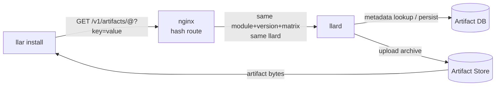

# Cloud Build Design

## Goal

`llar install` should obtain build artifacts from cloud build infrastructure
instead of building on the user's machine. The user-facing goal is remote
prebuilt installation:

```text
local cache hit
  use the existing LLAR local cache

local cache miss
  ask cloud build for an artifact
```

`llar make` remains the build command. Cloud build does not redefine formula
semantics, module loading semantics, matrix propagation, local install
directories, or cache metadata.

## Roles

The simplified cloud build system has four roles:



- **Client**: `llar install`. It sends one artifact request for one
  `module@version` plus matrix query, consumes the command JSON line response stream,
  downloads returned artifacts, and writes install directories and
  `.cache.json`.
- **nginx**: Routes `GET /v1/artifacts/...` by hashing the request identity. The
  same module, version, and matrix query should reach the same llard instance while
  that llard is healthy.
- **llard**: Owns HTTP handling, local active build entries,
  build execution, info fanout, artifact upload, and completed artifact
  metadata persistence.
- **Artifact store**: Stores archive bytes. GHCR is the default backend. The
  artifact DB stores completed artifact metadata. Artifact bytes do not flow
  through the DB.

Public GHCR blob downloads use `Authorization: Bearer QQ==`.
Publish credentials are provided by llard runtime, such as GitHub Actions
`GITHUB_TOKEN`; they are not part of the public build API.

There is no Scheduler, dispatcher, queue, Redis building key, Asynq task,
client WebSocket, agent WebSocket, VM module, or pending jobs table in this
design.

## Request Identity

The routing and artifact identity are carried by the request path and matrix
query:

```http
GET /v1/artifacts/<module>@<version>?key=value
```

Examples:

```http
GET /v1/artifacts/madler/zlib@v1.3.1?arch=amd64&os=linux
GET /v1/artifacts/pnggroup/libpng@v1.6.47?arch=amd64&os=linux&debug=false
```

The query string carries selected matrix values in the same natural shape as
the LLAR matrix CLI: `key=value`. It is not a serialized `formula.Matrix`
value and it does not expose `Require` or `Options` in the wire protocol.
The exact mapping from these values to LLAR's internal matrix representation is
owned by the LLAR build path. The artifact key remains `module + version +
matrixStr`, where `matrixStr` is the canonical LLAR matrix string for the
selected values. Query parameter order must not change the artifact key. `llar
install` sends the selected matrix values directly; it does not send a JSON
body or a routing header.

## Public API

Cloud build has one public build endpoint:

```http
GET /v1/artifacts/<module>@<version>?<matrix query>
```

Response headers:

```http
Content-Type: application/x-cmdjsonl
```

The response body uses the [`cmdjsonl`](https://github.com/qiniu/x/blob/main/cmdjsonl/README.md) format.

Supported commands are `info`, `artifact`, and `error`.

```go
type Info struct {
	Stream string `json:"stream,omitempty"`
	Text   string `json:"text"`
}

type ArtifactSet struct {
	Artifacts []TargetArtifact `json:"artifacts"`
}

type TargetArtifact struct {
	Target   string   `json:"target"` // module@version
	Artifact Artifact `json:"artifact"`
}

type Artifact struct {
	Source   ArtifactSource `json:"source"`
	Type     string         `json:"type"`     // zip | tar.gz | tar.zst
	Metadata string         `json:"metadata"` // LLAR build metadata, for example -lz
	Checksum string         `json:"checksum"` // sha256
}

type ArtifactSource struct {
	Type string `json:"type"` // artifact backend, for example ghcr
	URL  string `json:"url"`
}

type Error struct {
	Message string `json:"message"`
}
```

`ArtifactSet.Artifacts` is ordered for installation: dependencies first, the requested root artifact last. Each returned artifact uses the matrix selection from the request. The client combines each `target` with the request matrix to calculate the local install directory and `.cache.json` key.

Info message body:

```json
{
  "stream": "stderr",
  "text": "checking..."
}
```

Artifact message body:

```json
{
  "artifacts": [
    {
      "target": "madler/zlib@v1.3.1",
      "artifact": {
        "source": {
          "type": "ghcr",
          "url": "https://ghcr.io/v2/llar-artifacts/madler/zlib/blobs/sha256:2cf24dba5fb0a30e26e83b2ac5b9e29e1b161e5c1fa7425e73043362938b9824"
        },
        "type": "zip",
        "metadata": "-lz",
        "checksum": "2cf24dba5fb0a30e26e83b2ac5b9e29e1b161e5c1fa7425e73043362938b9824"
      }
    },
    {
      "target": "pnggroup/libpng@v1.6.47",
      "artifact": {
        "source": {
          "type": "ghcr",
          "url": "https://ghcr.io/v2/llar-artifacts/pnggroup/libpng/blobs/sha256:486ea46224d1bb4fb680f34f7c9ad96a8f24ec88be73ea8e5a6c65260e9cb8a7"
        },
        "type": "zip",
        "metadata": "-lpng",
        "checksum": "486ea46224d1bb4fb680f34f7c9ad96a8f24ec88be73ea8e5a6c65260e9cb8a7"
      }
    }
  ]
}
```

Error message body:

```json
{
  "message": "llar make failed"
}
```

Normal success stream:

```text
info {"stream":"stderr","text":"checking..."}
info {"stream":"stderr","text":"building..."}
artifact {"artifacts":[{"target":"madler/zlib@v1.3.1","artifact":{"source":{"type":"ghcr","url":"https://ghcr.io/v2/llar-artifacts/madler/zlib/blobs/sha256:2cf24dba5fb0a30e26e83b2ac5b9e29e1b161e5c1fa7425e73043362938b9824"},"type":"zip","metadata":"-lz","checksum":"2cf24dba5fb0a30e26e83b2ac5b9e29e1b161e5c1fa7425e73043362938b9824"}},{"target":"pnggroup/libpng@v1.6.47","artifact":{"source":{"type":"ghcr","url":"https://ghcr.io/v2/llar-artifacts/pnggroup/libpng/blobs/sha256:486ea46224d1bb4fb680f34f7c9ad96a8f24ec88be73ea8e5a6c65260e9cb8a7"},"type":"zip","metadata":"-lpng","checksum":"486ea46224d1bb4fb680f34f7c9ad96a8f24ec88be73ea8e5a6c65260e9cb8a7"}}]}
```

Clients parse each line by splitting at the first space. The command selects the response shape, and the JSON object is decoded into the corresponding structure. `info` lines are optional and may be ignored by clients that only care about the terminal `artifact` or `error`.

## Data Flow

### llar Install Remote Mode

`llar install` does not resolve formulas or dependency graphs for cloud
build requests. It submits one `module@version` and one matrix selection to the
llard, then consumes the returned command JSON line stream.

```text
1. llar install parses one `module@version` and one matrix selection.
2. llar install sends one `GET /v1/artifacts/<module>@<version>?<matrix query>` request.
3. llard returns command JSON lines with `info`, `artifact`, and `error`.
4. On `artifact`, the client iterates over `ArtifactSet.Artifacts` in order.
5. For each returned item, the client downloads `Artifact.Source`, verifies checksum,
   extracts the archive into that target's install directory, and writes `.cache.json`.
6. On `error`, the client returns the error to the caller.
```

The client does not resolve dependency graphs or submit multiple module
requests. It only bridges the user-facing install flow to llard protocol.

### Completed Artifact

```text
1. llar install resolves one `module@version` and one matrix selection.
2. llar install sends one `GET /v1/artifacts/<module>@<version>?<matrix query>` request.
3. nginx hashes the request identity and forwards the request to a llard.
4. llard parses module, version, and matrix query from the request URI.
5. llard calls artifact.Store.Get.
6. If the root artifact and its dependency artifacts exist, llard returns `artifact` with an ordered artifact set.
7. `llar install` downloads each returned `Artifact.Source` from the Artifact Store,
   verifies checksum, extracts into each target's local install directory, and writes
   `.cache.json`.
```

### Missing Artifact

```text
1. llard calls artifact.Store.Get and misses.
2. llard checks its local in-memory build entries by artifact identity.
3. If an entry exists, the request waits on that entry.
4. If no entry exists, llard creates one and starts a build.
5. The build executes the LLAR build path and writes raw info lines to the
   entry fanout.
6. The build uploads the completed archive through upload.
7. The build writes completed metadata through artifact.Store.Put.
8. After Put succeeds for the root and collected dependencies, the entry fans out `artifact` with an ordered artifact set to waiting requests.
9. llard removes the in-memory entry.
10. Clients download every returned Artifact.Source directly from the Artifact Store.
```

Completed artifact lookup always happens before local building-entry lookup.
After `artifact.Store.Put` succeeds, the entry is only a fanout object for
already-waiting requests and must not shadow the completed artifact. If a new
request arrives after `Put` but before entry deletion, it should hit the
artifact DB and return completed directly.

### Dependency Artifacts

The client submits only the root artifact request, but the terminal artifact response contains the dependency artifacts needed to install the root locally. Dependency handling belongs
inside the llard-side LLAR build path. When llard runs `llar make`, the
Builder resolves dependencies, checks local cache, checks artifact metadata,
downloads dependency artifacts when available, and builds missing dependencies
locally when needed.

This is not a global dependency build lock. The same dependency may be built
more than once when two root builds need it at the same time, either on the
same llard instance or on different llard instances. After a local dependency build finishes,
the Builder uploads the candidate artifact and calls `artifact.Store.Put`.
The Builder must use the artifact returned by `Put`; if another build already
stored an artifact for the same dependency key, the returned stored artifact
replaces the local candidate for the rest of the build.

### Multiple Workers

nginx hash routing gives active build affinity across llard instances:

```text
hash(request identity) -> llard
```

When a llard is healthy, requests for the same artifact key should reach the
same llard instance and share that instance's in-memory build entry.

If a llard restarts or is removed by nginx health checks, later requests may
fall back to another llard instance. The fallback llard instance uses the same logic: check the
artifact DB first, then build if the artifact is still missing. Duplicate builds
are acceptable in these failure windows. `artifact.Store.Put` is the final
consistency boundary.

## llard Project Modules

The `llard` service uses three internal modules plus `cmd/llard` glue:

```text
cmd/llard
internal/build
internal/artifact
internal/upload
```

### cmd/llard

`cmd/llard` owns HTTP concerns:

- start the Gin server;
- register `GET /v1/artifacts/<module>@<version>`;
- parse module name, version, and matrix query;
- call `internal/build`;
- wrap raw build logs into command JSON line `info` messages when streaming is enabled;
- write the terminal artifacts or error message.

`cmd/llard` does not own active build entry state, artifact DB semantics, or upload semantics.

### internal/build

`internal/build` owns llard-local build coordination and execution flow:

- completed artifact lookup before local entry lookup;
- artifact identity -> build entry in-memory coordination;
- waiting for an existing local build;
- starting a new local build when no entry exists;
- raw info fanout to waiting requests;
- invoking the LLAR build path;
- calling `upload` for archive bytes;
- calling `artifact.Store.Put` for completed metadata;
- removing local entries after terminal completion.

The module does not depend on Gin or HTTP. It does not JSON-encode protocol
messages. It writes only raw build output to the optional `io.Writer` provided
by the caller.

The `llard` build runner executes the real LLAR command:

```text
llar make -v -o <tmp>/artifact.zip <module>@<version> <matrix flags>
```

The generated archive is the upload input. The final LLAR metadata is taken
from the last non-empty stdout line. Earlier stdout and stderr output are raw
build output that `cmd/llard` wraps as `info`. This matches the current
`llar make -v` behavior, where build tool output and final metadata can both
appear on stdout.

Public interface:

```go
package build

type Target struct {
	Module  string
	Version string
}

type Matrix struct {
	Require map[string]string `json:"require"`
	Options map[string]string `json:"options,omitempty"`
}

type Request struct {
	Target    Target
	MatrixStr string
	Matrix    Matrix
}

type TargetArtifact struct {
	Target   string
	Artifact artifact.Artifact
}

type Result struct {
	Artifacts []TargetArtifact
}

type Builds struct {
	// internal state
}

func New(opts Options) *Builds
func (b *Builds) Build(ctx context.Context, req Request, log io.Writer) (Result, error)
```

`log` is optional:

```text
log == nil
  non-streaming request; Build waits and returns only the final Result/error.

log != nil
  streaming request; Build writes raw info text to log while waiting.
```

`Build` never writes terminal artifacts or error messages. The caller writes
the terminal artifact set from the returned `Result` or the terminal error from `error`.

### internal/artifact

`internal/artifact` owns completed artifact metadata. It does not upload,
download, unpack, calculate checksums, manage local build entries, or handle
HTTP.

```go
package artifact

type Key struct {
	Module    string
	Version   string
	MatrixStr string
}

type Artifact struct {
	Source   Source `json:"source"`
	Type     string `json:"type"`     // zip | tar.gz | tar.zst
	Metadata string `json:"metadata"` // LLAR build metadata, for example -lz
	Checksum string `json:"checksum"` // sha256
}

type Source struct {
	Type string `json:"type"` // artifact backend, for example ghcr
	URL  string `json:"url"`
}

type Store interface {
	Get(ctx context.Context, key Key) (Artifact, bool, error)
	Put(ctx context.Context, key Key, artifact Artifact) (Artifact, error)
	Delete(ctx context.Context, key Key) error
}
```

Artifact table:

```sql
CREATE TABLE artifacts (
  module      TEXT NOT NULL,
  version     TEXT NOT NULL,
  matrix_str  TEXT NOT NULL,
  source_type TEXT NOT NULL,
  source_url  TEXT NOT NULL,
  type        TEXT NOT NULL,
  metadata    TEXT NOT NULL,
  checksum    TEXT NOT NULL,
  created_at  TIMESTAMP NOT NULL,
  expires_at  TIMESTAMP NULL,
  PRIMARY KEY (module, version, matrix_str)
);
```

`Put` is atomic and canonicalizes the completed artifact:

```text
missing key
  insert artifact and return it

same key already exists
  return the existing stored artifact

database write/read failure
  return error
```

Callers must use the artifact returned by `Put`. They must not continue with a
locally produced candidate if `Put` returns an already stored artifact. This is
true even when the local candidate has a different checksum. The first stored
artifact is the canonical completed artifact for that key.

`Artifact.Source` describes how the client downloads archive bytes:

```text
http
  source.url is a direct HTTP file URL. The client downloads it with a normal
  GET.

ghcr
  source.url is a GitHub Container Registry blob URL. Public GHCR blob downloads
  use Authorization: Bearer QQ==. Private GHCR packages use client-local
  registry credentials. Credentials are never stored in Artifact.
```

For GHCR, completed artifacts use this storage shape:

```text
package = ghcr.io/<owner>/<target.module>
tag     = target.version
matrix  = OCI index manifest annotation org.llar.matrix = MatrixStr
blob    = artifact archive layer
```

For example, `pnggroup/libpng@v1.6.43` is published under:

```text
ghcr.io/<owner>/pnggroup/libpng:v1.6.43
```

The tag points to an OCI image index. Each matrix variant is an index manifest
entry. The index entry should fill standard OCI `platform.os` and
`platform.architecture` when those values are available, but LLAR artifact
matching uses the custom annotation:

```text
org.llar.matrix = <MatrixStr>
```

The uploader publishes the archive blob, writes or updates the version index,
and returns the final blob URL:

```text
https://ghcr.io/v2/<owner>/<target.module>/blobs/sha256:<digest>
```

### internal/upload

`internal/upload` owns artifact byte upload to the configured Artifact Store backend. GHCR is the default backend.

```go
package upload

type Options struct {
	Name  string
	Type  string // zip | tar.gz | tar.zst
	Attrs map[string]string
}

type Result struct {
	URL      string
	Size     int64
	Checksum string // sha256
}

type Uploader interface {
	Type() string
	Upload(ctx context.Context, r io.ReadSeeker, opts Options) (Result, error)
}

type GHCRConfig struct {
	Owner string
	Token string
}

func NewGHCR(cfg GHCRConfig) Uploader
```

`Uploader.Type()` is the artifact source type, for example `ghcr`.
`Options.Type` is the archive type, for example `zip`, `tar.gz`, or `tar.zst`.
`Upload` reads from the current `r` offset to EOF, computes SHA-256 and size,
seeks back to the original offset, uploads the same bytes, and returns
`Result{URL, Size, Checksum}`. It does not query or mutate the artifact DB and
does not manage build state.

For GHCR:

```text
Options.Name  = ghcr.io/<owner>/<module>:<version>
Options.Type  = zip
Options.Attrs = {"org.llar.matrix": "<matrixStr>"}
Result.URL    = https://ghcr.io/v2/<owner>/<module>/blobs/sha256:<digest>
```

`build` combines `Uploader.Type()`, upload URL, archive type, checksum, and
LLAR metadata into a candidate `artifact.Artifact`, then calls
`artifact.Store.Put`. The returned artifact is the canonical artifact used by
the caller.

## llar Client Behavior

`llar install` remains responsible for install semantics:

```text
1. Read one module name and version from the user request.
2. Read the matrix selection from the same request.
3. Send one `GET /v1/artifacts/<module>@<version>?<matrix query>` request.
4. Consume the command JSON line stream.
5. Print `info` lines if the caller requested streaming output.
6. Stop when an `artifact` or `error` message arrives.
7. On `artifact`, iterate over returned artifacts in order.
8. For each item, download `Artifact.Source`.
9. Verify checksum.
10. Extract into `installDir(target, request matrix)`.
11. Write `.cache.json` with LLAR metadata.
```

The client does not resolve dependency graphs or submit dependency jobs. It
acts as a protocol wrapper around one requested root artifact.

### llar-Side Interfaces

`llar install` should not create a shared protocol package with llard. The
llard keeps its own HTTP wire structs. The llar-side HTTP client lives in
`internal/remote`, where its request and response structs remain local to that
module.

The remote client shape is deliberately small:

```go
package remote

type Client struct {
	BaseURL string
	HTTP    *http.Client
	Verbose bool
}

type Source struct {
	Type string
	URL  string
}

type Artifact struct {
	Source   Source
	Type     string
	Metadata string
	Checksum string
}

type TargetArtifact struct {
	Target   string
	Artifact Artifact
}

type Submitter interface {
	Submit(ctx context.Context, target module.Version, matrix Matrix, log io.Writer) ([]TargetArtifact, error)
}
```

`Submit` maps to `GET /v1/artifacts/<module>@<version>?<matrix query>`. It
reads command JSON lines until one terminal `artifact` or `error` command
arrives. `info` command text is written to the provided writer when streaming
is enabled. The terminal `artifact` command returns all artifacts required for
local installation, dependencies first and root last.

The llar-side remote client is only a protocol wrapper. It does not resolve
dependencies, inspect formulas, decide build order, or manage artifact DB
state. llard-side artifact reuse belongs in the Builder cloud mode used by
`llar make` inside llard.

```text
llar install
  remote.Client.Submit
  download each returned Artifact.Source
  write each local installDir and .cache.json

llard llar make
  Builder resolves dependencies
  Builder checks local cache
  Builder checks artifact DB
  Builder builds and uploads misses
```

No approved design adds `LookupInstallCache`, `SaveInstallCache`, `BuildOrder`,
or `BuildRemote` as public APIs. If implementation needs helper functions, they
should remain local to the existing Builder flow unless a broader reuse case is
approved.

## Failure Boundaries

Request parsing errors return HTTP request errors before build execution:

```text
missing module or version in the request path
  400

invalid module or version in the request path
  400

missing matrix query
  400
```

If `artifact.Store.Get` fails, llard must not start a build. llard
returns an internal error because it cannot know whether the artifact already
exists.

Build-time failures return a failed terminal message:

```text
llar build failure
  error message

upload failure
  error message

artifact.Store.Put database error
  error message
```

`artifact.Store.Put` is the consistency boundary for completed artifacts.
Completed status is sent only after `Put` succeeds.

Client disconnect behavior:

```text
waiting client disconnects
  only that request stops waiting

first client disconnects after starting a build
  the shared llard-local build may continue

streaming writer fails
  remove that subscriber; do not fail the build or other subscribers
```

llard failure behavior:

```text
llard dies or is removed by nginx health checks
  later requests may reach another llard instance

fallback llard instance artifact DB hit
  return completed

fallback llard instance artifact DB miss
  build again
```

Duplicate builds across llard instances are acceptable in failure windows.

## Out Of Scope

- Global exactly-once build execution.
- Persistent pending job state.
- Redis, Asynq, or distributed locks.
- Client WebSocket wait API.
- Agent WebSocket control protocol.
- Scheduler-managed VM provisioning.
- New formula APIs.
- New `modules.Load` semantics.
- `sourceHash`, `formulaHash`, or lock-file reproducibility.
