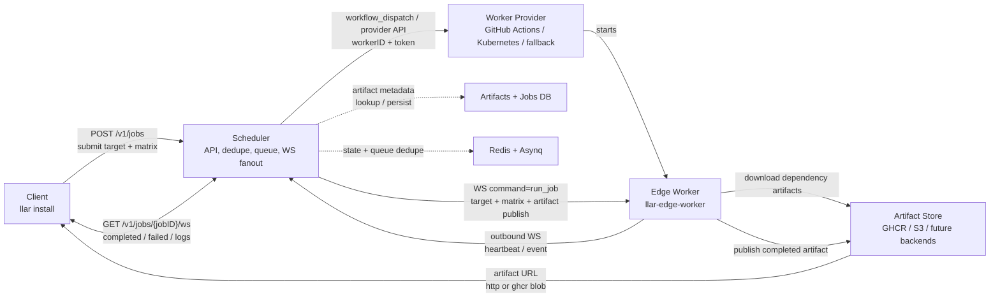

# Cloud Build Design

## Goal

`llar install` should obtain build artifacts from cloud build infrastructure
instead of building on the user's machine. `llar make` remains the local build
command and is also the build capability used by remote workers.

This design is intentionally scoped to cloud artifact orchestration. It must
not redefine formula semantics, module loading semantics, matrix propagation,
or `build.Builder` behavior.

## Roles

The cloud build system has four roles:



- **Client**: `llar install`. Resolves the requested module locally, computes
  the existing build order, submits each module build to the Scheduler, downloads
  artifacts, writes the local build cache, and prints the root metadata.
- **Scheduler**: Owns the public API, artifact lookup, active-job dedupe,
  queueing, worker provisioning, job state, and client WebSocket fanout. It can
  provision workers through GitHub Actions, Kubernetes, or a fallback provider,
  but it does not execute builds and does not initiate network connections to
  workers.
- **Edge Worker**: A provider-started `llar-edge-worker` process that executes
  build jobs. It starts with Scheduler connection credentials, opens an
  outbound control-plane WebSocket to the Scheduler, receives the job
  assignment, prepares dependency artifacts in its workspace, coordinates
  `llar make` as the build command, uploads the artifact, and streams logs/status
  back to the Scheduler.
- **Artifact Store**: Stores artifact archives. Clients and workers download
  archives from artifact URLs; workers upload completed archives. The initial
  backend can be GHCR, with S3-compatible and future backends hidden behind the
  same abstraction.

## Command Semantics

`llar make` is the build command.

- It can still be used locally.
- The Edge Worker invokes `llar make` in a controlled workspace.
- Existing build cache, workspace layout, and result selection are preserved.

`llar install` is the cloud artifact command.

- It does not build locally.
- It resolves dependencies locally and submits cloud build jobs in build order.
- It first checks the local build cache and skips remote work for local hits.
- It downloads each remote artifact into the existing workspace layout and writes
  the existing build cache metadata so later `llar make` sees a normal cache hit.
- It prints the root target metadata, matching `llar make`.
- With `-v`, it streams remote worker logs while waiting for pending jobs.

## Matrix Handling

The cloud API receives a structured matrix selection, not the internal matrix
string.

```go
type MatrixSelection struct {
	Require map[string]string `json:"require"`
	Options map[string]string `json:"options,omitempty"`
}
```

`MatrixSelection` must be complete when sent to the Scheduler. The client is
responsible for filling defaults, including the host matrix when the user did
not pass matrix flags. The Scheduler validates the matrix but does not infer
missing values from its own host.

Internally, `MatrixSelection` is converted to the existing `formula.Matrix`
shape by wrapping each selected value in a single-element slice. The internal
`MatrixStr` is:

```text
formula.Matrix.Combinations()[0]
```

`MatrixStr` is used for artifact keys, active-job dedupe, `modules.Options`,
`build.Options`, workspace install directories, and build cache keys. The API
does not expose `MatrixStr`.

Cloud build does not redefine matrix behavior. It only converts the API matrix
selection into the existing `MatrixStr` and passes that into the existing
`modules` and `build` APIs.

## Public API

### Submit Job

```text
POST /v1/jobs
```

Request:

```go
type SubmitJobRequest struct {
	Target Target          `json:"target"`
	Matrix MatrixSelection `json:"matrix"`
}

type Target struct {
	Module  string `json:"module"`
	Version string `json:"version"`
}
```

`Target.Version` is required. If the user omits a version in the CLI, the
client resolves it before submitting the request.

Response:

```go
type SubmitJobResponse struct {
	Target   Target    `json:"target"`
	Status   string    `json:"status"` // ready | pending
	JobID    string    `json:"jobID,omitempty"`
	Artifact *Artifact `json:"artifact,omitempty"`
}

type Artifact struct {
	URL      string `json:"url"`
	Type     string `json:"type"`     // zip | tar.gz | tar.zst
	Storage  string `json:"storage"`  // http | ghcr
	Metadata string `json:"metadata"`
	Checksum string `json:"checksum"` // SHA-256 of archive bytes
}
```

Response constraints:

```text
status=ready   -> artifact required
status=pending -> jobID required
```

Scheduler behavior:

```text
1. Convert the request target + matrix into ArtifactKey.
2. Read Redis artifact state.
3. If Redis state is building(jobID):
   return pending + jobID.
4. If Redis state is completed:
   read artifacts by ArtifactKey.
   if artifact exists, return ready + artifact.
   if artifact is missing, delete the stale Redis state and continue.
5. If Redis state is missing:
   read artifacts by ArtifactKey.
   if artifact exists, write Redis completed and return ready + artifact.
6. Create or reuse a pending job for ArtifactKey.
7. Write Redis building(jobID).
8. Enqueue the Asynq provisioning task with TaskID=ArtifactKey.String().
9. Return pending + jobID.
```

The internal artifact key is:

```go
type ArtifactKey struct {
	Module    string
	Version   string
	MatrixStr string
}
```

`ArtifactKey.String()` uses the internal form:

```text
<module>@<version>#<matrixStr>
```

This string is used for Redis artifact state keys and Asynq task IDs. It is an
internal representation; the public API still accepts structured target and
matrix fields.

## Redis and Asynq Dedupe

Redis is used for build-state dedupe, not as an artifact metadata cache. It does
not store artifact URL, type, metadata, or checksum. The artifact database
remains the source of truth for completed artifact metadata.

For each artifact key, the Scheduler maintains a Redis state key:

```text
artifact:state:<ArtifactKey.String()> = building(jobID) | completed
```

State meaning:

```text
building
  A job is already building this artifact key. Repeated submit requests return
  pending + jobID without creating another job.

completed
  This artifact key was recently completed. Submit requests query the artifact
  database and return ready + artifact when the database record exists.

missing Redis key
  Redis has no current state for this artifact key. The Scheduler queries the
  artifact database. If the artifact exists, it restores completed state in
  Redis and returns ready. If it does not exist, it creates a new job.
```

The `building` state uses a short TTL tied to the maximum build/attempt timeout
so crashed workers cannot block a key forever. The `completed` state uses a long
TTL and may rely on Redis eviction policy to let cold artifact keys disappear.

Completed Redis state is written only after the Scheduler has successfully
recorded the artifact in the artifact database. If a completed Redis state is
found but the artifact database has no matching artifact, the Scheduler treats
the Redis state as stale, deletes it, and continues through normal job creation.

Asynq is used as the lightweight Redis-backed queue for worker provisioning
tasks. Provision tasks use `ArtifactKey.String()` as their Asynq task ID, so the
queue also dedupes repeated provisioning for the same artifact key. Asynq task
state is not job state: a successful Asynq task only means a worker was
provisioned, not that the build completed.

## Persistent State

Persistent state exists to recover client job waits, worker reconnects, and
completed artifacts across Scheduler restart. Redis and Asynq are fast-path
coordination tools, not the only source of truth.

### Artifacts Table

`artifacts` stores completed artifact metadata. It is queried by
`module/version/matrix_str`.

```sql
CREATE TABLE artifacts (
  module      TEXT NOT NULL,
  version     TEXT NOT NULL,
  matrix_str  TEXT NOT NULL,

  url         TEXT NOT NULL,
  type        TEXT NOT NULL,
  metadata    TEXT NOT NULL,
  checksum    TEXT NOT NULL,

  created_at  TIMESTAMP NOT NULL,
  expires_at  TIMESTAMP NULL,

  PRIMARY KEY (module, version, matrix_str)
);
```

Artifact rows are immutable for a given primary key. When a worker submits a
completed artifact:

```text
missing row:
  insert artifact

existing row with same checksum:
  treat as idempotent success

existing row with different checksum:
  fail the job with 409 Conflict and do not overwrite the artifact
```

If the same module/version/matrix produces a different checksum, the package
should publish a new version instead of replacing the old artifact.

### Jobs Table

`jobs` stores the client-visible build request. `job_id` is the client's
recovery handle for `/v1/jobs/{jobID}/ws`.

```sql
CREATE TABLE jobs (
  job_id             TEXT PRIMARY KEY,

  module             TEXT NOT NULL,
  version            TEXT NOT NULL,
  matrix_str         TEXT NOT NULL,

  current_worker_id  TEXT NULL,
  state              TEXT NOT NULL, -- pending | completed | failed

  error_status       INTEGER NULL,
  error_message      TEXT NULL,

  created_at         TIMESTAMP NOT NULL,
  finished_at        TIMESTAMP NULL
);
```

`jobs.current_worker_id` points to the worker currently responsible for the job.
It is used to validate worker log/status messages and to recover client
subscriptions after reconnect. A job only accepts terminal status from its
current worker.

At most one pending job may exist for the same `module/version/matrix_str` at a
time. The Scheduler should enforce this with a transaction or a partial unique
index on pending jobs. Historical completed/failed jobs may remain for
diagnostics.

### Workers Table

`workers` stores Scheduler-created worker identities. Provider IDs are external
provider handles, not Scheduler identities.

```sql
CREATE TABLE workers (
  worker_id        TEXT PRIMARY KEY,

  state            TEXT NOT NULL, -- created | connected | reconnecting | closed

  provider         TEXT NOT NULL,
  provider_id      TEXT NULL,

  token_hash       TEXT NOT NULL,

  created_at       TIMESTAMP NOT NULL,
  connected_at     TIMESTAMP NULL,
  disconnected_at  TIMESTAMP NULL,
  closed_at        TIMESTAMP NULL
);
```

`worker_id` is the Scheduler identity used for worker WebSocket registration and
job assignment. `provider_id` is the external ID returned by the provider, such
as a GitHub Actions run ID, Kubernetes job/pod name, or VM instance ID.

Worker reconnect validation uses `worker_id + token`, `state`, and
`disconnected_at`:

```text
state=connected:
  worker has an active Scheduler WebSocket

state=reconnecting:
  worker disconnected; it may reconnect if now - disconnected_at <= 150 seconds

state=closed:
  worker is no longer accepted; later reconnects or results are rejected
```

Jobs assigned to a worker are found through:

```sql
SELECT job_id FROM jobs
WHERE current_worker_id = ?
  AND state = 'pending';
```

## Artifact Store Abstraction

The design does not choose a concrete object storage backend or upload
mechanism. S3-compatible storage, GitHub Releases, GitHub Packages, local
storage, and future backends are implementation choices behind an internal
artifact store abstraction.

The public API exposes completed artifacts as `Artifact{URL, Type, Storage,
Metadata, Checksum}`. Clients download from `Artifact.URL`. `Artifact.Storage`
selects the download behavior:

```text
http
  URL is a direct HTTP file URL. The client downloads it with a normal GET.

ghcr
  URL is a GitHub Container Registry blob URL. The client downloads it with the
  same style Homebrew uses for bottles:

  Authorization: Bearer QQ==

  Private GHCR packages may override this with client-local registry
  credentials. Credentials are never stored in Artifact.
```

The Scheduler uses the artifact store abstraction for artifact lookup and for
publishing completed artifact metadata. The Edge Worker uses provider-specific
upload capability supplied through that abstraction. The upload path may be a
direct object-storage upload, a GitHub Release asset upload, GHCR OCI publish,
or another backend-specific mechanism.

Those storage details must not leak into the public job protocol. For cloud
build orchestration, the only stable contract is:

```text
artifact key -> maybe completed Artifact
completed build output -> completed Artifact
```

`Artifact.URL` must be usable by clients when `POST /v1/jobs` returns
`status=ready` or when a job WebSocket reports `completed`. The Scheduler must
not proxy artifact downloads; artifact bytes flow from the artifact backend to
the client.

### GHCR Artifact Store

GitHub Container Registry is supported using the same shape as Homebrew bottles.
The mapping is:

```text
package = ghcr.io/<owner>/<target.module>
tag     = target.version
matrix  = OCI index manifest annotation org.llar.matrix = MatrixStr
blob    = artifact archive layer
```

For example, `pnggroup/libpng@v1.6.43` is published under:

```text
ghcr.io/<owner>/pnggroup/libpng:v1.6.43
```

The tag points to an OCI image index. Each matrix variant is an index manifest
entry. The index entry SHOULD fill standard OCI `platform.os` and
`platform.architecture` when those values are available, but llar artifact
matching uses the custom annotation:

```text
org.llar.matrix = <MatrixStr>
```

The worker uploads the archive blob, writes or updates the version index, and
reports the final blob URL:

```text
https://ghcr.io/v2/<owner>/<target.module>/blobs/sha256:<digest>
```

Public GHCR packages must be pre-created or made public manually before clients
can use anonymous downloads. For public packages, clients send
`Authorization: Bearer QQ==`. Private GHCR packages use client-local registry
credentials. Publish credentials are provided by the worker runtime, such as
GitHub Actions `GITHUB_TOKEN` or provider-injected secrets; they are not sent
through the Scheduler protocol.

### Client Job WebSocket

```text
GET /v1/jobs/{jobID}/ws?verbose=true|false
```

The connection is bound to a single job. The Scheduler broadcasts the job's
terminal status to all subscribers. When `verbose=true`, it also forwards worker
logs.

The Scheduler sends two message shapes.

```go
type StatusMessage struct {
	Type  string     `json:"type"`  // status
	State JobState   `json:"state"` // completed | failed
	Body  StatusBody `json:"body"`
}

type JobState string

const (
	JobCompleted JobState = "completed"
	JobFailed    JobState = "failed"
)

type StatusBody struct {
	Artifact *Artifact `json:"artifact,omitempty"` // completed
	Status   int       `json:"status,omitempty"`   // failed, HTTP-style status
	Message  string    `json:"message,omitempty"`  // failed
}
```

```go
type LogMessage struct {
	Type string  `json:"type"` // log
	Data LogData `json:"data"`
}

type LogData struct {
	Stream string `json:"stream,omitempty"` // stdout | stderr
	Text   string `json:"text"`             // UTF-8, ANSI preserved
}
```

The WebSocket does not send progress. Without verbose logs, the client waits
for `completed` or `failed`. After sending a terminal status, the Scheduler
closes the connection.

### Job Log Window

Worker logs are required for diagnostics, but log volume must not compete with
Redis queue/dedupe traffic in the initial design. The Scheduler keeps a
best-effort in-memory log window per job.

Default behavior:

```text
capacity
  1024 log fragments per job.

append
  Each worker log fragment is appended to the job's in-memory ring buffer.

eviction
  When the ring is full, the oldest fragments are dropped.

verbose reconnect
  A verbose client connection replays the current ring buffer before receiving
  live log fragments.

non-verbose
  Non-verbose clients do not receive log fragments.
```

The log window is not a source of truth. It may be lost on Scheduler restart and
is not required for job recovery. Completed/failed job status and artifacts are
recovered from persistent state; logs are diagnostic only.

The storage behind this log window should remain replaceable. Future
implementations may move the same sliding-window semantics to Redis List,
Redis Stream, or a dedicated log backend without changing the client WebSocket
message shapes.

### HTTP Errors

Synchronous API errors use HTTP status codes and a simple body:

```go
type ErrorResponse struct {
	Message string `json:"message"`
}
```

Initial status set:

```text
400 Bad Request
  malformed JSON, missing target/matrix fields, empty matrix values

404 Not Found
  unknown job, missing artifact object

409 Conflict
  inconsistent artifact/job state for an artifact key

424 Failed Dependency
  worker cannot find a required dependency artifact

500 Internal Server Error
  unexpected scheduler or worker error
```

Asynchronous job failures are sent over the client WebSocket as
`StatusMessage{State: failed}` with `body.status` and `body.message`. The
status value uses HTTP status code semantics.

## Worker Control Plane

The Scheduler owns the queue and provisions Edge Workers. The Edge Worker is an
execution agent. A worker may execute multiple independent jobs over its
lifetime, but it is not a long-lived worker pool member.

Workers are not public HTTP/WebSocket servers. The network direction is always:

```text
Edge Worker -> Scheduler
```

When the Scheduler decides to run a queued job and has no suitable active worker,
it creates a worker identity and token, then starts a worker through the selected
provider:

```text
GitHub Actions workflow_dispatch: scheduler URL + worker ID + worker token as inputs
Kubernetes Job/Pod: scheduler URL + worker ID + worker token as environment variables
Fallback provider: equivalent worker launch metadata
```

The worker starts and opens an authenticated outbound WebSocket to the
Scheduler:

```text
GET /v1/workers/{workerID}/ws
Authorization: Bearer <worker_token>
```

This is an internal control-plane endpoint. Authentication happens before the
HTTP upgrade completes. Failed authentication returns an HTTP error and does not
create a WebSocket. The exact URL can change, but the direction must not:
workers connect to the Scheduler, not the other way around.

After authenticating the worker ID/token, the Scheduler records the worker as
connected. The worker periodically sends resource heartbeats. The first
heartbeat gates scheduling eligibility: the Scheduler must not send commands to
a connection until it has received at least one heartbeat. Heartbeats are not an
application-level liveness check. The Scheduler does not close a healthy TCP
connection merely because heartbeats are late or missing; connection liveness is
determined by TCP keepalive and WebSocket read/write errors.

Worker WebSocket messages have three top-level types:

```text
heartbeat  worker -> scheduler
command    scheduler -> worker
event      worker -> scheduler
```

There is no `register` message. Successful WebSocket upgrade is worker
registration. There is no command ack. If a connection is lost and later
restored inside the reconnect window, the Scheduler may re-send still-pending
commands for the same worker.

The Scheduler owns concurrency and lifecycle limits; workers do not choose their
own limits. The Scheduler may send commands while the worker is eligible to
accept work.

```go
type WorkerHeartbeatMessage struct {
	Type        string          `json:"type"` // heartbeat
	RunningJobs int             `json:"runningJobs"`
	Resources   WorkerResources `json:"resources"`
}

type WorkerResources struct {
	CPUUsage    float64 `json:"cpuUsage"`    // 0.0-1.0
	CPUCores    int     `json:"cpuCores"`
	MemoryUsage float64 `json:"memoryUsage"` // 0.0-1.0
	MemoryTotal int64   `json:"memoryTotal"` // bytes
	DiskUsage   float64 `json:"diskUsage"`   // 0.0-1.0
}

type WorkerCommandMessage struct {
	Type    string            `json:"type"`    // command
	Command string            `json:"command"` // run_job
	Body    RunJobCommandBody `json:"body"`
}

type RunJobCommandBody struct {
	Target   Target          `json:"target"`
	Matrix   MatrixSelection `json:"matrix"`
	Artifact ArtifactSpec    `json:"artifact"`
}

type ArtifactSpec struct {
	Type    string      `json:"type"` // zip | tar.gz | tar.zst
	Publish PublishSpec `json:"publish"`
}

type PublishSpec struct {
	Type   string `json:"type"`             // ghcr | s3_presigned_put | ...
	Config any    `json:"config,omitempty"` // type-specific; omitted for ghcr
}

type WorkerEventMessage struct {
	Type   string          `json:"type"`  // event
	Event  string          `json:"event"` // log | completed | failed
	Target Target          `json:"target"`
	Matrix MatrixSelection `json:"matrix"`
	Data   any             `json:"data"`
}

type WorkerLogEventData struct {
	Stream string `json:"stream,omitempty"` // stdout | stderr
	Text   string `json:"text"`             // UTF-8, ANSI preserved
}

type WorkerCompletedEventData struct {
	Artifact Artifact `json:"artifact"`
}

type WorkerFailedEventData struct {
	Status  int    `json:"status"`
	Message string `json:"message"`
}
```

Worker protocol does not expose `jobID`. Workers build artifacts identified by
`target + matrix`. The Scheduler maps each worker event back to the pending job
by converting `target + matrix` into the internal ArtifactKey and selecting the
pending job assigned to the current worker.

`run_job` does not carry `verbose`. Edge Workers always run `llar make -v` and
always stream stdout/stderr as `event=log`. The Scheduler stores logs in the
per-job ring and forwards them only to client subscribers connected with
`verbose=true`.

For `artifact.publish.type=ghcr`, `artifact.publish.config` is omitted. The
worker derives the GHCR package and tag from the command:

```text
package = ghcr.io/<owner>/<target.module>
tag     = target.version
matrix  = MatrixStr from command.matrix
```

`owner` and publish credentials are provided by the worker runtime. For GitHub
Actions, this normally comes from `GITHUB_REPOSITORY_OWNER`,
`GITHUB_ACTOR`, and `GITHUB_TOKEN` with `packages: write` permission. The
Scheduler does not receive or forward third-party publish credentials.

The Scheduler stores worker logs and forwards them only to verbose client
subscribers. Worker terminal events update the job record, update artifact
metadata on success, fan out terminal status to clients, close client WebSockets,
close the worker connection when the worker has no more running jobs, and
trigger provider cleanup when needed.

Worker reuse policy:

```text
maxConcurrency
  Scheduler-controlled. A worker may run at most this many jobs concurrently.
  It is bounded by CPU cores and resource headroom.

maxJobs
  Scheduler-controlled. A worker may execute at most this many jobs over its
  lifetime. The default cap is min(cpu cores, 4).

busy-only reuse
  A worker may receive a new job only while it already has at least one running
  job. If the worker has no running jobs, it must stop accepting work and be
  destroyed instead of waiting for future jobs.

independent jobs only
  Concurrent jobs on the same worker must be independent. The Scheduler must not
  assign jobs with dependency relationships to the same worker at the same time.
```

Every job assigned to a worker uses its own workspace and cache root. Completed
job workspaces are cleaned before the worker exits. This preserves `llar`
isolation even when a worker executes more than one job.

If a provisioned worker never connects or misses its reconnect window after
disconnecting before terminal status, the Scheduler keeps the original job IDs,
treats affected worker assignments as lost, and may provision replacement
workers. Client subscribers continue waiting on the same client WebSocket until
each job reaches `completed` or `failed`.

Worker disconnect recovery:

```text
1. Worker WebSocket disconnects.
2. Scheduler marks the worker as reconnecting and starts a 150 second reconnect
   timer.
3. Jobs assigned to that worker stay pending and keep the same jobID.
4. The Scheduler does not assign those jobs to another worker during the
   reconnect window.
```

If the worker reconnects within 150 seconds, it reconnects with the same worker
ID and worker token:

```text
GET /v1/workers/{workerID}/ws
Authorization: Bearer <worker_token>
```

The Scheduler recognizes the worker by `workerID + token`, verifies that the
worker is still in the reconnect window, and restores the worker connection. The
jobs remain assigned to the same worker, so later worker events for the same
target and matrix are mapped back to the pending jobs and fanned out to client
subscribers exactly as before. Clients that lost their own WebSocket reconnect
independently through `GET /v1/jobs/{jobID}/ws`; the recovery handle for
clients is always `jobID`, not worker ID.

If the worker does not reconnect within 150 seconds, the Scheduler reclaims it:

```text
1. Mark the worker unavailable.
2. Invalidate the worker token.
3. Unassign its pending jobs.
4. Requeue those jobs for other workers, keeping the original jobIDs.
```

Any later reconnect or result submission from a reclaimed worker is rejected.
A job accepts terminal status only from its currently assigned worker.

## Client Install Flow

`llar install` is responsible for dependency scheduling.

```text
1. Parse CLI target and matrix flags.
2. Resolve any omitted root version locally. SubmitJobRequest requires a version.
3. Convert matrix flags into a complete MatrixSelection.
4. Run modules.Load(root, MatrixStr) locally.
5. Use the same postorder build ordering as the existing build path.
6. For each module in build order:
   a. Check local build cache using existing build cache helpers.
   b. If local cache hit, skip remote work.
   c. Submit POST /v1/jobs for that module.
   d. If ready, download the artifact.
   e. If pending, open /v1/jobs/{jobID}/ws and wait for completed/failed.
   f. Verify artifact checksum.
   g. Extract artifact into the existing installDir for module/version/MatrixStr.
   h. Write cache metadata through the same helpers/format used by build.Builder.
7. Print the root module metadata.
```

The client does not submit dependency metadata or BuildList to the Scheduler.
It schedules modules one at a time in build order. Future concurrency can submit
independent modules concurrently without changing the public job API.

Dependency scheduling is client-owned. The Scheduler does not recursively submit
dependency jobs. The Edge Worker resolves dependencies only to prepare its local
build workspace; dependency artifacts are prerequisites for `run_job`. If a
required dependency artifact is missing, the worker reports `event=failed` with
status `424`.

## Edge Worker Runtime

`llar-edge-worker` is a separate program from the user-facing `llar` CLI. It
owns Scheduler connectivity and cloud coordination. `llar make` remains a
protocol-free local build command and must not know about Scheduler URLs,
worker tokens, job IDs, WebSockets, provider selection, or artifact publishing.

Each `llar-edge-worker` process can execute multiple independent targets within
its lifetime, subject to Scheduler-controlled `maxConcurrency`, `maxJobs`, and
the busy-only reuse policy. The initial implementation may set
`maxConcurrency=1`, but the protocol does not require one worker per job.

```text
1. Start with Scheduler URL, worker ID, and worker token from the worker provider.
2. Open the outbound worker WebSocket to the Scheduler.
3. Send worker heartbeats with resource facts.
4. Receive `command=run_job` from the Scheduler.
5. Prepare an isolated per-job workspace.
6. Resolve the target enough to identify direct dependency artifacts required by
   this build.
7. For each required dependency artifact:
   a. Require its artifact to exist in the artifact store.
   b. Download it into the worker workspace installDir.
   c. Write dependency cache metadata using the existing build cache format.
8. Execute `llar make -v <module>@<version>` with the assigned matrix and
   workspace.
9. Stream child process stdout/stderr to the Scheduler as worker log messages.
10. If `llar make` exits non-zero, report failed with the mapped status/message.
11. If `llar make` succeeds, locate the target installDir in the workspace.
12. Package installDir contents as an artifact archive.
13. Upload the archive through the artifact store abstraction.
14. Report completed with Artifact{URL, Type, Storage, Metadata, Checksum}.
15. If no jobs remain running, stop accepting new work and exit.
```

The artifact archive contains the install directory contents only:

```text
include/...
lib/...
```

It does not contain a wrapper directory and does not contain `.cache.json`.
Cache metadata is materialized by the client or worker when the artifact is
installed into a workspace.

If a dependency artifact is missing, the worker reports failed with status
`424`. Official clients should not hit this path when they submit modules in
build order, but the worker still validates dependencies to handle manual API
calls, artifact expiry, and race conditions.

## Non-Goals

- Do not change formula APIs.
- Do not change `modules.Load` semantics.
- Do not change `build.Builder` ordering, cache-hit behavior, or result
  selection.
- Do not put Scheduler protocol, worker token handling, WebSocket handling, or
  artifact publishing into `llar make`.
- Do not add `sourceHash`, `formulaHash`, or lock-file based reproducibility in
  this design.
- Do not make Edge Workers public API servers. Workers are internal build
  executors that call back to the Scheduler over outbound connections.

## Open Questions

- Exact worker provider priority and fallback policy: GitHub Actions first,
  Kubernetes capacity, or other providers.
- Exact Kubernetes resource model: Job vs Pod, timeout, and cleanup.
- Worker token format, lifetime, rotation, and retry behavior.
- Worker authentication with the Scheduler and object storage.
- Client authentication with the Scheduler.
- Artifact retention, eviction, and metadata persistence.
- Whether future install concurrency should use DAG layers or a bounded worker
  pool on the client side.
