# llar Cloud Build Architecture

## Background

LLAR is a cloud-based multi-language package manager built with XGo. It manages C/C++ and other native libraries through declarative formula files. A formula describes how to resolve dependencies through `onRequire` and how to build a library through `onBuild`.

Today the main user-facing command is `llar make`. It resolves the requested module, loads formulas, resolves dependencies with MVS, builds dependencies before dependents, downloads source code, runs formula build hooks, and records the result in LLAR's local build cache.

`llar install` adds the prebuilt-artifact path for the same package manager. It should install a completed artifact when one exists, and ask cloud build to produce one when it does not. It must still look like LLAR to the user: module resolution, matrix selection, dependency order, install directories, cache metadata, and result selection stay in `llar`.

Cloud build changes only the cache-miss action.

```text
llar make
cache miss -> run OnBuild locally
llar install
cache miss -> ask Scheduler for a completed artifact or a remote build
```

`llar make` remains the build command. The remote executor runs `llar make`; it does not reimplement formula logic and it does not become a public build API.

## Goals

This design defines how LLAR implements `llar install` with cloud-built artifacts.

The system should support two install paths:

- If the requested artifact already exists, `llar install` downloads it from the artifact backend and installs it into the local LLAR cache.
- If the requested artifact does not exist, `llar install` asks the Scheduler to create a remote build. The Scheduler dispatches the build to an agent, the agent produces and uploads the artifact, and `llar install` downloads the completed artifact.

The goal is to make cloud build a cache-miss path for `llar install`. Local resolution, dependency order, matrix selection, install directories, and cache metadata remain owned by LLAR. Remote execution only produces the missing artifact.

This design does not add `sourceHash`, `formulaHash`, lock-file reproducibility, new formula APIs, or new `modules.Load` semantics.

## Architecture At A Glance

The runtime has five layers. The important boundary is that `llar` owns install behavior, the Scheduler owns coordination, the agent owns execution, and the artifact backend owns bytes.

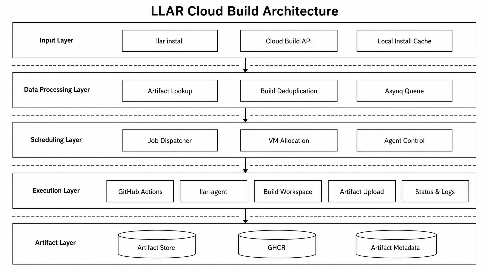

The top-level data flow is:

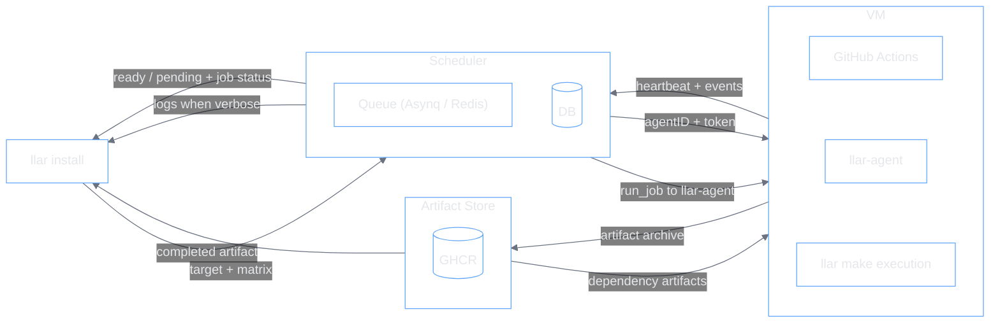

## Concepts

### Package Identity

- **Target**: the module and version LLAR wants to install or build, for example `pnggroup/libpng@v1.6.47`.
- **Matrix**: the existing `formula.Matrix` shape used by LLAR to describe the build variant, such as OS and architecture. Public APIs pass the structured matrix, not `MatrixStr`.
- **MatrixStr**: the internal build-cache key derived from `formula.Matrix.Combinations()[0]`.
- **ArtifactKey**: the identity of one build output, derived from `module + version + matrixStr`. Dedupe and artifact lookup use this key.

### Artifact Model

- **Artifact**: the completed prebuilt package that `llar install` can download and install. It contains the archive type, checksum, LLAR metadata such as pkg-config information, and a download source.
- **Artifact.Source**: the direct download description for artifact bytes. The Scheduler returns this metadata, but clients and agents download the bytes from the artifact backend directly.
- **LLAR metadata**: metadata produced by LLAR for the built package, such as pkg-config flags. It is not the dependency list.

### Build Coordination

- **JobID**: the client recovery handle returned by `POST /v1/jobs` and used by `/v1/jobs/{jobID}/ws`. It identifies the pending build from the client's point of view.
- **Scheduler**: the cloud service that accepts build requests, deduplicates pending work, dispatches agents, stores completed artifact metadata, and fans out job status to clients.
- **build**: the Scheduler module that owns pending build jobs, Redis building keys, Asynq task creation, client subscribers, log rings, and terminal fanout.
- **dispatcher**: the Scheduler loop that claims unassigned pending jobs and asks `vm` for an execution resource.
- **vm**: the Scheduler module that starts and stops provider resources. The initial provider path is GitHub Actions.

### Agent Runtime

- **Agent**: a provider-started `llar-agent` process connected to the Scheduler over an outbound WebSocket.
- **Scheduler-side agent**: the Scheduler module that encodes and decodes the agent WebSocket, serializes writes, and reports callbacks to Scheduler glue.
- **llar-agent**: the executable running on the provider resource. It receives `run_job`, prepares the workspace, downloads dependency artifacts, runs the LLAR build path, uploads the artifact, and reports logs or terminal status.

### Backends

- **Asynq**: the Redis-backed task queue used to hold pending build triggers.
- **Redis building key**: the hot in-progress index for an `ArtifactKey`. It lets later clients find the same pending `JobID` without creating another build.
- **GHCR**: GitHub Container Registry, the initial artifact byte backend.

## User Stories

### 1. Installing An Artifact That Already Exists

This is the cheapest path. The Scheduler only answers where the bytes are; the client downloads and materializes the artifact locally.

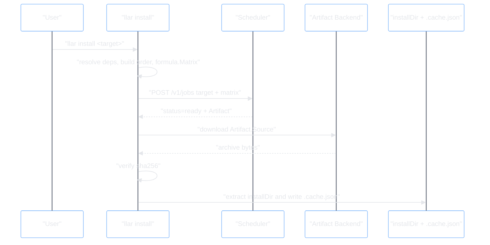

The last step is required. A downloaded artifact must be written to both the install directory and the cache metadata entry; otherwise later `llar make` cannot observe it as a cache hit.

### 2. Building A Missing Artifact

When no completed artifact exists, the Scheduler creates or reuses a pending job. The client waits on the job. The agent builds and uploads the artifact.

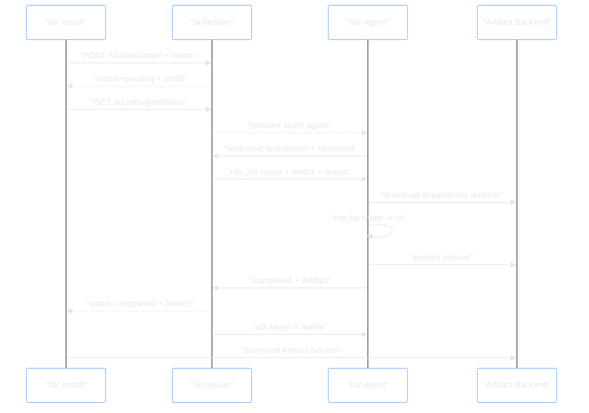

The client subscribes to a build job, not to an agent. That keeps client recovery simple when an agent reconnects or gets replaced.

### 3. Multiple Clients Ask For The Same Artifact

Active dedupe is keyed by `ArtifactKey`. Later clients do not create another build; they receive the same `jobID` and subscribe to the same build fanout.

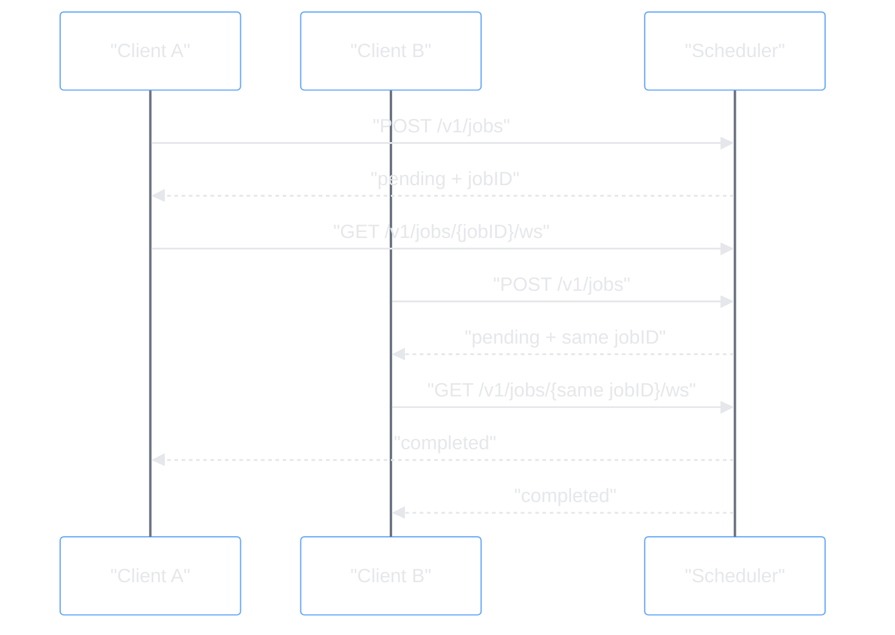

## How The Pieces Are Used

### llar

`llar install` uses the existing `build.Builder` in remote mode. It still owns dependency resolution and build order. For each module in that order, it checks the local cache first. Only a local cache miss calls `remote.Client.Submit`.

`remote.Client` is deliberately small:

- `Submit` maps to `POST /v1/jobs`.
- `Wait` maps to `/v1/jobs/{jobID}/ws`.

It does not resolve modules, calculate install directories, unpack artifacts, or write `.cache.json`. Those behaviors stay in `build.Builder` because they are part of install semantics, not HTTP protocol.

Inside `llar`, the cloud path is just a different cache-miss branch:

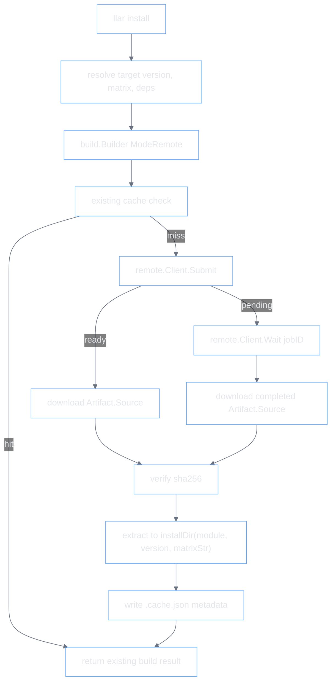

This diagram is the reason `remote.Client` stays small. It is only the network client used by the remote cache-miss branch; install state is still owned by `build.Builder`.

### Scheduler

The Scheduler has two public client responsibilities:

- answer `POST /v1/jobs` with either `ready + Artifact` or `pending + jobID`;
- keep `/v1/jobs/{jobID}/ws` open until the job completes or fails.

Internally, those responsibilities are split:

- `artifact` stores completed artifact metadata.
- `build` owns pending build runtime, Redis building keys, Asynq task creation, client subscribers, log rings, and terminal fanout.
- `dispatcher` claims unassigned pending jobs and chooses whether to reuse or start an agent.
- `agent` represents one connected agent WebSocket. It only encodes, decodes, serializes writes, and reports callbacks.
- `vm` starts and stops provider resources. An agent runs on a VM-like provider resource, one agent per resource. Gin resources stay in the Scheduler layer as glue. They parse HTTP/WebSocket requests, call the modules above, and render responses. They are not part of the `build`, `artifact`, or `agent` packages.

The top-level "missing artifact" story enters the Scheduler through three interfaces:

- `POST /v1/jobs` decides ready vs pending.
- `/v1/jobs/{jobID}/ws` waits for terminal status and optional logs.
- the agent WebSocket receives heartbeats/events and sends commands/acks.

#### Submit API

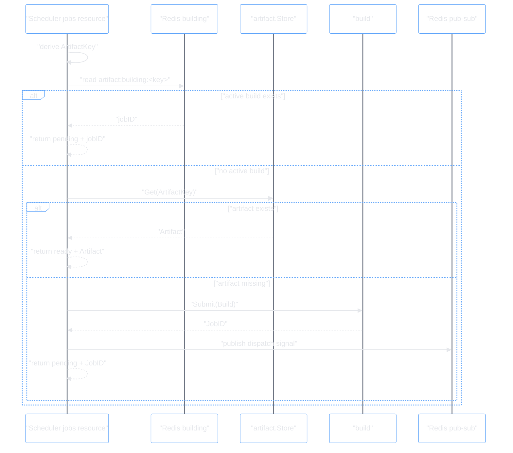

Redis is only the hot in-progress index. It does not store completed artifact URLs, metadata, checksum, or archive type. Completed artifact metadata comes from the artifacts table.

The pending path is deduped by `ArtifactKey`, so concurrent clients reuse the same build job instead of creating duplicate remote builds. The exact Redis, Asynq, and singleflight rules are implementation details covered by the cloud build spec.

#### Client Job WebSocket

The client WebSocket is attached to `jobID`, not to an agent. It is a build fanout subscription.

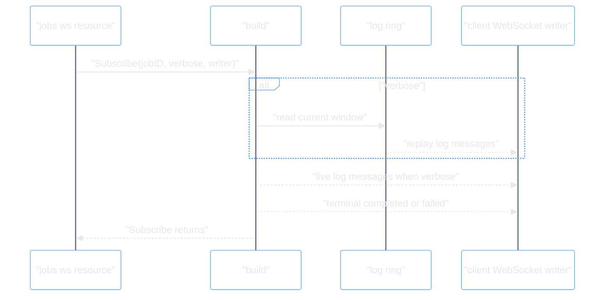

`build.Subscribe` does not know which agent is running the job. It only waits for `Job.Log`, `Job.Complete`, or `Job.Fail`.

#### Dispatch

The dispatch signal is intentionally small. It only wakes the dispatcher; it is not trusted as job data.

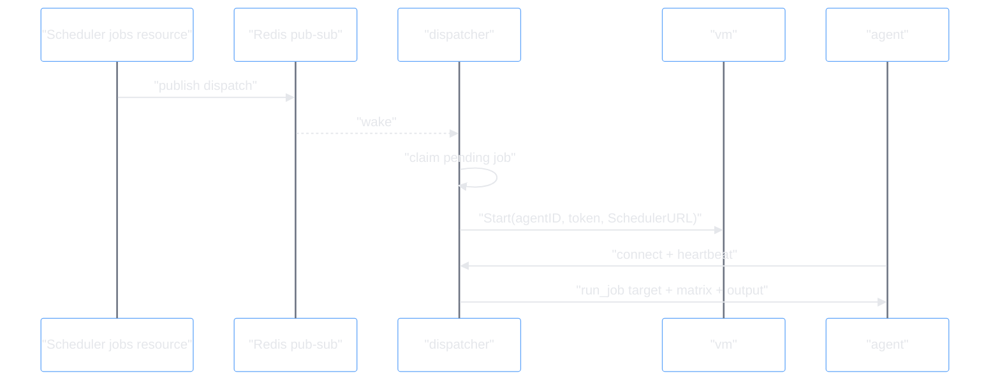

A low-frequency tick repairs missed wakeups by restoring missing Redis building keys and Asynq tasks from pending jobs, then publishing another dispatch signal. The tick does not directly assign agents.

GitHub Actions is the preferred initial provider path. The Scheduler still talks to it through `vm`, so Kubernetes or another provider can implement the same `start agent with Scheduler URL, agentID, and token` behavior later.

#### Agent Events

Agent event handling is Scheduler glue. The Scheduler-side `agent` package only decodes messages and invokes callbacks.

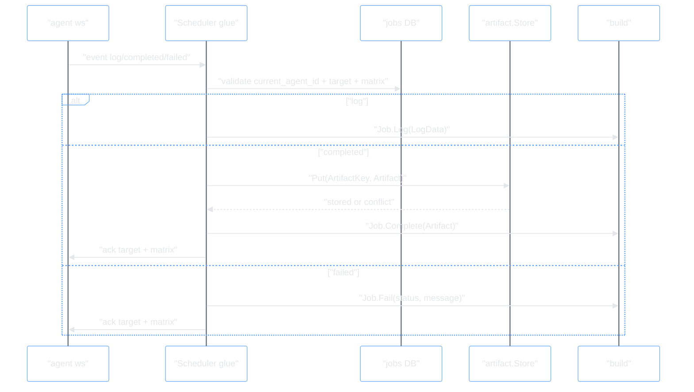

The `agent` package must not call `build` or `artifact`. Scheduler glue owns that boundary.

### Edge Agent

`llar-agent` is a separate program. It starts with Scheduler URL, agent ID, and token, then connects outbound to the Scheduler. After the first heartbeat, the Scheduler can send `run_job` commands.

For each command, the agent:

- prepares an isolated workspace;
- uses `modules.Load(target, matrixStr)` to find direct dependency artifacts;
- downloads dependency artifacts into that workspace and writes cache metadata;
- runs `llar make -v -o <tmp>/artifact.zip`;
- streams stderr as log events;
- keeps stdout as final build metadata;
- uploads the archive;
- sends completed or failed;
- waits for terminal ack.

Agents may run multiple independent jobs, but they are not a permanent pool.

The Scheduler controls concurrency, max job count, and busy-only reuse. If an agent has no running jobs, it should stop accepting new jobs and be cleaned up.

Inside the agent, the user story is one control loop plus one per-job execution path:

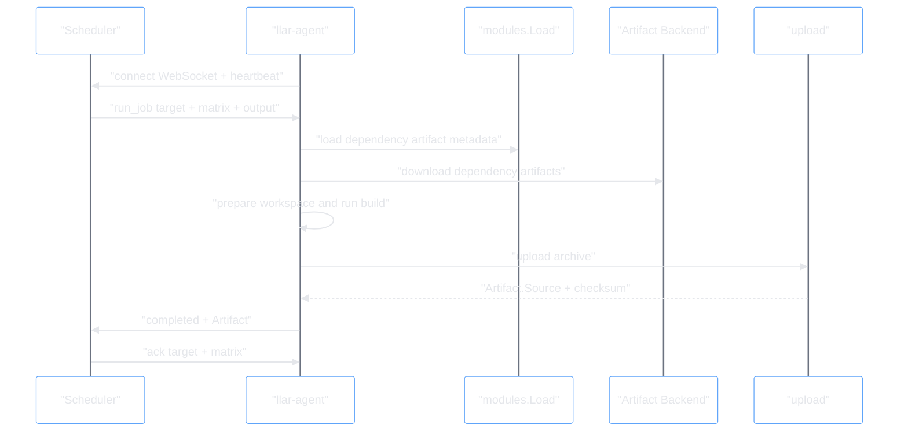

The agent does not need `jobID` for this flow. It executes `target + matrix`; the Scheduler maps events back to the pending job assigned to that agent.

### Artifact Backend

The backend stores bytes. The public artifact contract is only a download description:

```go
type Artifact struct {
	Source   ArtifactSource `json:"source"`
	Type     string         `json:"type"`
	Metadata string         `json:"metadata"`
	Checksum string         `json:"checksum"`
}

type ArtifactSource struct {
	Type string `json:"type"`
	URL  string `json:"url"`
}
```

The Scheduler stores this metadata, but does not proxy the archive. Clients and agents download directly from `Artifact.Source`.

For GHCR:

```text
package = ghcr.io/<owner>/<target.module>
tag = target.version
matrix = OCI index manifest annotation org.llar.matrix = MatrixStr
blob = artifact archive layer
```

Public GHCR blob downloads use `Authorization: Bearer QQ==`. Publish credentials come from the agent runtime, such as GitHub Actions `GITHUB_TOKEN`; they are not passed through the Scheduler protocol.

The artifact backend participates in the user story through metadata lookup and direct byte transfer:

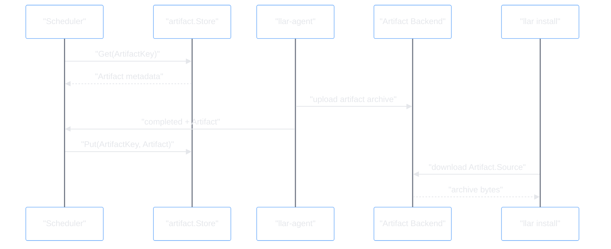

`artifact.Store` is metadata storage. It is not an upload API for clients and it does not proxy downloads.

## Important Boundaries

The design depends on these boundaries staying clear:

- The client submits builds in dependency build order. The Scheduler does not recursively submit dependency jobs.
- The agent may load dependencies to prepare its workspace, but dependency artifacts are expected to already exist because the client submitted in order.
- `build` does not write completed artifact metadata. Scheduler glue calls `artifact.Store.Put` first, then `Job.Complete`.
- The Scheduler-side `agent` package does not import `build` or `artifact`. Scheduler glue handles agent events and calls the correct modules.
- The agent protocol does not expose `jobID`. Agent messages identify work by `target + matrix`; the Scheduler maps that back to the assigned pending job.

## Failure And Recovery

### Client WebSocket Disconnect

Client recovery is based on `jobID`.

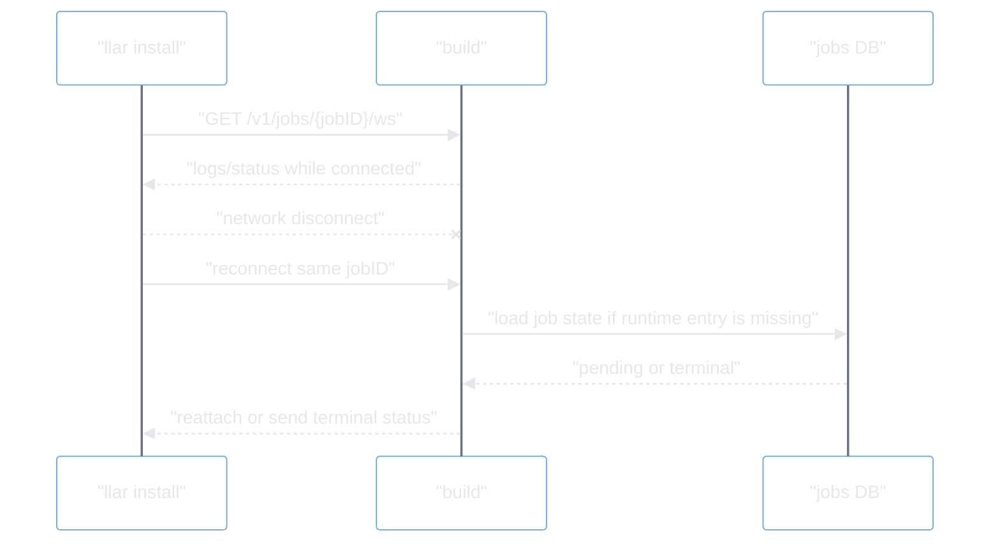

Subscribers and log rings are in memory. Losing them does not lose the job.

Verbose reconnect replays only the current log ring if it still exists.

### Scheduler Restart

Scheduler restart loses WebSocket connections, subscribers, log rings, active agent map, and local singleflight state. Persistent state is used to rebuild Scheduler runtime state.

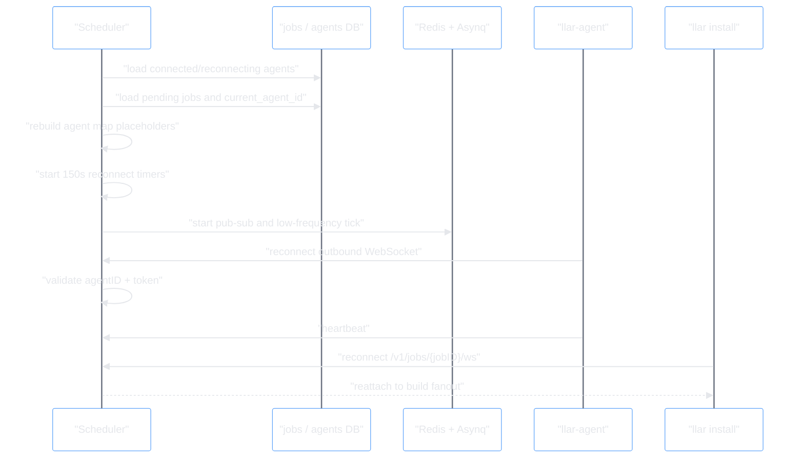

If an agent does not reconnect inside the 150 second window, its pending jobs are unassigned and requeued with the same `jobID`.

### Agent Disconnect

Agent recovery preserves pending job IDs. During the reconnect window, jobs assigned to that agent are not given to another agent.

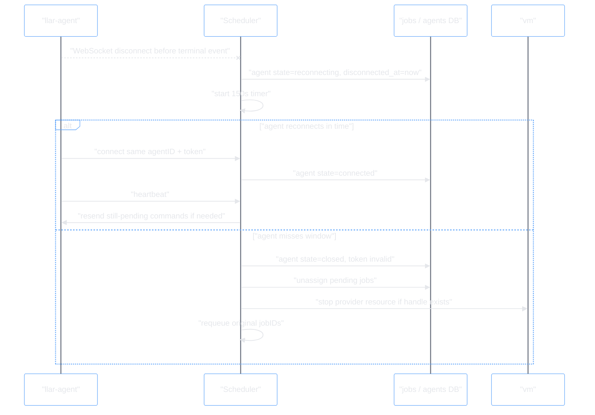

Late reconnects or late terminal events from a closed agent are rejected. A job accepts terminal status only from its currently assigned agent.

### Artifact Completion Ordering

Successful completion must be persisted in this order:

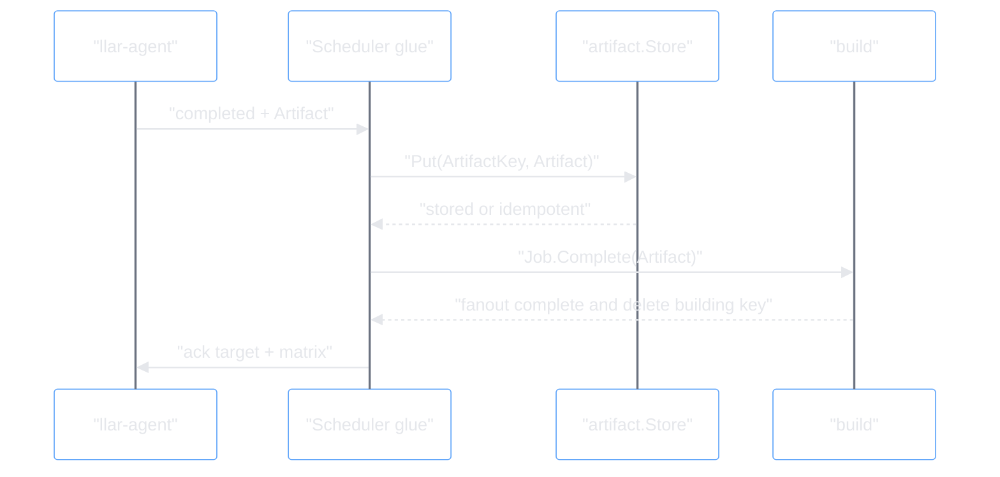

`Job.Complete` must not happen before `artifact.Store.Put`. Otherwise a new submit could see no building key and no completed artifact, then create a duplicate build.

### Internal Failure Policy

The initial policy is intentionally small:

- If pending job creation succeeds but Redis building, Asynq task creation, or dispatch publish fails, `POST /v1/jobs` returns 500. The low-frequency tick may later repair the hot path.
- Dispatcher/provider failures are written to normal Scheduler service logs, for example `log.Printf`; they are not client verbose logs.
- A failed `run_job` WebSocket write is treated as agent disconnect.
- If `artifact.Store.Put` fails, the Scheduler does not call `Job.Complete`.
- Same artifact key with different checksum fails the job with 409.
- There is no application-level ack timeout. WebSocket write failure is the connection failure signal.

## Interfaces Appendix

This appendix is split into two parts:

- **API interfaces** are network-facing HTTP or WebSocket contracts.
- **Module interfaces** are Go package boundaries used inside `llar`, Scheduler, or `llar-agent`.

#### Shared API Types

```go
type Matrix = formula.Matrix

type Target struct {
	Module  string `json:"module"`
	Version string `json:"version"`
}

type Artifact struct {
	Source   ArtifactSource `json:"source"`
	Type     string         `json:"type"`     // zip | tar.gz | tar.zst
	Metadata string         `json:"metadata"`
	Checksum string         `json:"checksum"` // SHA-256 of archive bytes
}

type ArtifactSource struct {
	Type string `json:"type"` // http | ghcr
	URL  string `json:"url"`
}
```

### API Interfaces

#### Submit API

```text
POST /v1/jobs
```

```go
type SubmitJobRequest struct {
	Target Target `json:"target"`
	Matrix Matrix `json:"matrix"`
}

type SubmitJobResponse struct {
	Target   Target    `json:"target"`
	Status   string    `json:"status"` // ready | pending
	JobID    string    `json:"jobID,omitempty"`
	Artifact *Artifact `json:"artifact,omitempty"`
}
```

Request example:

```json
{
  "target": {
    "module": "madler/zlib",
    "version": "v1.3.1"
  },
  "matrix": {
    "require": {
      "os": ["darwin"],
      "arch": ["arm64"]
    }
  }
}
```

Ready response example:

```json
{
  "target": {
    "module": "madler/zlib",
    "version": "v1.3.1"
  },
  "status": "ready",
  "artifact": {
    "type": "tar.gz",
    "metadata": "-lz",
    "checksum": "0f4c2f1b6f1c0c7b7a0d6f6c9a2c8f4e5d7c3b2a1f0e9d8c7b6a5f4e3d2c1b0a",
    "source": {
      "type": "ghcr",
      "url": "https://ghcr.io/v2/llar/madler/zlib/blobs/sha256:..."
    }
  }
}
```

Pending response example:

```json
{
  "target": {
    "module": "pnggroup/libpng",
    "version": "v1.6.47"
  },
  "status": "pending",
  "jobID": "build_01HX7Y9A3Y5G8Q4J7T2N6M5K9V"
}
```

#### Client Job WebSocket

```text
GET /v1/jobs/{jobID}/ws?verbose=true|false
```

```go
type JobState string

const (
	JobCompleted JobState = "completed"
	JobFailed    JobState = "failed"
)

type StatusMessage struct {
	Type  string     `json:"type"`  // status
	State JobState   `json:"state"` // completed | failed
	Body  StatusBody `json:"body"`
}

type StatusBody struct {
	Artifact *Artifact `json:"artifact,omitempty"` // completed
	Status   int       `json:"status,omitempty"`   // failed, HTTP-style status
	Message  string    `json:"message,omitempty"`  // failed
}

type LogMessage struct {
	Type string  `json:"type"` // log
	Data LogData `json:"data"`
}

type LogData struct {
	Stream string `json:"stream,omitempty"` // stderr
	Text   string `json:"text"`             // ANSI preserved
}
```

Completed status example:

```json
{
  "type": "status",
  "state": "completed",
  "body": {
    "artifact": {
      "type": "tar.gz",
      "metadata": "-lpng",
      "checksum": "0f4c2f1b6f1c0c7b7a0d6f6c9a2c8f4e5d7c3b2a1f0e9d8c7b6a5f4e3d2c1b0a",
      "source": {
        "type": "ghcr",
        "url": "https://ghcr.io/v2/llar/pnggroup/libpng/blobs/sha256:..."
      }
    }
  }
}
```

Failed status example:

```json
{
  "type": "status",
  "state": "failed",
  "body": {
    "status": 500,
    "message": "failed to resolve module pnggroup/libpng@v1.6.47"
  }
}
```

Log message example:

```json
{
  "type": "log",
  "data": {
    "stream": "stderr",
    "text": "\u001b[32mchecking for zlib...\u001b[0m\n"
  }
}
```

#### API Error Cases

Synchronous API errors use HTTP status codes and a simple body:

```go
type ErrorResponse struct {
	Message string `json:"message"`
}
```

Asynchronous job failures are sent over the client WebSocket as `StatusMessage{State: failed}` with `body.status` and `body.message`. The status value uses HTTP status code semantics.

| Status | Reason |
| --- | --- |
| 400 Bad Request | Malformed JSON, missing target/matrix fields, or empty matrix values. |
| 404 Not Found | Unknown job or missing artifact object. |
| 409 Conflict | Inconsistent artifact/job state for an artifact key, including checksum conflict for the same artifact key. |
| 424 Failed Dependency | Agent cannot find a required dependency artifact. |
| 500 Internal Server Error | Unexpected scheduler or agent error, including pending path partial failure after the jobs row exists but Redis building, Asynq task creation, or Redis dispatch publish fails. |

#### Agent WebSocket

```text
GET /v1/agents/{agentID}/ws
Authorization: Bearer <agent token>
```

This is the outbound connection opened by `llar-agent`. The agent ID and token are created by the Scheduler and passed to the provider resource through `vm`. After the WebSocket is upgraded, both sides use the agent protocol below.

The agent WebSocket is not a client build subscription. It carries heartbeat messages, command messages, event messages, and ack messages. The protocol does not include `jobID`; agent work is identified by `target + matrix`, and Scheduler glue maps that back to the assigned pending job.

There is no `register` message and no command ack. Successful WebSocket upgrade is agent registration; only terminal events are acknowledged with `ack target + matrix`.

Connection example:

```http
GET /v1/agents/agent_01HX7Y9A3Y5G8Q4J7T2N6M5K9V/ws HTTP/1.1
Authorization: Bearer agent-token
Connection: Upgrade
Upgrade: websocket
```

```go
package protocol

type Type string

const (
	TypeHeartbeat Type = "heartbeat"
	TypeCommand   Type = "command"
	TypeEvent     Type = "event"
	TypeAck       Type = "ack"
)

type Message struct {
	Type Type
	Body any
}

type Heartbeat struct {
	Running   int       `json:"running"`
	Resources Resources `json:"resources"`
}

type Resources struct {
	CPUUsage    float64 `json:"cpuUsage"`
	CPUCores    int     `json:"cpuCores"`
	MemoryUsage float64 `json:"memoryUsage"`
	MemoryTotal int64   `json:"memoryTotal"`
	DiskUsage   float64 `json:"diskUsage"`
}

type Command struct {
	Name string `json:"name"` // run_job
	Body any    `json:"body"`
}

type Run struct {
	Target Target `json:"target"`
	Matrix Matrix `json:"matrix"`
	Output Output `json:"output"`
}

type Output struct {
	Type    string      `json:"type"`
	Publish PublishSpec `json:"publish"`
}

type PublishSpec struct {
	Type   string `json:"type"`             // ghcr | s3_presigned_put | ...
	Config any    `json:"config,omitempty"` // omitted for ghcr
}

type Event struct {
	Name   string `json:"name"` // log | completed | failed
	Target Target `json:"target,omitempty"`
	Matrix Matrix `json:"matrix,omitempty"`
	Data   any    `json:"data,omitempty"`
}

type LogData struct {
	Stream string `json:"stream,omitempty"` // stderr
	Text   string `json:"text"`
}

type CompletedData struct {
	Artifact Artifact `json:"artifact"`
}

type FailedData struct {
	Status  int    `json:"status"`
	Message string `json:"message"`
}

type Ack struct {
	Target Target `json:"target"`
	Matrix Matrix `json:"matrix"`
}

type Matrix struct {
	Require        map[string][]string `json:"require"`
	Options        map[string][]string `json:"options,omitempty"`
	DefaultOptions map[string][]string `json:"defaultOptions,omitempty"`
}
```

Heartbeat example:

```json
{
  "type": "heartbeat",
  "running": 1,
  "resources": {
    "cpuUsage": 0.35,
    "cpuCores": 4,
    "memoryUsage": 0.42,
    "memoryTotal": 17179869184,
    "diskUsage": 0.18
  }
}
```

Command example:

```json
{
  "type": "command",
  "name": "run_job",
  "body": {
    "target": {
      "module": "pnggroup/libpng",
      "version": "v1.6.47"
    },
    "matrix": {
      "require": {
        "os": ["darwin"],
        "arch": ["arm64"]
      }
    },
    "output": {
      "type": "zip",
      "publish": {
        "type": "ghcr"
      }
    }
  }
}
```

Log event example:

```json
{
  "type": "event",
  "name": "log",
  "target": {
    "module": "pnggroup/libpng",
    "version": "v1.6.47"
  },
  "matrix": {
    "require": {
      "os": ["darwin"],
      "arch": ["arm64"]
    }
  },
  "data": {
    "stream": "stderr",
    "text": "checking for zlib...\n"
  }
}
```

Completed event example:

```json
{
  "type": "event",
  "name": "completed",
  "target": {
    "module": "pnggroup/libpng",
    "version": "v1.6.47"
  },
  "matrix": {
    "require": {
      "os": ["darwin"],
      "arch": ["arm64"]
    }
  },
  "data": {
    "artifact": {
      "type": "zip",
      "metadata": "-lpng",
      "checksum": "0f4c2f1b6f1c0c7b7a0d6f6c9a2c8f4e5d7c3b2a1f0e9d8c7b6a5f4e3d2c1b0a",
      "source": {
        "type": "ghcr",
        "url": "https://ghcr.io/v2/llar/pnggroup/libpng/blobs/sha256:..."
      }
    }
  }
}
```

Failed event example:

```json
{
  "type": "event",
  "name": "failed",
  "target": {
    "module": "pnggroup/libpng",
    "version": "v1.6.47"
  },
  "matrix": {
    "require": {
      "os": ["darwin"],
      "arch": ["arm64"]
    }
  },
  "data": {
    "status": 500,
    "message": "failed to resolve module pnggroup/libpng@v1.6.47"
  }
}
```

Ack example:

```json
{
  "type": "ack",
  "target": {
    "module": "pnggroup/libpng",
    "version": "v1.6.47"
  },
  "matrix": {
    "require": {
      "os": ["darwin"],
      "arch": ["arm64"]
    }
  }
}
```

### Module Interfaces

#### llar Remote Client

```go
package remote

type Client struct {
	// base URL, auth token, HTTP client, WebSocket dialer
}

type Options struct {
	BaseURL string
	Token   string
	HTTP    *http.Client
}

func NewClient(opts Options) *Client

func (c *Client) Submit(ctx context.Context, req SubmitJobRequest) (SubmitJobResponse, error)
func (c *Client) Wait(ctx context.Context, jobID string, opts WaitOptions) (Artifact, error)

type WaitOptions struct {
	Verbose bool
	OnLog   func(LogMessage)
}
```

Usage example:

```go
resp, err := client.Submit(ctx, remote.SubmitJobRequest{
	Target: remote.Target{
		Module:  "pnggroup/libpng",
		Version: "v1.6.47",
	},
	Matrix: matrix,
})
if err != nil {
	return err
}

if resp.Status == "ready" {
	return installArtifact(ctx, *resp.Artifact)
}

artifact, err := client.Wait(ctx, resp.JobID, remote.WaitOptions{
	Verbose: true,
	OnLog: func(msg remote.LogMessage) {
		fmt.Fprint(os.Stderr, msg.Data.Text)
	},
})
if err != nil {
	return err
}
return installArtifact(ctx, artifact)
```

#### llar Build Mode

```go
package build

type Mode string

const (
	ModeLocal  Mode = "local"
	ModeRemote Mode = "remote"
)

type Options struct {
	Store        repo.Store
	Matrix       formula.Matrix
	RunTest      bool
	WorkspaceDir string

	Mode    Mode
	Remote  *remote.Client
	Verbose bool
}
```

`ModeRemote` changes only the cache-miss action. Build order, cache lookup, install directory calculation, cache format, and result selection stay in `build.Builder`.

#### Scheduler artifact Module

```go
package artifact

type Key struct {
	Module    string
	Version   string
	MatrixStr string
}

func (k Key) String() string

type Artifact struct {
	Source   Source `json:"source"`
	Type     string `json:"type"`     // zip | tar.gz | tar.zst
	Metadata string `json:"metadata"`
	Checksum string `json:"checksum"` // sha256
}

type Source struct {
	Type string `json:"type"` // http | ghcr
	URL  string `json:"url"`
}

type Store interface {
	Get(ctx context.Context, key Key) (Artifact, bool, error)
	Put(ctx context.Context, key Key, artifact Artifact) error
	Delete(ctx context.Context, key Key) error
}
```

#### Scheduler build Module

```go
package build

type BuildID string

type Build struct {
	Target Target `json:"target"`
	Matrix Matrix `json:"matrix"`
}

type Target struct {
	Module  string `json:"module"`
	Version string `json:"version"`
}

type Matrix struct {
	Require        map[string][]string `json:"require"`
	Options        map[string][]string `json:"options,omitempty"`
	DefaultOptions map[string][]string `json:"defaultOptions,omitempty"`
}

type Builds struct {
	// redis building index, asynq client,
	// client subscribers, and log ring
}

func New(opts Options) *Builds

func (b *Builds) Submit(ctx context.Context, req Build) (*Job, error)
func (b *Builds) Subscribe(ctx context.Context, id BuildID, opts SubscribeOptions) error

type SubscribeOptions struct {
	Verbose bool
	Writer  MessageWriter
}

type MessageWriter interface {
	Write(ctx context.Context, msg Message) error
}

type Job struct {
	// internal: Builds, BuildID, Build, and artifact key
}

func (j *Job) ID() BuildID
func (j *Job) Complete(ctx context.Context, artifact artifact.Artifact) error
func (j *Job) Fail(ctx context.Context, status int, message string) error
func (j *Job) Log(ctx context.Context, log LogData) error
```

#### Scheduler agent Module

```go
package agent

func (a *Agent) Write(ctx context.Context, msg protocol.Message) error
func (a *Agent) Close(ctx context.Context, reason string) error
func (a *Agent) Subscribe(opts SubscribeOptions) error

type SubscribeOptions struct {
	OnMessage    func(ctx context.Context, msg protocol.Message)
	OnDisconnect func(ctx context.Context, err error)
}
```

#### Scheduler dispatcher Module

```go
package dispatcher

type Options struct {
	SubscribeDispatch func(ctx context.Context) (<-chan struct{}, error)
	Tick              time.Duration
}

func Run(ctx context.Context, opts Options) error
```

`dispatcher.Run` listens for dispatch signals and uses a low-frequency tick as a missed-wakeup repair path. A dispatch signal only wakes the dispatcher; it is not trusted as job data. The dispatcher claims pending jobs from persistent state and sends runnable work to an agent through Scheduler glue.

#### Scheduler vm Module

```go
package vm

type StartOptions struct {
	AgentID      string
	Token        string
	SchedulerURL string
}

type Handle interface {
	Stop(ctx context.Context) error
}

func Start(ctx context.Context, opts StartOptions) (Handle, error)
```

`vm.Start` starts or reuses a provider resource that will run one `llar-agent`. It is blocking under the caller's context; the caller owns the timeout. The initial provider path is GitHub Actions `workflow_dispatch`, but Scheduler code depends on `vm`, not directly on GitHub Actions.

#### Edge Agent Run Loop

```go
package agent

type Config struct {
	SchedulerURL string
	ID           string
	Token        string

	GHCROwner string
	GHCRToken string
}

func Run(ctx context.Context, cfg Config, samples <-chan stats.Sample) error
```

#### Edge Agent stats Module

```go
package stats

type Sample struct {
	Resources Resources
	Time      time.Time
}

type Resources struct {
	CPUUsage    float64 `json:"cpuUsage"`    // 0.0-1.0
	CPUCores    int     `json:"cpuCores"`
	MemoryUsage float64 `json:"memoryUsage"` // 0.0-1.0
	MemoryTotal int64   `json:"memoryTotal"` // bytes
	DiskUsage   float64 `json:"diskUsage"`   // 0.0-1.0
}

func Collect(ctx context.Context, interval time.Duration) <-chan Sample
```

`stats.Collect` owns node information collection. `agent.Run` consumes the sample channel and turns samples into heartbeat messages.

#### Edge Agent upload Module

```go
package upload

type Options struct {
	Name  string
	Type  string // zip | tar.gz | tar.zst
	Attrs map[string]string
}

type Result struct {
	URL      string
	Size     int64
	Checksum string
}

type Uploader interface {
	Type() string
	Upload(ctx context.Context, body io.ReadSeeker, opts Options) (Result, error)
}

type GHCRConfig struct {
	Owner string
	Token string
}

func NewGHCR(cfg GHCRConfig) Uploader
```

`Uploader.Type()` is the artifact source type, so uploader type and source type must stay the same. `Upload` reads from the current `body` offset to EOF, computes SHA-256 and size, seeks back to the original offset, uploads the same bytes, and returns `Result{URL, Size, Checksum}`. Backend credentials are owned by the agent runtime, for example GitHub Actions secrets or `GITHUB_TOKEN`; they are not passed through the Scheduler protocol.

#### Edge Agent protocol Module

```go
package protocol

func Encode(msg Message) (json.RawMessage, error)
func Decode(data json.RawMessage) (Message, error)
```

The protocol package owns message JSON encoding and decoding. The WebSocket loop owns connection lifetime, read/write loops, and dispatching decoded messages to handlers.

## Persistent State Appendix

```sql
CREATE TABLE artifacts (
  module      TEXT NOT NULL,
  version     TEXT NOT NULL,
  matrix_str  TEXT NOT NULL,
  source_type TEXT NOT NULL,
  source_url  TEXT NOT NULL,
  type        TEXT NOT NULL,
  metadata    TEXT NOT NULL,
  checksum    TEXT NOT NULL,
  created_at  TIMESTAMP NOT NULL,
  expires_at  TIMESTAMP NULL,
  PRIMARY KEY (module, version, matrix_str)
);
```

```sql
CREATE TABLE jobs (
  job_id             TEXT PRIMARY KEY,
  module             TEXT NOT NULL,
  version            TEXT NOT NULL,
  matrix_str         TEXT NOT NULL,
  current_agent_id   TEXT NULL,
  state              TEXT NOT NULL, -- pending | completed | failed
  error_status       INTEGER NULL,
  error_message      TEXT NULL,
  created_at         TIMESTAMP NOT NULL,
  finished_at        TIMESTAMP NULL
);
```

At most one pending job may exist for the same `module/version/matrix_str` at a time. `build.Submit` uses insert-on-conflict/upsert semantics to create or reuse that pending job. The concrete database conflict target is an implementation detail and is not fixed by this design.

```sql
CREATE TABLE agents (
  agent_id         TEXT PRIMARY KEY,
  state            TEXT NOT NULL, -- created | connected | reconnecting | closed
  provider         TEXT NOT NULL,
  provider_id      TEXT NULL,
  token_hash       TEXT NOT NULL,
  created_at       TIMESTAMP NOT NULL,
  connected_at     TIMESTAMP NULL,
  disconnected_at  TIMESTAMP NULL,
  closed_at        TIMESTAMP NULL
);
```
