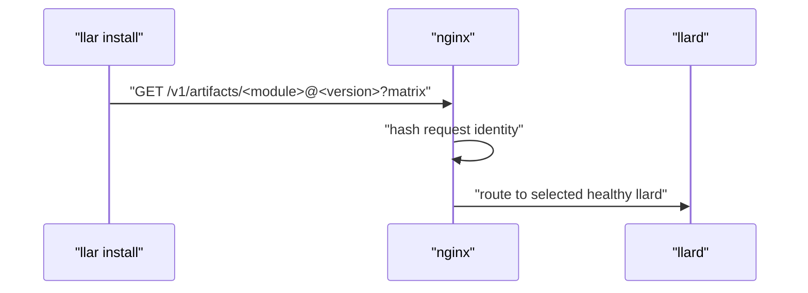
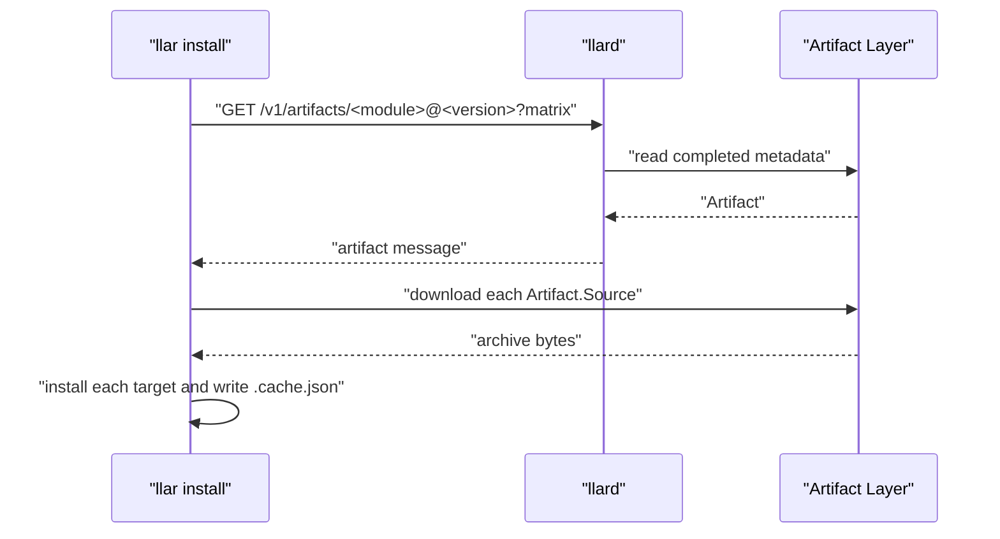
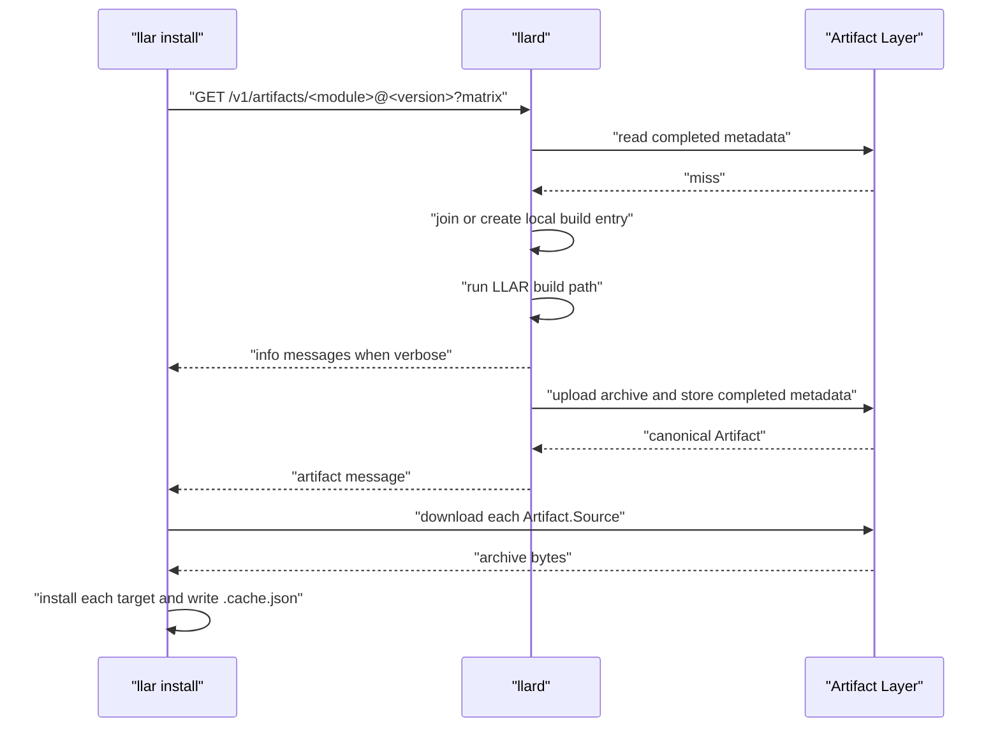
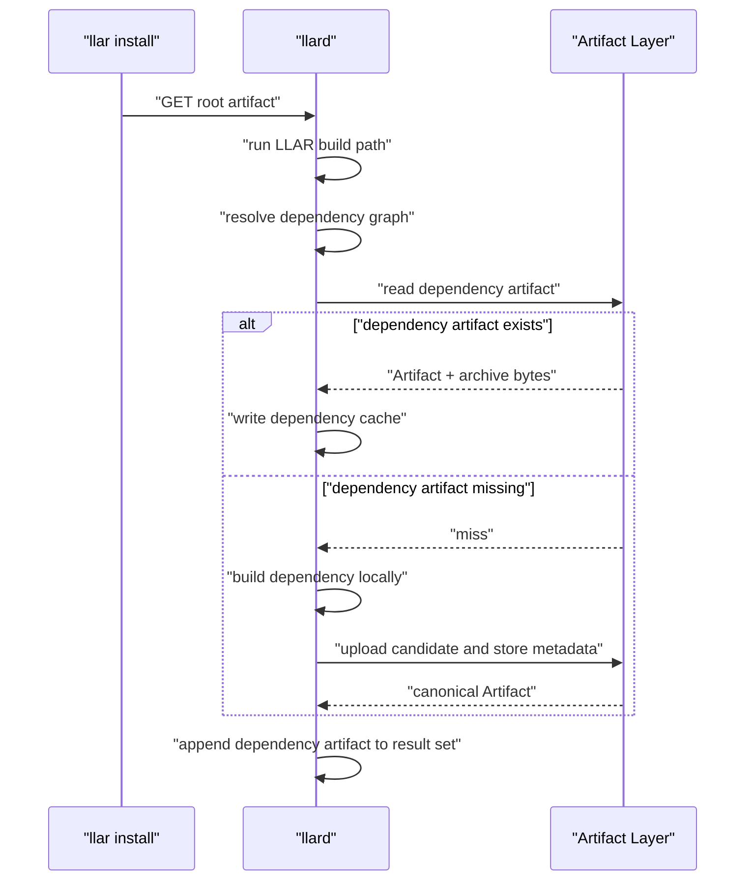
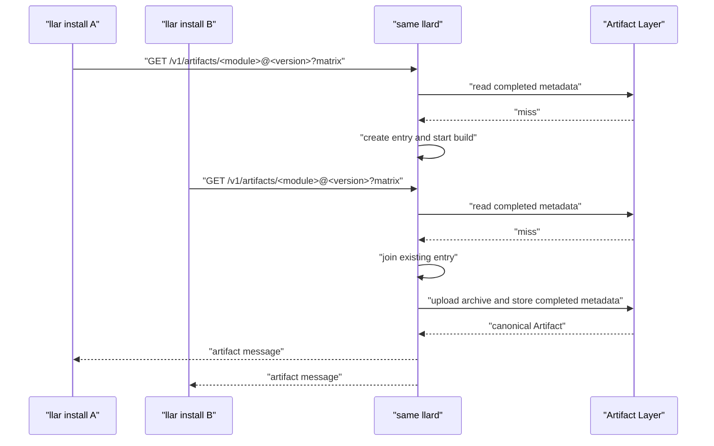
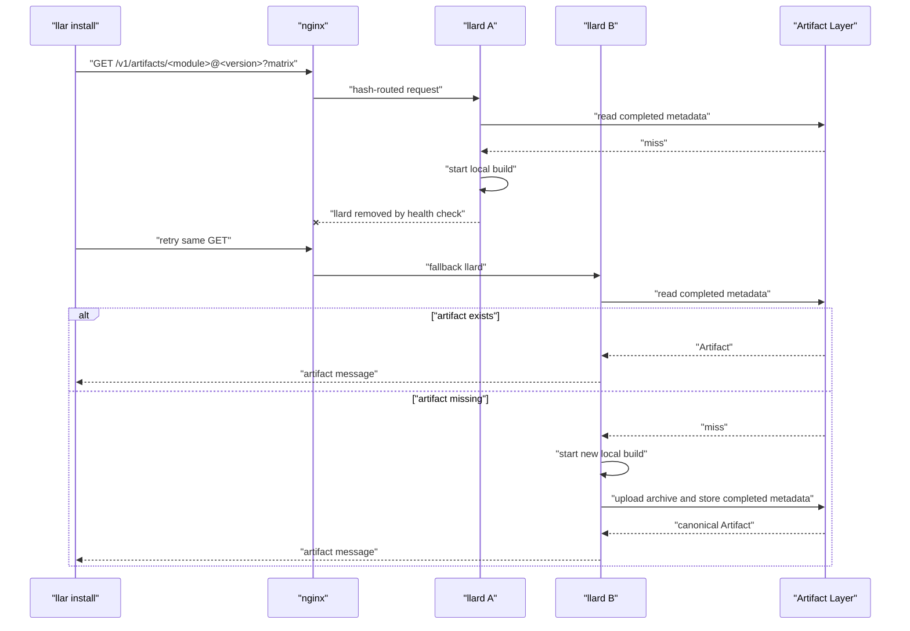

# llar Cloud Build llard Architecture

## Background

LLAR is a cloud-based multi-language package manager built with XGo. It manages C/C++ and other native libraries through declarative formula files. A formula describes how to resolve dependencies and how to build a library.

`llar make` is the existing build command. It resolves the requested module, loads formulas, resolves dependencies, builds dependencies before dependents, runs formula build hooks, and records build results in LLAR's local cache.

`llar install` adds a prebuilt artifact path for the same package manager. In the `llard` design, the client is only a protocol wrapper: it sends one artifact request for one `module@version` plus matrix selection, consumes the command JSON line response stream, downloads the returned artifact set, and writes local install directories and `.cache.json` entries.

Dependency resolution, dependency artifact reuse, and dependency artifact return move to the llard-side LLAR build path. `llard` runs `llar make`; Builder resolves dependencies, checks local cache, checks artifact metadata, downloads dependency artifacts when available, and builds missing dependencies locally when needed.

Cloud build is the remote artifact path:

```text
llar make
cache miss -> build locally

llar install
request -> llard -> artifact or error
```

`llard` is an HTTP server for one artifact request path. `GET /v1/artifacts/<module>@<version>?<matrix query>` performs artifact lookup, waits for an active local build when one exists, or starts a new local build when the artifact is missing.

## Goal

The goal is to implement remote artifact lookup, remote artifact production, direct artifact download for `llar install`, and llard-side dependency artifact return/reuse.

The architecture provides:

- one request per requested root artifact;
- hash-affine routing by module, version, and matrix query;
- command JSON line streaming through the same HTTP response;
- llard-local in-progress coordination;
- Builder-owned dependency resolution, dependency artifact lookup, and dependency artifact return;
- persistent storage for completed artifact metadata and artifact bytes;
- canonical completed artifact selection through `artifact.Store.Put`.

The runtime model is a llard model behind nginx hash routing. In-progress build state is memory-local to a llard. Completed metadata is stored in the artifact database. Artifact bytes are stored in the Artifact Store. GHCR is the default Artifact Store backend.

## Concepts

| Concept | Meaning |
| --- | --- |
| GHCR | GitHub Container Registry. GHCR is the default backend for the Artifact Store, not a hard dependency of the llard architecture. |
| Artifact | A completed LLAR build result for one module, version, and matrix. It describes where the archive can be downloaded, what archive type it is, the LLAR metadata captured from the build, and the checksum used by clients before installation. |
| llard | The cloud build service behind nginx hash routing. A llard handles `GET /v1/artifacts/<module>@<version>?<matrix query>`, shares in-progress work within the process, runs remote builds for cache misses, uploads archives, and records completed artifact metadata. |
| Builder cloud mode | The llard-side `llar make` mode that resolves dependencies and uses artifact metadata as an additional cache source before local builds. |

## Data Flow Architecture

The runtime has one client request path. nginx provides cross-llard routing. `llard` owns HTTP handling, local build coordination, artifact metadata access, and upload orchestration. The artifact DB stores completed metadata. The Artifact Store stores archive bytes; GHCR is the default backend.


Completed artifact lookup always happens before local building-entry lookup. After `artifact.Put` succeeds, the local entry serves requests that were already waiting. New requests resolve through completed artifact metadata in the artifact DB.

## API Specification

### Request

Cloud build has one public build endpoint:

```http
GET /v1/artifacts/<module>@<version>?<matrix query>
```

Examples:

```http
GET /v1/artifacts/madler/zlib@v1.3.1?arch=amd64&os=linux
GET /v1/artifacts/pnggroup/libpng@v1.6.47?arch=amd64&os=linux&debug=false
```

The path carries module and version. The query string carries selected matrix values in the same natural shape as the LLAR matrix CLI: `key=value`. It is not a serialized `formula.Matrix` value and it does not expose `Require` or `Options` in the wire protocol. The exact mapping from these values to LLAR's internal matrix representation is owned by the LLAR build path. The artifact key remains `module + version + matrixStr`, where `matrixStr` is the canonical LLAR matrix string for the selected values. Query parameter order must not change the artifact key.

### Response

Response headers:

```http
Content-Type: application/x-cmdjsonl
```

The response body uses the [`cmdjsonl`](https://github.com/qiniu/x/blob/main/cmdjsonl/README.md) format.

Supported commands are `info`, `artifact`, and `error`.

```go
type Info struct {
	Stream string `json:"stream,omitempty"`
	Text   string `json:"text"`
}

type ArtifactSet struct {
	Artifacts []TargetArtifact `json:"artifacts"`
}

type TargetArtifact struct {
	Target   string   `json:"target"` // module@version
	Artifact Artifact `json:"artifact"`
}

type Artifact struct {
	Source   ArtifactSource `json:"source"`
	Type     string         `json:"type"`     // zip | tar.gz | tar.zst
	Metadata string         `json:"metadata"` // LLAR build metadata, for example -lz
	Checksum string         `json:"checksum"` // sha256
}

type ArtifactSource struct {
	Type string `json:"type"` // artifact backend, for example ghcr
	URL  string `json:"url"`
}

type Error struct {
	Message string `json:"message"`
}
```

`ArtifactSet.Artifacts` is ordered for installation: dependencies first, the requested root artifact last. Each returned artifact uses the matrix selection from the request. The client combines each `target` with the request matrix to calculate the local install directory and `.cache.json` key.

Info message body:

```json
{
  "stream": "stderr",
  "text": "checking..."
}
```

Artifact message body:

```json
{
  "artifacts": [
    {
      "target": "madler/zlib@v1.3.1",
      "artifact": {
        "source": {
          "type": "ghcr",
          "url": "https://ghcr.io/v2/llar-artifacts/madler/zlib/blobs/sha256:2cf24dba5fb0a30e26e83b2ac5b9e29e1b161e5c1fa7425e73043362938b9824"
        },
        "type": "zip",
        "metadata": "-lz",
        "checksum": "2cf24dba5fb0a30e26e83b2ac5b9e29e1b161e5c1fa7425e73043362938b9824"
      }
    },
    {
      "target": "pnggroup/libpng@v1.6.47",
      "artifact": {
        "source": {
          "type": "ghcr",
          "url": "https://ghcr.io/v2/llar-artifacts/pnggroup/libpng/blobs/sha256:486ea46224d1bb4fb680f34f7c9ad96a8f24ec88be73ea8e5a6c65260e9cb8a7"
        },
        "type": "zip",
        "metadata": "-lpng",
        "checksum": "486ea46224d1bb4fb680f34f7c9ad96a8f24ec88be73ea8e5a6c65260e9cb8a7"
      }
    }
  ]
}
```

Error message body:

```json
{
  "message": "llar make failed"
}
```

Normal success stream:

```text
info {"stream":"stderr","text":"checking..."}
info {"stream":"stderr","text":"building..."}
artifact {"artifacts":[{"target":"madler/zlib@v1.3.1","artifact":{"source":{"type":"ghcr","url":"https://ghcr.io/v2/llar-artifacts/madler/zlib/blobs/sha256:2cf24dba5fb0a30e26e83b2ac5b9e29e1b161e5c1fa7425e73043362938b9824"},"type":"zip","metadata":"-lz","checksum":"2cf24dba5fb0a30e26e83b2ac5b9e29e1b161e5c1fa7425e73043362938b9824"}},{"target":"pnggroup/libpng@v1.6.47","artifact":{"source":{"type":"ghcr","url":"https://ghcr.io/v2/llar-artifacts/pnggroup/libpng/blobs/sha256:486ea46224d1bb4fb680f34f7c9ad96a8f24ec88be73ea8e5a6c65260e9cb8a7"},"type":"zip","metadata":"-lpng","checksum":"486ea46224d1bb4fb680f34f7c9ad96a8f24ec88be73ea8e5a6c65260e9cb8a7"}}]}
```

Clients parse each line by splitting at the first space. The command selects the response shape, and the JSON object is decoded into the corresponding structure. `info` lines are optional and may be ignored by clients that only care about the terminal `artifact` or `error`.

### Error Boundaries

Request errors happen before build execution and return HTTP request errors:

| Status Code | Reason |
| --- | --- |
| 400 | Missing module or version in the request path |
| 400 | Invalid module or version in the request path |
| 400 | Missing matrix query |
| 500 | `artifact.Store.Get` failed before build execution |

Build-time failures return an `error` terminal message:

| Status Code | Reason |
| --- | --- |
| 500 | LLAR build failed |
| 500 | Artifact upload failed |
| 500 | `artifact.Store.Put` database error |

`artifact.Store.Put` must succeed before an `artifact` message is sent.

## llard Module Specification

`llard` has one HTTP entrypoint and three internal submodules. The entrypoint wires HTTP to the service modules. The submodules own build coordination, completed artifact metadata, and artifact upload.

```text
cmd/llard
  internal/build
  internal/artifact
  internal/upload
```

### cmd/llard

`cmd/llard` is HTTP glue. It starts Gin, registers `GET /v1/artifacts/<module>@<version>`, parses module name, version, and matrix query, calls `internal/build`, and writes the command JSON line response.

`cmd/llard` adapts raw build output into public `info` command lines. Response encoding stays at the HTTP boundary.

### internal/build

`internal/build` owns llard-local build coordination:

- completed artifact lookup before local entry lookup;
- in-memory artifact identity -> build entry coordination;
- waiting for an existing local build;
- starting a new local build;
- raw info fanout;
- invoking the LLAR build path;
- calling `upload`;
- calling `artifact.Store.Put`;
- using the artifact returned by `Put`;
- removing local entries after terminal completion.

Public interface:

```go
package build

type Target struct {
	Module  string
	Version string
}

type Matrix struct {
	Require map[string]string `json:"require"`
	Options map[string]string `json:"options,omitempty"`
}

type Request struct {
	Target    Target
	MatrixStr string
	Matrix    Matrix
}

type TargetArtifact struct {
	Target   string
	Artifact artifact.Artifact
}

type Result struct {
	Artifacts []TargetArtifact
}

type Builds struct {
	// internal state
}

func New(opts Options) *Builds
func (b *Builds) Build(ctx context.Context, req Request, info io.Writer) (Result, error)
```

`info` is optional:

```text
nil
  non-streaming request; wait for final Result/error only

non-nil
  streaming request; write raw info text while waiting
```

`Build` never writes terminal artifact or error messages. The caller writes the terminal artifact set from `Result` or the terminal error from `error`.

### Builder Cloud Mode

Dependency handling belongs inside the llard-side LLAR build path. When the llard runs `llar make`, Builder resolves dependencies, checks local cache, checks artifact metadata, downloads dependency artifacts when available, and builds missing dependencies locally when needed.

This is not a global dependency build lock. The same dependency may be built more than once when two root builds need it at the same time, either on the same llard instance or on different llard instances. After a local dependency build finishes, Builder uploads the candidate artifact and calls `artifact.Store.Put`. Builder must use the artifact returned by `Put`; if another build already stored an artifact for the same dependency key, the returned stored artifact replaces the local candidate for the rest of the build.

### internal/artifact

`internal/artifact` owns completed artifact metadata. Upload, download, unpack, checksum calculation, local build coordination, and HTTP handling are owned by other modules.

```go
package artifact

type Key struct {
	Module    string
	Version   string
	MatrixStr string
}

type Artifact struct {
	Source   Source `json:"source"`
	Type     string `json:"type"`     // zip | tar.gz | tar.zst
	Metadata string `json:"metadata"` // LLAR build metadata, for example -lz
	Checksum string `json:"checksum"` // sha256
}

type Source struct {
	Type string `json:"type"` // artifact backend, for example ghcr
	URL  string `json:"url"`
}

type Store interface {
	Get(ctx context.Context, key Key) (Artifact, bool, error)
	Put(ctx context.Context, key Key, artifact Artifact) (Artifact, error)
	Delete(ctx context.Context, key Key) error
}
```

Artifact table:

| Column | Type | Key | Meaning |
| --- | --- | --- | --- |
| `module` | `TEXT NOT NULL` | Primary key | Module path |
| `version` | `TEXT NOT NULL` | Primary key | Resolved module version |
| `matrix_str` | `TEXT NOT NULL` | Primary key | LLAR matrix string used by cache and install directory layout |
| `source_type` | `TEXT NOT NULL` |  | Artifact source backend, for example `ghcr` |
| `source_url` | `TEXT NOT NULL` |  | Direct artifact download URL |
| `type` | `TEXT NOT NULL` |  | Archive type |
| `metadata` | `TEXT NOT NULL` |  | LLAR build metadata, for example `-lz` |
| `checksum` | `TEXT NOT NULL` |  | Artifact checksum |
| `created_at` | `TIMESTAMP NOT NULL` |  | Artifact metadata creation time |
| `expires_at` | `TIMESTAMP NULL` |  | Optional artifact metadata expiration time |

Primary key: `module`, `version`, `matrix_str`.

`Put` is atomic and canonicalizes the completed artifact:

```text
missing key
  insert artifact and return it

same key already exists
  return the existing stored artifact

database write/read failure
  return error
```

Callers must use the artifact returned by `Put`. They must not continue with a locally produced candidate if `Put` returns an already stored artifact. This is true even when the local candidate has a different checksum. The first stored artifact is the canonical completed artifact for that key.

### internal/upload

`internal/upload` owns artifact byte upload to the configured Artifact Store backend. GHCR is the default backend.

```go
package upload

type Options struct {
	Name  string
	Type  string // zip | tar.gz | tar.zst
	Attrs map[string]string
}

type Result struct {
	URL      string
	Size     int64
	Checksum string // sha256
}

type Uploader interface {
	Type() string
	Upload(ctx context.Context, r io.ReadSeeker, opts Options) (Result, error)
}

type GHCRConfig struct {
	Owner string
	Token string
}

func NewGHCR(cfg GHCRConfig) Uploader
```

`Uploader.Type()` is the artifact source type, for example `ghcr`. `Options.Type` is the archive type, for example `zip`, `tar.gz`, or `tar.zst`. `upload` computes checksum and size, uploads bytes, and returns upload metadata. Artifact DB writes and build state remain outside the upload module. `build` combines `Uploader.Type()`, upload URL, archive type, checksum, and LLAR metadata into a candidate `artifact.Artifact`, then calls `artifact.Store.Put`.

## User Stories

### Request Routing

All artifact requests enter through nginx. nginx hashes the request identity and routes requests for the same module, version, and matrix query to the same healthy llard. llard-local build sharing depends on this routing affinity. If the selected llard becomes unhealthy, later requests may reach another llard instance; that llard checks the artifact DB before starting a build.



### 1. Install Artifacts That Already Exist

The user runs `llar install <target>`. The client sends one artifact request with the selected matrix. It does not resolve dependency graphs or submit dependency jobs.

After routing, the llard checks completed artifact metadata first. If the artifact exists, the llard returns an `artifact` message with `Artifact.Source`. The client downloads from the Artifact Store, verifies checksum, extracts into the LLAR install directory, and writes `.cache.json`.



### 2. Build A Missing Artifact

The client sends the same GET request. The llard checks the artifact DB and misses. If no local build entry exists for the artifact key, the llard creates one and starts a build. The build runs the LLAR build path, uploads the archive to the Artifact Store, and writes completed metadata through `artifact.Store.Put`.

After `Put` succeeds for the root and collected dependencies, all waiting requests receive `artifact` messages containing the ordered artifact set. The client then downloads every artifact directly from the Artifact Store.



### 3. Dependencies During llard Build

The client still sends one root artifact request. During that build, `llard` runs the LLAR build path. The Builder resolves dependencies, reuses dependency artifacts when metadata exists, locally builds missing dependencies when needed, and records every dependency artifact needed by the client.



Duplicate dependency builds are acceptable. `artifact.Store.Put` chooses the canonical completed artifact. If another build already stored the same dependency, Builder uses the artifact returned by `Put`, even when its local candidate has a different checksum. The terminal response still returns the canonical dependency artifact so the client can install it locally.

### 4. Multiple Clients Ask For The Same Root Artifact

Requests for the same request identity arrive at the same healthy llard. The first request creates the local build entry. Later requests for the same artifact key join that entry instead of starting another root build.

Streaming clients receive `info` output from the local entry. Non-streaming clients wait for the terminal message. Completed metadata is persisted once through `artifact.Store.Put`; the terminal response contains the same ordered artifact set for all joined clients.



### 5. llard Fails During A Build

If a llard dies or is removed by nginx health checks, in-memory build entries and retained info output are lost. Later requests may reach another llard instance. The fallback llard instance checks the artifact DB first. If the artifact exists, it returns an `artifact` message. If the artifact is still missing, it starts a new build.

Duplicate builds are acceptable in these failure windows. `artifact.Store.Put` is the consistency boundary that prevents completed metadata from becoming ambiguous.


