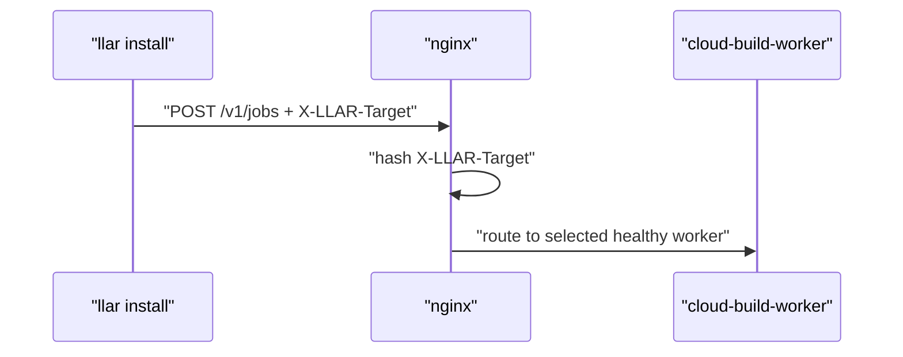
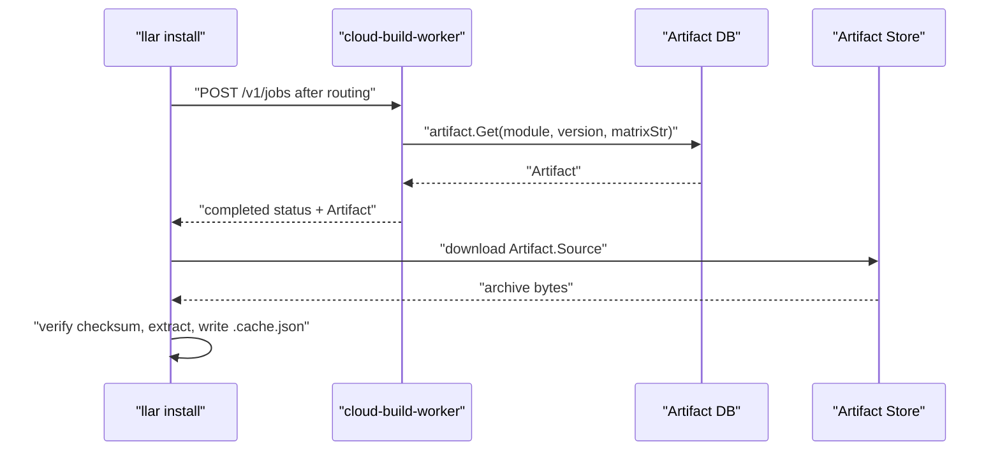
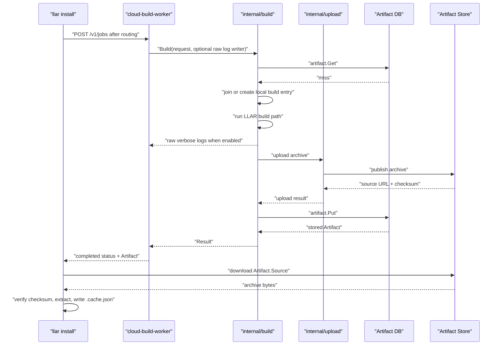
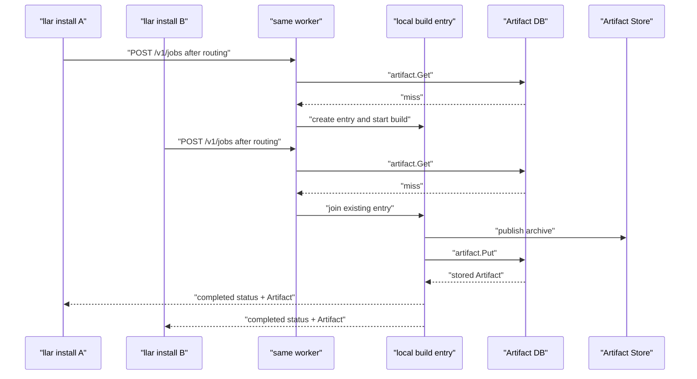
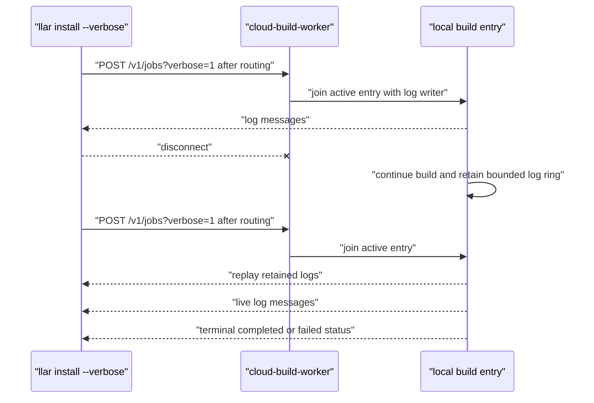
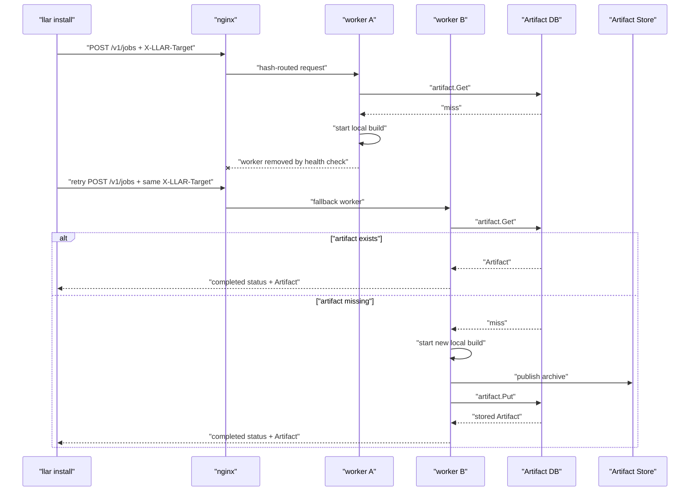

# llar Cloud Build Worker Architecture

## Background

LLAR is a cloud-based multi-language package manager built with XGo. It manages C/C++ and other native libraries through declarative formula files. A formula describes how to resolve dependencies and how to build a library.

`llar make` is the existing build command. It resolves the requested module, loads formulas, resolves dependencies, builds dependencies before dependents, runs formula build hooks, and records build results in LLAR's local cache.

`llar install` adds a prebuilt artifact path for the same package manager. It installs a completed artifact when one exists and delegates artifact production to cloud build when the artifact is missing. LLAR keeps ownership of module resolution, matrix selection, dependency order, local install directories, `.cache.json`, and final metadata.

Cloud build is the remote cache-miss path:

```text
llar make
cache miss -> build locally

llar install
cache miss -> ask cloud-build-worker for an artifact
```

A worker is an HTTP server for one artifact request path. The same `POST /v1/jobs` endpoint performs artifact lookup, waits for an active local build when one exists, or starts a new local build when the artifact is missing.

## Goal

The goal is to implement remote artifact lookup, remote artifact production, and direct artifact download for `llar install`.

The architecture provides:

- completed artifact lookup before remote build execution;
- remote build execution for missing artifacts;
- hash-affine routing by `module/version/matrixStr`;
- optional verbose log streaming through the same HTTP response;
- worker-local in-progress coordination;
- persistent storage for completed artifact metadata and artifact bytes;
- separate ownership for LLAR install semantics, build coordination, artifact metadata, and artifact upload.

The runtime model is a worker model behind nginx hash routing. In-progress build state is memory-local to a worker. Completed metadata is stored in the artifact database. Artifact bytes are stored in the Artifact Store. GHCR is the default Artifact Store backend.

## Concepts

| Concept | Meaning |
| --- | --- |
| GHCR | GitHub Container Registry. GHCR is the default backend for the Artifact Store, not a hard dependency of the worker architecture. |
| Artifact | A completed LLAR build result for one `module/version/matrixStr`. It describes where the archive can be downloaded, what archive type it is, the LLAR metadata captured from the build, and the checksum used by clients before installation. |
| Worker | The cloud build server behind nginx hash routing. A worker handles the single `POST /v1/jobs` request path, shares in-progress work within the process, runs remote builds for cache misses, uploads archives through the configured Artifact Store backend, and records completed artifact metadata. |

## Data Flow Architecture

The runtime has one client request path. nginx provides cross-worker routing. Worker owns HTTP handling, local build coordination, artifact metadata access, and upload orchestration. The artifact DB stores completed metadata. The Artifact Store stores archive bytes; GHCR is the default backend.


Completed artifact lookup always happens before local building-entry lookup. After `artifact.Put` succeeds, the local entry serves requests that were already waiting. New requests resolve through completed artifact metadata in the artifact DB.

## API Specification

### Request

Cloud build has one public build endpoint:

```http
POST /v1/jobs
POST /v1/jobs?verbose=1
```

Required headers:

```http
X-LLAR-Target: <module>@<version>#<matrixStr>
Content-Type: application/json
```

`X-LLAR-Target` is both the nginx routing key and the artifact identity used by the worker.

Request body:

```json
{
  "matrix": {
    "require": {
      "arch": "amd64",
      "os": "linux"
    },
    "options": {
      "debug": "false"
    }
  }
}
```

The body carries the selected matrix values. It does not carry `target`, `verbose`, or `defaultOptions`.

Go shape:

```go
type JobRequest struct {
	Matrix Matrix `json:"matrix"`
}

type Matrix struct {
	Require map[string]string `json:"require"`
	Options map[string]string `json:"options,omitempty"`
}
```

The worker does not recompute `matrixStr` from `body.matrix`. `llar install` must generate `X-LLAR-Target` and `body.matrix` from the same selected matrix.

### Non-Verbose Response

Without `verbose=1`, the request waits until the artifact is available or the build fails. The response body is one JSON status message.

```go
type StatusMessage struct {
	Type  string     `json:"type"`  // status
	State JobState   `json:"state"` // completed | failed
	Body  StatusBody `json:"body"`
}

type JobState string

const (
	JobCompleted JobState = "completed"
	JobFailed    JobState = "failed"
)

type StatusBody struct {
	Artifact *Artifact `json:"artifact,omitempty"`
	Status   int       `json:"status,omitempty"`
	Message  string    `json:"message,omitempty"`
}
```

Completed:

```json
{
  "type": "status",
  "state": "completed",
  "body": {
    "artifact": {
      "source": {
        "type": "ghcr",
        "url": "https://..."
      },
      "type": "zip",
      "metadata": "...",
      "checksum": "0f4c2f1b6f1c0c7b7a0d6f6c9a2c8f4e5d7c3b2a1f0e9d8c7b6a5f4e3d2c1b0a"
    }
  }
}
```

Failed:

```json
{
  "type": "status",
  "state": "failed",
  "body": {
    "status": 500,
    "message": "llar make failed"
  }
}
```

### Verbose Response

With `verbose=1`, the response still uses `Content-Type: application/json`, but the body is a stream of JSON messages. The worker writes zero or more log messages and then one terminal status message.

```go
type LogMessage struct {
	Type string  `json:"type"` // log
	Data LogData `json:"data"`
}

type LogData struct {
	Stream string `json:"stream,omitempty"` // stderr
	Text   string `json:"text"`             // ANSI preserved
}
```

Example:

```json
{"type":"log","data":{"stream":"stderr","text":"checking..."}}
{"type":"log","data":{"stream":"stderr","text":"building..."}}
{"type":"status","state":"completed","body":{"artifact":{"source":{"type":"ghcr","url":"https://..."},"type":"zip","metadata":"...","checksum":"0f4c2f1b6f1c0c7b7a0d6f6c9a2c8f4e5d7c3b2a1f0e9d8c7b6a5f4e3d2c1b0a"}}}
```

Go clients read verbose responses with `json.Decoder` by decoding one JSON value at a time.

### Error Boundaries

Request errors happen before build execution and return HTTP request errors:

| Status Code | Reason |
| --- | --- |
| 400 | Missing `X-LLAR-Target` |
| 400 | Invalid `X-LLAR-Target` |
| 400 | Invalid JSON body |
| 400 | Missing `matrix` |
| 500 | `artifact.Store.Get` failed before build execution |

Build-time failures return a failed status message:

| Status Code | Reason |
| --- | --- |
| 500 | LLAR build failed |
| 500 | Artifact upload failed |
| 500 | `artifact.Store.Put` database error |
| 409 | Same artifact key with different checksum |

`artifact.Put` must succeed before a completed status is sent. A checksum conflict for the same artifact key fails the current build with 409.

## Worker Module Specification

The worker has one HTTP entrypoint and three internal submodules. The entrypoint wires HTTP to the worker modules. The submodules own build coordination, completed artifact metadata, and artifact upload.

```text
cmd/worker
  internal/build
  internal/artifact
  internal/upload
```

### cmd/worker

`cmd/worker` is HTTP glue. It starts Gin, registers `POST /v1/jobs`, parses `X-LLAR-Target`, parses `verbose`, decodes `body.matrix`, calls `internal/build`, and writes the final response.

In verbose mode, `cmd/worker` adapts raw build logs into the public JSON log message shape. JSON response encoding stays at the HTTP boundary.

### internal/build

`internal/build` owns worker-local build coordination:

- completed artifact lookup before local entry lookup;
- in-memory `ArtifactKey -> build entry` coordination;
- waiting for an existing local build;
- starting a new local build;
- raw verbose log fanout;
- invoking the LLAR build path;
- calling `upload`;
- calling `artifact.Store.Put`;
- removing local entries after terminal status.

Public interface:

```go
package build

type Target struct {
	Module  string
	Version string
}

type Matrix struct {
	Require map[string]string `json:"require"`
	Options map[string]string `json:"options,omitempty"`
}

type Request struct {
	Target    Target
	MatrixStr string
	Matrix    Matrix
}

type Result struct {
	Artifact artifact.Artifact
}

type Builds struct {
	// internal state
}

func New(opts Options) *Builds
func (b *Builds) Build(ctx context.Context, req Request, log io.Writer) (Result, error)
```

`log` is optional:

```text
nil
  non-verbose request; wait for final Result/error only

non-nil
  verbose request; write raw log text while waiting
```

`Build` never writes terminal completed or failed messages. The caller writes terminal status from `Result` or `error`.

### internal/artifact

`internal/artifact` owns completed artifact metadata. Upload, download, unpack, checksum calculation, local build coordination, and HTTP handling are owned by other modules.

```go
package artifact

type Key struct {
	Module    string
	Version   string
	MatrixStr string
}

type Artifact struct {
	Source   Source `json:"source"`
	Type     string `json:"type"`     // zip | tar.gz | tar.zst
	Metadata string `json:"metadata"` // LLAR metadata, for example pkg-config info
	Checksum string `json:"checksum"` // sha256
}

type Source struct {
	Type string `json:"type"` // artifact backend, for example ghcr
	URL  string `json:"url"`
}

type Store interface {
	Get(ctx context.Context, key Key) (Artifact, bool, error)
	Put(ctx context.Context, key Key, artifact Artifact) (Artifact, error)
	Delete(ctx context.Context, key Key) error
}
```

Artifact table:

| Column | Type | Key | Meaning |
| --- | --- | --- | --- |
| `module` | `TEXT NOT NULL` | Primary key | Module path |
| `version` | `TEXT NOT NULL` | Primary key | Resolved module version |
| `matrix_str` | `TEXT NOT NULL` | Primary key | LLAR matrix string used by cache and install directory layout |
| `source_type` | `TEXT NOT NULL` |  | Artifact source backend, for example `ghcr` |
| `source_url` | `TEXT NOT NULL` |  | Direct artifact download URL |
| `type` | `TEXT NOT NULL` |  | Archive type |
| `metadata` | `TEXT NOT NULL` |  | LLAR metadata, for example pkg-config info |
| `checksum` | `TEXT NOT NULL` |  | Artifact checksum |
| `created_at` | `TIMESTAMP NOT NULL` |  | Artifact metadata creation time |
| `expires_at` | `TIMESTAMP NULL` |  | Optional artifact metadata expiration time |

Primary key: `module`, `version`, `matrix_str`.

`Put` is atomic and idempotent:

```text
missing key
  insert artifact and return it

same key + same checksum
  return the existing stored artifact

same key + different checksum
  return conflict
```

### internal/upload

`internal/upload` owns artifact byte upload to the configured Artifact Store backend. GHCR is the default backend.

```go
package upload

type Options struct {
	Name  string
	Type  string // zip | tar.gz | tar.zst
	Attrs map[string]string
}

type Result struct {
	URL      string
	Size     int64
	Checksum string // sha256
}

type Uploader interface {
	Type() string
	Upload(ctx context.Context, r io.ReadSeeker, opts Options) (Result, error)
}

type GHCRConfig struct {
	Owner string
	Token string
}

func NewGHCR(cfg GHCRConfig) Uploader
```

`Uploader.Type()` is the artifact source type, for example `ghcr`. `Options.Type` is the archive type, for example `zip`, `tar.gz`, or `tar.zst`. `upload` computes checksum and size, uploads bytes, and returns upload metadata. Artifact DB writes and build state remain outside the upload module. `build` combines `Uploader.Type()`, upload URL, archive type, checksum, and LLAR metadata into `artifact.Artifact`.

## User Stories

### Request Routing

All build requests enter through nginx. nginx hashes `X-LLAR-Target` and routes requests for the same artifact key to the same healthy worker. Worker-local build sharing depends on this routing affinity. If the selected worker becomes unhealthy, later requests may reach another worker; that worker checks the artifact DB before starting a build.



### 1. Install An Artifact That Already Exists

The user runs `llar install <target>`. LLAR resolves the target, dependency order, and selected matrix locally. For a local cache miss, it posts the artifact key and matrix selection to cloud build.

After routing, the worker checks completed artifact metadata first. If the artifact exists, the worker returns a completed status with `Artifact.Source`. The client downloads from the Artifact Store, verifies checksum, extracts into the LLAR install directory, and writes `.cache.json`.



### 2. Build A Missing Artifact

The client posts the same `POST /v1/jobs` request. The worker checks the artifact DB and misses. If no local build entry exists for the artifact key, the worker creates one and starts a build. The build runs the LLAR build path, uploads the archive to the Artifact Store, and writes completed metadata through `artifact.Store.Put`.

After `Put` succeeds, all waiting requests receive completed status. The client then downloads the artifact bytes directly from the Artifact Store.



### 3. Multiple Clients Ask For The Same Artifact

Requests for the same `X-LLAR-Target` arrive at the same healthy worker. The first request creates the local build entry. Later requests for the same artifact key join that entry instead of starting another build.

Verbose clients receive log output from the local entry. Non-verbose clients wait for the final status. Completed metadata is persisted once through `artifact.Store.Put`.



### 4. Verbose Client Reconnects

A verbose client may disconnect and send a new `POST /v1/jobs?verbose=1` for the same `X-LLAR-Target`. If the build is still active, the worker replays the current in-memory log ring from its first retained entry, then streams live logs. The client can keep a per-build printed log count and skip that many replayed log messages to avoid duplicate terminal output.

The log ring is bounded. Logs are diagnostic and do not guarantee complete history. Terminal completed/failed status is independent from log replay.



### 5. Worker Fails During A Build

If a worker dies or is removed by nginx health checks, in-memory build entries and logs are lost. Later requests may reach another worker. The fallback worker checks the artifact DB first. If the artifact exists, it returns completed. If the artifact is still missing, it starts a new build.

Duplicate builds are acceptable in these failure windows. `artifact.Store.Put` is the consistency boundary that prevents completed metadata from becoming ambiguous.


