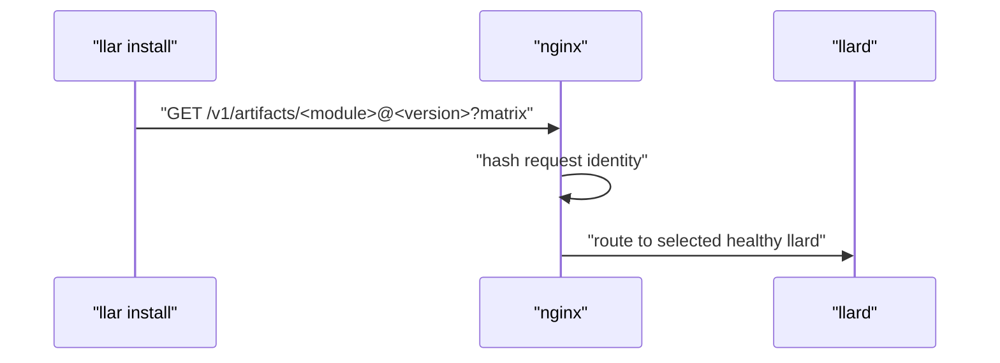
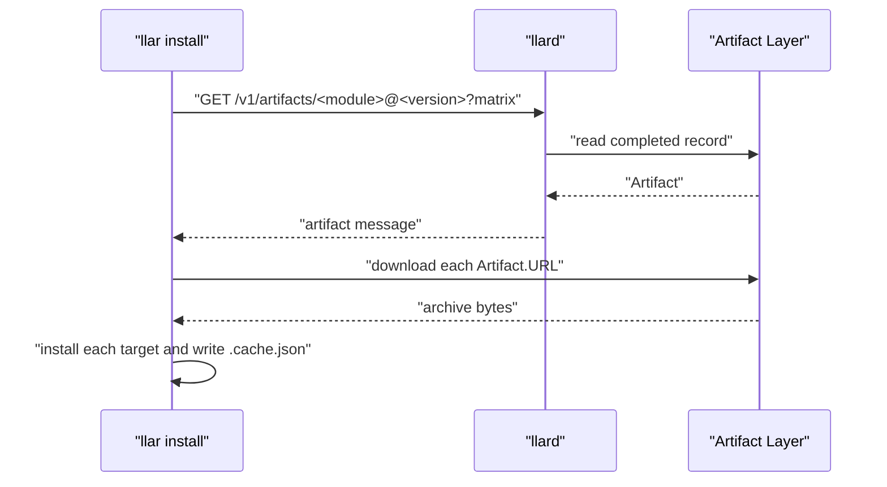
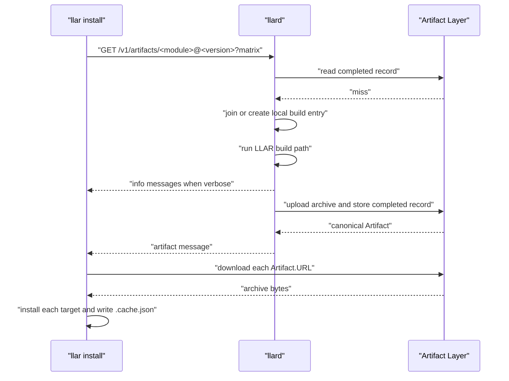
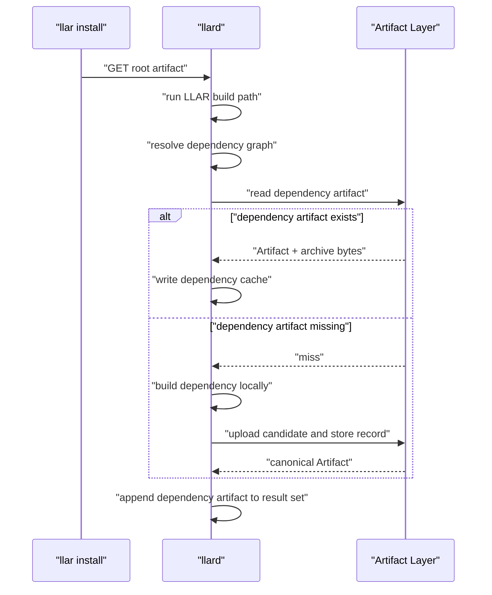
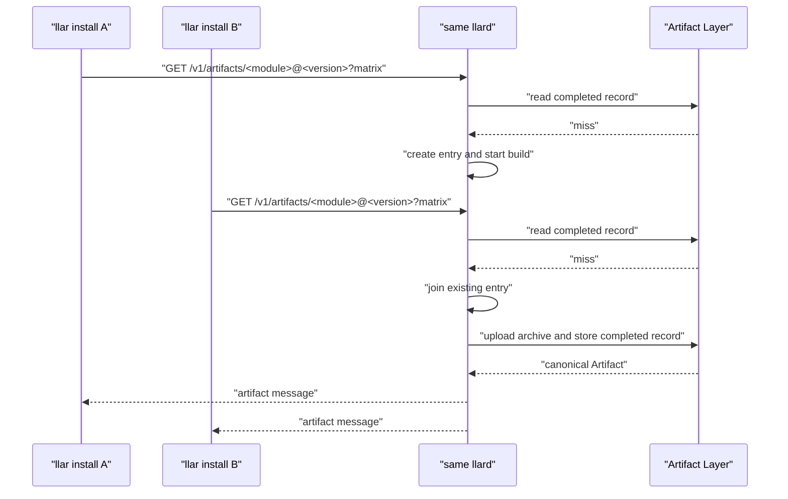
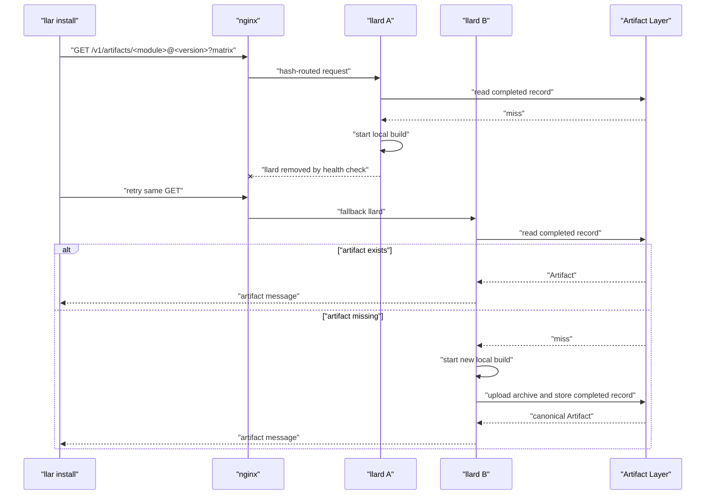

# llar Cloud Build llard Architecture

## Background

LLAR is a cloud-based multi-language package manager built with XGo. It manages native libraries through declarative formula files.

`llar make` resolves formulas and dependencies, builds dependencies before dependents, runs build hooks, and records results in LLAR's local cache.

`llar install` adds a prebuilt artifact path. The client sends one artifact request for one `module@version` plus matrix selection. The response returns the artifact set.

Dependency resolution moves to the llard-side LLAR build path. `llard` runs `llar make`; Builder checks local cache, completed artifact records, then local build.

Cloud build is the remote artifact path:

```text
llar make
cache miss -> build locally

llar install
request -> llard -> artifact or error
```

`llard` serves one artifact request path: `GET /v1/artifacts/<module>@<version>?<matrix query>`.

## Goal

The goal is to implement remote artifact lookup, remote artifact production, direct artifact download for `llar install`, and llard-side dependency artifact return/reuse.

The architecture provides:

- one request per requested root artifact;
- hash-affine routing by module, version, and matrix query;
- command JSON line streaming through the same HTTP response;
- llard-local in-progress coordination;
- Builder-owned dependency resolution, dependency artifact lookup, and dependency artifact return;
- persistent storage for completed artifact records and artifact bytes;
- canonical completed artifact selection through `artifact.Store.Put`.

In-progress build state is memory-local to a llard. Completed records live in the artifact database. Artifact bytes live in the Artifact Store.

## Concepts

| Concept | Meaning |
| --- | --- |
| GHCR | Default Artifact Store backend. |
| Artifact | Completed build record: URL, archive type, and checksum. Build metadata lives in `.llar/metadata.json` inside the archive. |
| llard | HTTP build service behind nginx hash routing. |
| Builder cloud mode | llard-side `llar make` mode that can reuse completed artifact records. |

## Data Flow Architecture

nginx provides cross-llard routing. `llard` owns HTTP handling, local build coordination, artifact records, and upload orchestration.


Completed artifact lookup happens before local build-entry lookup. After `artifact.Put`, waiting requests use the local result; new requests use the artifact DB.

## API Specification

[llard-Service-Specification](https://github.com/xgo-dev/llar/wiki/llard-Service-Specification)

## llard Module Specification

`llard` has one HTTP entrypoint and three internal submodules:

```text
cmd/llard
  internal/build
  internal/artifact
  internal/upload
```

### cmd/llard

`cmd/llard` is HTTP glue. It registers `GET /v1/artifacts/<module>@<version>`, parses the request, calls `internal/build`, and writes the command JSON line response.

`cmd/llard` adapts raw build output into public `info` command lines. Response encoding stays at the HTTP boundary.

### internal/build

`internal/build` owns llard-local build coordination:

- completed artifact lookup before local entry lookup;
- in-memory artifact identity -> build entry coordination;
- waiting for an existing local build;
- starting a new local build;
- raw info fanout;
- invoking the LLAR build path;
- calling `upload`;
- calling `artifact.Store.Put`;
- using the artifact returned by `Put`;
- removing local entries after terminal completion.

Public interface:

```go
package build

import "github.com/goplus/llar/formula"

type Target struct {
	Module  string
	Version string
}

type Request struct {
	Target Target
	Matrix formula.Matrix
}

type TargetArtifact struct {
	Target   string
	Artifact artifact.Artifact
}

type Result struct {
	Artifacts []TargetArtifact
}

type Builds struct {
	// internal state
}

func New(opts Options) *Builds
func (b *Builds) Build(ctx context.Context, req Request, info io.Writer) (Result, error)
```

`info` is optional:

```text
nil
  non-streaming request; wait for final Result/error only

non-nil
  streaming request; write raw info text while waiting
```

`Build` never writes terminal artifact or error messages. The caller writes the terminal artifact set from `Result` or the terminal error from `error`.

### Builder Cloud Mode

Builder cloud mode keeps dependency handling inside the LLAR build path.

Rules:

- check local cache first;
- check completed artifact records second;
- build locally on miss;
- commit produced artifacts through `artifact.Store.Put`;
- use the artifact returned by `Put`.

Duplicate dependency builds are allowed.

### internal/artifact

`internal/artifact` owns completed artifact records. It does not upload, download, unpack, checksum, coordinate builds, or handle HTTP.

```go
package artifact

type Key struct {
	Module    string
	Version   string
	MatrixStr string
}

type Artifact struct {
	URL      string `json:"url"`
	Type     string `json:"type"`     // tar.gz by default
	Checksum string `json:"checksum"` // sha256
}

type Store interface {
	Get(ctx context.Context, key Key) (Artifact, bool, error)
	Put(ctx context.Context, key Key, artifact Artifact) (Artifact, error)
	Delete(ctx context.Context, key Key) error
}
```

Artifact table:

| Column | Type | Key | Meaning |
| --- | --- | --- | --- |
| `module` | `TEXT NOT NULL` | Primary key | Module path |
| `version` | `TEXT NOT NULL` | Primary key | Resolved module version |
| `matrix_str` | `TEXT NOT NULL` | Primary key | LLAR matrix string used by cache and install directory layout |
| `url` | `TEXT NOT NULL` |  | Direct artifact download URL |
| `type` | `TEXT NOT NULL` |  | Archive type |
| `checksum` | `TEXT NOT NULL` |  | Artifact checksum |
| `created_at` | `TIMESTAMP NOT NULL` |  | Artifact record creation time |
| `expires_at` | `TIMESTAMP NULL` |  | Optional artifact record expiration time |

Primary key: `module`, `version`, `matrix_str`.

`Put` is atomic and canonicalizes the completed artifact:

```text
missing key
  insert artifact and return it

same key already exists
  return the existing stored artifact

database write/read failure
  return error
```

Callers use the artifact returned by `Put`. The first stored artifact is canonical, even when a later local candidate has a different checksum.

### internal/upload

`internal/upload` owns artifact byte upload to the configured Artifact Store backend. GHCR is the default backend.

```go
package upload

type Options struct {
	Name  string
	Type  string // tar.gz by default
	Attrs map[string]string
}

type Result struct {
	URL      string
	Size     int64
	Checksum string // sha256
}

type Uploader interface {
	Upload(ctx context.Context, r io.ReadSeeker, opts Options) (Result, error)
}

type GHCRConfig struct {
	Owner string
	Token string
}

func NewGHCR(cfg GHCRConfig) Uploader
```

`Options.Type` is the archive type. The default archive type is `tar.gz`.

`upload` computes checksum and size, uploads bytes, and returns the download URL. Artifact DB writes and build state remain outside this module.

### GHCR Artifact Store Layout

GHCR is the default Artifact Store backend. Its OCI layout is defined in [GHCR Artifact Store](./2026-06-15-ghcr-artifact-store.md).

## User Stories

### Request Routing

nginx hash-routes the same module, version, and matrix query to the same healthy llard. Fallback llards check the artifact DB before building.



### 1. Install Artifacts That Already Exist

If the completed artifact exists, llard returns an `artifact` message. The client downloads, verifies, extracts, reads `.llar/metadata.json`, and writes `.cache.json`.



### 2. Build A Missing Artifact

On artifact DB miss, llard joins or starts a local build. The build uploads archives, stores completed records, and returns the ordered artifact set.



### 3. Dependencies During llard Build

The client still sends one root request. Builder resolves dependencies and returns every artifact needed by the client.



Duplicate dependency builds are acceptable. `artifact.Store.Put` chooses the canonical artifact, and Builder returns that artifact to the client.

### 4. Multiple Clients Ask For The Same Root Artifact

Requests for the same identity join the same local build entry. All joined clients receive the same ordered artifact set.



### 5. llard Fails During A Build

If a llard dies, in-memory build entries and retained info output are lost. Fallback llards check the artifact DB first. Duplicate builds are acceptable.


