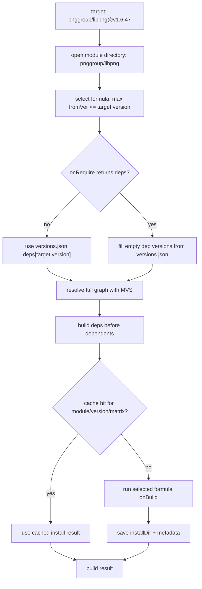

LLAR Module
====

A module is a package or library unit that is released, versioned, and
distributed together. LLAR identifies a module by module id, for example
`pnggroup/libpng`.

The formula store keeps one directory for each module:

```text
pnggroup/libpng/
  versions.json
  Libpng_cmp.gox           # optional version comparator
  1.0.0/
    Libpng_llar.gox        # formula from version 1.0.0
  1.5.0/
    Libpng_llar.gox        # formula from version 1.5.0
```

`versions.json` gives LLAR the module path and a static direct-dependency
table:

```json
{
  "path": "pnggroup/libpng",
  "deps": {
    "1.0.0": [
      {"path": "madler/zlib", "version": "v1.2.11"}
    ]
  }
}
```

- `path` is the module id for this directory.
- `deps[version]` is the direct dependency list for that source version.
- If `onRequire` is missing or returns no deps, LLAR uses `deps[version]`.
- If `onRequire` returns a dep with an empty version, LLAR fills it from
  `deps[version]`.
- If the empty-version dep is not in `deps[version]`, LLAR does not invent a
  version.

Module loading:



`fromVer` selects the formula. If formulae exist at `1.0.0` and `1.5.0`,
`pnggroup/libpng@1.7.0` uses the `1.5.0` formula. A target version lower than
all available `fromVer` values has no matching formula.

## Version comparator

```coffee
compareVer (a, b) => {
    return semver.Compare(a.Version, b.Version)
}
```

Without `*_cmp.gox`, LLAR uses GNU version comparison.
